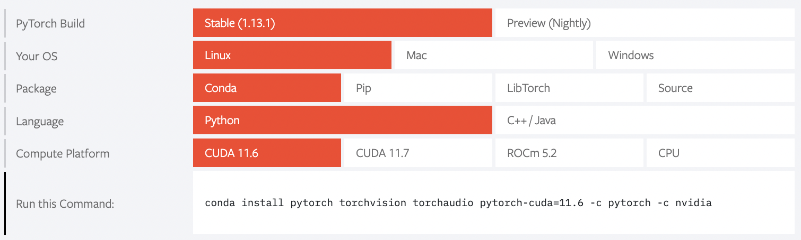

# PyTorch


## What is PyTorch?

[PyTorch](https://pytorch.org) is a GPU accelerated tensor computational framework with a Python front end. Functionality can be easily extended with common Python libraries such as NumPy, SciPy, and Cython. Automatic differentiation is done with a tape-based system at both a functional and neural network layer level. This functionality brings a high level of flexibility and speed as a deep learning framework and provides accelerated NumPy-like functionality.

## Installing PyTorch

These instructions are intended to help you install PyTorch on the FASRC cluster.

### GPU Support

For general information on running GPU jobs refer to our [user documentation](https://www.rc.fas.harvard.edu/resources/documentation/gpgpu-computing-on-the-cluster). To set up PyTorch with GPU support in your user environment, please follow the below steps:

**PyTorch with CUDA 12.1 in a conda environment**

These instructions set up a `conda` environment with `PyTorch` version 2.2.1 and CUDA version 12.1, where the `cuda-toolkit` is installed directly in the `conda` environment. 

* Start an interactive job requesting GPUs, e.g., (Note: you will want to start a session on the same type of hardware as what you will run on)

```bash
salloc -p gpu -t 0-06:00 --mem=8000 --gres=gpu:1 
```

* Load required software modules, e.g.,

```bash
module load python/3.10.13-fasrc01
```

* Create a [conda environment](https://conda.io/projects/conda/en/latest/index.html), e.g.,

```bash
mamba create -n pt2.3.0_cuda12.1 python=3.10 pip wheel
```

* Activate the new `conda` environment:

```bash
source activate pt2.3.0_cuda12.1
```

* Install `cuda-toolkit` version 12.1.0 with `mamba`

```bash
mamba install -c  "nvidia/label/cuda-12.1.0" cuda-toolkit=12.1.0
```

* Install PyTorch with `mamba`

```bash
mamba install pytorch torchvision torchaudio pytorch-cuda=12.1 -c pytorch -c nvidia
```

* Install additional Python packages, if needed, e.g.,

```bash
mamba install -c conda-forge numpy scipy pandas matplotlib seaborn h5py jupyterlab jupyterlab-spellchecker scikit-learn
```

**PyTorch with CUDA 11.8 from a software module**

These instructions set up a `conda` environment with PyTorch version 2.2.0 and `CUDA` version 11.8, where `CUDA` is loaded as a software module, `cuda/11.8.0-fasrc01`

```bash
# Start an interactive job on a GPU node (target the architecture where you plan to run), e.g.,
salloc -p gpu -t 0-06:00 --mem=8000 --gres=gpu:1

# Load the required modules, e.g.,
module load python 
module load cuda/11.8.0-fasrc01 # CUDA version 11.8.0

# Create a conda environment and activate it, e.g.,
mamba create -n pt2.2.0_cuda11.8 python=3.10 pip wheel -y
source activate pt2.2.0_cuda11.8

# Install PyTorch
mamba install pytorch torchvision torchaudio pytorch-cuda=11.8 -c pytorch -c nvidia

# Install additional packages, e.g.,
mamba install pandas scikit-learn matplotlib seaborn jupyterlab -y
```

### Other PyTorch/cuda versions

To install other versions, refer to the PyTorch [compatibility chart](https://pytorch.org/):



## Running PyTorch:

If you are running PyTorch on GPU with multi-instance GPU (MIG) mode on (e.g. `gpu_test` partition), see [PyTorch on MIG mode](#pytorch-on-mig-mode)

### PyTorch checks

You can run the following tests to ensure that PyTorch was installed properly and can find the GPU card. Example output of PyTorch checks:

```bash
(pt2.3.0_cuda12.1_v0) [jharvard@holygpu7c26106 ~]$ python -c 'import torch;print(torch.__version__)'
2.3.0
(pt2.3.0_cuda12.1_v0) [jharvard@holygpu7c26106 ~]$ python -c 'import torch;print(torch.cuda.is_available())'
True
(pt2.3.0_cuda12.1_v0) [jharvard@holygpu7c26106 ~]$ python -c 'import torch;print(torch.cuda.device_count())'
1
(pt2.3.0_cuda12.1_v0) [jharvard@holygpu7c26106 ~]$ python -c 'import torch;print(torch.cuda.current_device())'
0
(pt2.3.0_cuda12.1_v0) [jharvard@holygpu7c26106 ~]$ python -c 'import torch;print(torch.cuda.device(0))'
<torch.cuda.device object at 0x14942e6579d0>
(pt2.3.0_cuda12.1_v0) [jharvard@holygpu7c26106 ~]$ python -c 'import torch;print(torch.cuda.get_device_name(0))'
NVIDIA A100-SXM4-40GB MIG 3g.20gb
```

### Run PyTorch Interactively

For an **interactive session** to work with the GPUs you can use following:

```bash
salloc -p gpu -t 0-06:00 --mem=8000 --gres=gpu:1 
```

Load required software modules and source your PyTorch conda environment.

```bash
[username@holygpu7c26103 ~]$ module load python/3.10.12-fasrc01
[username@holygpu7c26103 ~]$ source activate pt2.3.0_cuda12.1
(pt2.3.0_cuda12.1) [username@holygpu7c26103 ~]$
```

Test PyTorch interactively:

```bash
(pt2.3.0_cuda12.1) [username@holygpu7c26103 ~]$ python check_gpu.py
Using device: cuda

NVIDIA A100-SXM4-40GB
Memory Usage:
Allocated: 0.0 GB
Reserved:  0.0 GB

tensor([[-2.3792, -1.2330, -0.5143,  0.5844]], device='cuda:0')
```

The below code, <code>check_gpu.py</code>, checks if GPUs are available and if available sets up the device to use them.

```python
#!/usr/bin/env python
import torch

# Setting device on GPU if available, else CPU
device = torch.device('cuda' if torch.cuda.is_available() else 'cpu')
print('Using device:', device)
print()

# Print out additional information when using CUDA
if device.type == 'cuda':
    print(torch.cuda.get_device_name(0))
    print('Memory Usage:')
    print('Allocated:', round(torch.cuda.memory_allocated(0)/1024**3,1), 'GB')
    print('Reserved: ', round(torch.cuda.memory_reserved(0)/1024**3,1), 'GB')
    print()

# Run a small test on the available device
T = torch.randn(1, 4).to(device)
print(T)
```

### Run PyTorch with Batch Jobs

An example batch-job submission script is included below:

```bash
#!/bin/bash
#SBATCH -c 1
#SBATCH -N 1
#SBATCH -t 0-00:30
#SBATCH -p gpu
#SBATCH --gres=gpu:1
#SBATCH --mem=4G
#SBATCH -o pytorch_%j.out 
#SBATCH -e pytorch_%j.err 

# Load software modules and source conda environment
module load python/3.10.12-fasrc01
source activate pt2.3.0_cuda12.1

# Run program
srun -c 1 --gres=gpu:1 python check_gpu.py 
```

If you name the above batch-job submission script <code>run.sbatch</code>, for instance, the job is submitted with:

```bash
sbatch run.sbatch
```

## Installing PyG (torch geometry)

After you create the conda environment `pt2.3.0_cuda12.1` and activated it, you can install [PyG](https://pytorch-geometric.readthedocs.io/en/latest/install/installation.html)
in your environment with the command:

```bash
(pt2.3.0_cuda12.1) [username@holygpu7c26103 ~]$ mamba install pyg -c pyg
```

## PyTorch and Jupyter Notebook on Open OnDemand

If you would like to use the PyTorch environment on [Open OnDemand/VDI](https://vdi.rc.fas.harvard.edu/), you will also need to install packages `ipykernel` and `ipywidgets` with the following commands:

```bash
(pt2.3.0_cuda12.1) [username@holygpu7c26103 ~]$ mamba install ipykernel ipywidgets
```

## Pull a PyTorch Singularity container

Alternatively, one can pull and use a PyTorch [singularity](https://docs.sylabs.io/guides/3.5/user-guide/index.html) container:

```bash
singularity pull docker://pytorch/pytorch:2.1.0-cuda12.1-cudnn8-runtime
```
The specific example illustrates this for `PyTorch` version `2.1.0` with GPU support with `CUDA` version `12.1`. This will result in the image <code>pytorch_2.1.0-cuda12.1-cudnn8-runtime.sif</code>. The image then can be used with, e.g.,

```python
$ singularity exec --nv pytorch_2.1.0-cuda12.1-cudnn8-runtime.sif python
Python 3.10.13 (main, Sep 11 2023, 13:44:35) [GCC 11.2.0] on linux
Type "help", "copyright", "credits" or "license" for more information.
>>> import torch
>>> print(torch.__version__)
2.1.0
>>> device = torch.device('cuda' if torch.cuda.is_available() else 'cpu')
>>> print('Using device:', device)
Using device: cuda
>>> T = torch.randn(1, 4).to(device)
>>> print(T)
tensor([[1.2458, 0.9938, 0.4733, 0.3014]], device='cuda:0')
```

Alternatively, you can also pull a PyTorch singularity image from the [NVIDIA NGC Catalog](https://catalog.ngc.nvidia.com/orgs/nvidia/containers/pytorch), e.g.:

```bash
singularity pull docker://nvcr.io/nvidia/pytorch:23.09-py3
```
This will result in the image `pytorch_23.09-py3.sif`. Then you can use the image as usual.

## PyTorch on MIG mode

> **Note**: currently only `gpu_test` partition has MIG mode on

To use PyTorch on [Multi-instance GPU (MIG)](https://www.nvidia.com/en-us/technologies/multi-instance-gpu/) mode, you need to set `CUDA_VISIBLE_DEVICES` with the MIG instance. For example:

```bash
# run this command to get the gpu card name
nvidia-smi -L

# set CUDA_VISIBLE_DEVICES
export CUDA_VISIBLE_DEVICES=MIG-5b36b802-0ab0-5f37-af2d-ac23f40ef62d
```

Alternatively, you can automate this process with this one liner

```bash
export CUDA_VISIBLE_DEVICES=$(nvidia-smi -L | awk '/MIG/ {gsub(/[()]/,"");print $NF}')
```

## References:

* [Official PyTorch website](https://pytorch.org)
* [PyTorch Tutorials](https://pytorch.org/tutorials/)
