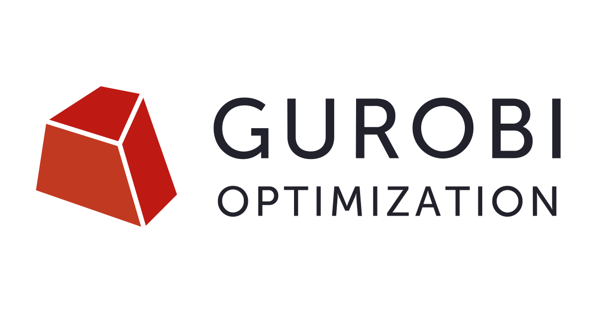

## Gurobi

### What is Gurobi?

[Gurobi](https://www.gurobi.com/) is a state-of-the-art commercial optimization solver for mathematical programming, widely used in academia and industry for solving large-scale linear programming (LP), mixed-integer linear programming (MILP), quadratic programming (QP), mixed-integer quadratic programming (MIQP), and related optimization problems. It is designed for high performance on modern multicore and distributed computing systems, making it well suited for research workloads on the Cannon cluster. Gurobi provides interfaces for Python, C/C++, Java, MATLAB, R, and other environments, enabling seamless integration with scientific computing, data science, and engineering workflows.

* [Using Gurobi with Matlab](Matlab/)
* [Using Gurobi with Python](Python/)
