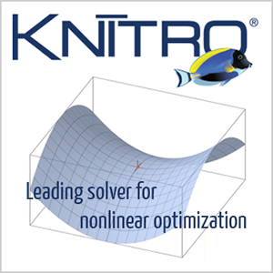

## Knitro


### What is Knitro?

[Artelys Knitro](https://www.artelys.com/solvers/knitro/) is a leading optimization solver for difficult large-scale nonlinear problems. Four state-of-the-art algorithms and many user options enable users to customize Artelys Knitro to control performance tuning. Each algorithm addresses the full range of continuous or smooth nonlinear optimization problems, and each is constructed for maximal large-scale efficiency. Many respected companies in finance, energy, engineering, telecommunications, and other high-tech and scientific industries rely on Artelys Knitro to solve their most demanding problems.

Artelys Knitro is easily interfaced to MATLAB via its MEX interface. Artelys Knitro uses syntax similar to Optimization Toolbox functions and provides additional flexibility and more options for very difficult and large-scale problems.

This example illustrates using Knitro with its MATLAB interface in a batch mode on the [FAS Cannon cluster](https://www.rc.fas.harvard.edu/about/cluster-architecture) at Harvard University. 

### Contents:

* <code>knitro_test.m</code>: MATLAB source code
* <code>run.sbatch</code>: Batch job submission script for sending the job to the queue
* <code>knitro_test.out</code>: Example STD output

### Matlab source code:

```matlab
%=====================================================================
% Program: knitro_test.m
%          Program illustrates use of Knitro with MATLAB
%=====================================================================

% objective to minimize
obj = @(x) 1000 - x(1)^2 - 2*x(2)^2 - x(3)^2 - x(1)*x(2) - x(1)*x(3);

% No nonlinear equality constraints.
ceq  = [];

% Specify nonlinear inequality constraint to be nonnegative
c2 =  @(x) x(1)^2 + x(2)^2 + x(3)^2 - 25;

% "nlcon" should return [c, ceq] with c(x) <= 0 and ceq(x) = 0
% so we need to negate the inequality constraint above
nlcon = @(x)deal(-c2(x), ceq);

% Initial point
x0  = [2; 2; 2];

% No linear inequality contraint ("A*x <= b")
A = [];
b = [];

% Since the equality constraint "c1" is linear, specify it here  ("Aeq*x = beq")
Aeq = [8 14 7];
beq = [56];

% lower and upper bounds
lb = zeros(3,1);
ub = [];

% solver call
x = knitromatlab(obj, x0, A, b, Aeq, beq, lb, ub, nlcon);
```

### Example batch-job submission script:

```bash
#!/bin/bash
#SBATCH -J knitro_test
#SBATCH -o knitro_test.out
#SBATCH -e knitro_test.err
#SBATCH -p test
#SBATCH -N 1
#SBATCH -n 1
#SBATCH -c 1
#SBATCH -t 30
#SBATCH --mem=40000

# --- Load required modules ---
module load matlab/R2021a-fasrc01
module load knitro/10.1.2-fasrc01

# --- Run the program ---
srun -n 1 -c 1 matlab -nosplash -nodesktop -nodisplay -r "knitro_test;exit"
```
                       
### Example usage:

```bash
module load matlab/R2021a-fasrc01
module load knitro/10.1.2-fasrc01
sbatch run.sbatch
```

### Example output:

Upon the job completion the results will be in the <code>knitro_test.out</code> file.

```
$ cat knitro_test.out
                            < M A T L A B (R) >
                  Copyright 1984-2021 The MathWorks, Inc.
                  R2021a (9.10.0.1602886) 64-bit (glnxa64)
                             February 17, 2021

 
To get started, type doc.
For product information, visit www.mathworks.com.
 

=======================================
           Academic License
       (NOT FOR COMMERCIAL USE)
         Artelys Knitro 10.1.2
=======================================

Knitro presolve eliminated 0 variables and 0 constraints.

algorithm:            1
gradopt:              4
hessopt:              2
honorbnds:            1
maxit:                10000
outlev:               1
par_concurrent_evals: 0
Knitro changing bar_initpt from AUTO to 3.
Knitro changing bar_murule from AUTO to 4.
Knitro changing bar_penaltycons from AUTO to 1.
Knitro changing bar_penaltyrule from AUTO to 2.
Knitro changing bar_switchrule from AUTO to 2.
Knitro changing linsolver from AUTO to 2.

Problem Characteristics                    ( Presolved)
-----------------------
Objective goal:  Minimize
Number of variables:                     3 (         3)
    bounded below:                       3 (         3)
    bounded above:                       0 (         0)
    bounded below and above:             0 (         0)
    fixed:                               0 (         0)
    free:                                0 (         0)
Number of constraints:                   2 (         2)
    linear equalities:                   1 (         1)
    nonlinear equalities:                0 (         0)
    linear inequalities:                 0 (         0)
    nonlinear inequalities:              1 (         1)
    range:                               0 (         0)
Number of nonzeros in Jacobian:          6 (         6)
Number of nonzeros in Hessian:           6 (         6)

EXIT: Locally optimal solution found.

Final Statistics
----------------
Final objective value               =   9.36000000000340e+02
Final feasibility error (abs / rel) =   7.11e-15 / 5.47e-16
Final optimality error  (abs / rel) =   2.25e-09 / 1.41e-10
# of iterations                     =          9 
# of CG iterations                  =          0 
# of function evaluations           =         44
# of gradient evaluations           =          0
Total program time (secs)           =       0.30073 (     0.167 CPU time)
Time spent in evaluations (secs)    =       0.06753

===============================================================================
```

### References:

* [Official Knitro User's Manual](https://www.artelys.com/tools/knitro_doc/index.html)
* [Knitro / MATLAB reference](https://www.artelys.com/tools/knitro_doc/3_referenceManual/knitromatlabReference.html)

