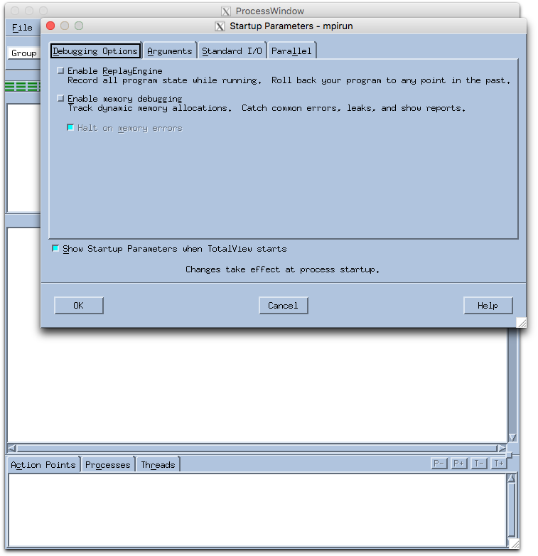
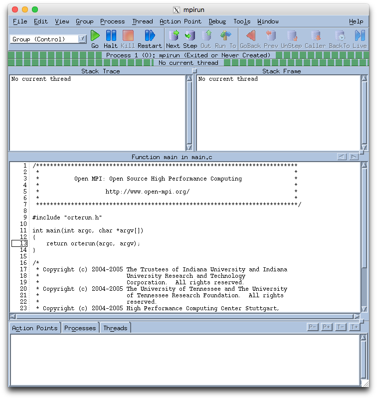
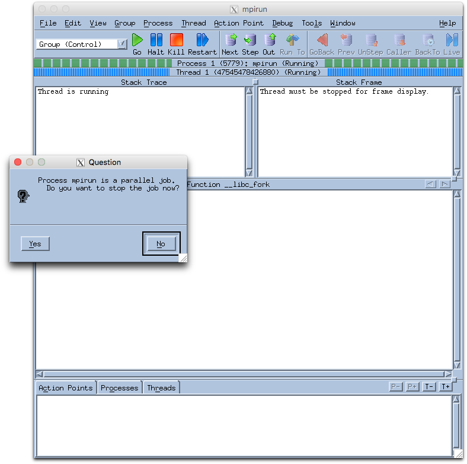
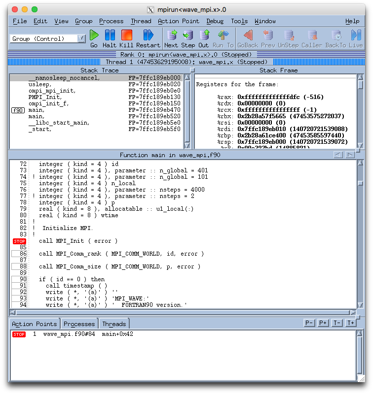

#### Introduction:

[TotalView](http://www.roguewave.com/products/totalview.aspx) from [Rogue Wave Software](http://www.roguewave.com) is a debugging tool particularly suitable for debugging of parallel applications. It provides both X Window-based Graphical User Interface (GUI) and command line interface (CLI) environments for debugging. This example illustrates how to use TotalView on Odyssey.

WAVE_MPI solves the wave equation in parallel using MPI.

#### Contents:

<code>wave_mpi.f90</code>: Example MPI Fortran code
                       
#### Using TotalView on Odyssey:

To use Totalview on Odyssey, first you need to load the Totalview module-file to set the correct environment settings. This is done most conveniently by placing the command <tt>module load totalview/8.8.0.1-fasrc01</tt> in your <tt>.bashrc</tt> startup file.

In order to debug MPI parallel applications, in addition to the TotalView software module, you need also to load appropriate Compiler and MPI modules, for instance:

```bash
module load totalview/8.8.0.1-fasrc01
module load intel/17.0.2-fasrc01
module load openmpi/2.1.0-fasrc01
```

In order to use Totalview, your code must be compiled with the -g option. It is also recommended to suppress any level of optimization by compiling your application with the -O0 option.

```bash
Fortran 77: [username@rclogin04 ~]$ mpif77 -g -O0 -o tv_test.x tv_test.f
Fortran 90: [username@rclogin04 ~]$ mpif90 -g -O0 -o tv_test.x tv_test.f90
C: [username@rclogin04 ~]$ mpicc -g -O0 -o tv_test.x tv_test.c
C++: [username@rclogin04 ~]$ mpicxx -g -O0 -o tv_test.x tv_test.cpp
```
**Note:** The instrumented executable should be used for debugging only, not in production runs. After your code is up and running, for actual production runs you need to recompile your application with the desired level of optimization.

To use Totalview, you need to log in with an X window forwarding enabled. If you access Odyssey from a Unix-like system, you have to use the -X or -Y option to ssh. The -Y option often works better for Mac OS X. For instructions on how to enable X11 forwarding when accessing Odyssey from Windows click [here](https://www.rc.fas.harvard.edu/kb/high-performance-computing/using-windowsmac-and-x11-forwarding).

```
ssh -l username login.rc.fas.harvard.edu -X
```

After loading the Totalview module and compiling with the -g option, request an interactive session:

```bash
[username@rclogin04 ~]$ srun -p interact -n 4 -t 00-01:00 --pty --x11=first --mem-per-cpu=4000 bash
[username@holy2a18306 ~]$
```
This will start an interactive (bash) shell and load the module-files included in your startup .bashrc file. Then launch the debugger with one of the following commands:

```
totalview mpirun -a -np 4 ./tv_test.x
```

or

```
mpirun -np 4 -tv ./tv_test.x
```

or

```
mpirun -np 4 -debug ./tv_test.x
```

The TotalView startup GUI will pop up and display debugging startup parameters, as illustrated below. After reviewing them, click OK.



Go to the process window, and click the "Go" button.



**Note:** At this stage Totalview displays the source code of the mpirun function, NOT the source code of your application.

After you click "GO" in the process window, a small window will pop up, asking whether the mpirun process should be stopped. Click "Yes".



Then, in the "Stack Trace" section of the process window you should see the name of the main program of your application. You can now display the source code by clicking on it. To start debugging, create a break point by clicking on a line number in the source pane, and click "Go". After that, you can use other buttons ("Next", "Step", "Out", etc).



#### References:

* [Official Totalview Documentation](http://www.roguewave.com/support/product-documentation/totalview-family.aspx#totalview)
* [Totalview tutorial, Lawrence Livermore National Laboratory](https://computing.llnl.gov/tutorials/totalview)

#### Example Output:

```
[pkrastev@hp2203 TotalView]$ mpirun -np 4 ./wave_mpi.x 
12 April 2017   5:50:46.779 PM

MPI_WAVE:
  FORTRAN90 version.
  Estimate a solution of the wave equation using MPI.

  Using  4 processes.
  Using a total of    401 points.
  Using   4000 time steps of size   0.125000E-02
  Computing final solution at time    5.00000    

    I      X     F(X)   Exact

    0   0.000   0.000   0.000
    1   0.003   0.016   0.016
    2   0.005   0.031   0.031
    3   0.007   0.047   0.047
    4   0.010   0.063   0.063
    5   0.013   0.078   0.078
    6   0.015   0.094   0.094
    7   0.018   0.110   0.110
    8   0.020   0.125   0.125
    9   0.022   0.141   0.141
   10   0.025   0.156   0.156
   11   0.028   0.172   0.172
   12   0.030   0.187   0.187
   13   0.033   0.203   0.203
   14   0.035   0.218   0.218
   15   0.037   0.233   0.233
   16   0.040   0.249   0.249
   17   0.043   0.264   0.264
   18   0.045   0.279   0.279
   19   0.048   0.294   0.294
   20   0.050   0.309   0.309
   21   0.052   0.324   0.324
   22   0.055   0.339   0.339
   23   0.058   0.353   0.353
   24   0.060   0.368   0.368
   25   0.062   0.383   0.383
   26   0.065   0.397   0.397
   27   0.068   0.412   0.412
   28   0.070   0.426   0.426
   29   0.072   0.440   0.440
   30   0.075   0.454   0.454
   31   0.077   0.468   0.468
   32   0.080   0.482   0.482
   33   0.083   0.495   0.495
   34   0.085   0.509   0.509
   35   0.087   0.523   0.522
   36   0.090   0.536   0.536
   37   0.092   0.549   0.549
   38   0.095   0.562   0.562
   39   0.098   0.575   0.575
   40   0.100   0.588   0.588
   41   0.102   0.600   0.600
   42   0.105   0.613   0.613
   43   0.107   0.625   0.625
   44   0.110   0.637   0.637
   45   0.113   0.649   0.649
   46   0.115   0.661   0.661
   47   0.117   0.673   0.673
   48   0.120   0.685   0.685
   49   0.122   0.696   0.696
   50   0.125   0.707   0.707
   51   0.128   0.718   0.718
   52   0.130   0.729   0.729
   53   0.133   0.740   0.740
   54   0.135   0.750   0.750
   55   0.138   0.760   0.760
   56   0.140   0.771   0.771
   57   0.142   0.780   0.780
   58   0.145   0.790   0.790
   59   0.147   0.800   0.800
   60   0.150   0.809   0.809
   61   0.152   0.818   0.818
   62   0.155   0.827   0.827
   63   0.158   0.836   0.836
   64   0.160   0.844   0.844
   65   0.163   0.853   0.853
   66   0.165   0.861   0.861
   67   0.168   0.869   0.869
   68   0.170   0.876   0.876
   69   0.172   0.884   0.884
   70   0.175   0.891   0.891
   71   0.177   0.898   0.898
   72   0.180   0.905   0.905
   73   0.182   0.911   0.911
   74   0.185   0.918   0.918
   75   0.188   0.924   0.924
   76   0.190   0.930   0.930
   77   0.193   0.935   0.935
   78   0.195   0.941   0.941
   79   0.198   0.946   0.946
   80   0.200   0.951   0.951
   81   0.203   0.956   0.956
   82   0.205   0.960   0.960
   83   0.207   0.965   0.965
   84   0.210   0.969   0.969
   85   0.212   0.972   0.972
   86   0.215   0.976   0.976
   87   0.217   0.979   0.979
   88   0.220   0.982   0.982
   89   0.223   0.985   0.985
   90   0.225   0.988   0.988
   91   0.228   0.990   0.990
   92   0.230   0.992   0.992
   93   0.233   0.994   0.994
   94   0.235   0.996   0.996
   95   0.237   0.997   0.997
   96   0.240   0.998   0.998
   97   0.242   0.999   0.999
   98   0.245   1.000   1.000
   99   0.247   1.000   1.000
  100   0.250   1.000   1.000
  101   0.253   1.000   1.000
  102   0.255   1.000   1.000
  103   0.258   0.999   0.999
  104   0.260   0.998   0.998
  105   0.263   0.997   0.997
  106   0.265   0.996   0.996
  107   0.268   0.994   0.994
  108   0.270   0.992   0.992
  109   0.273   0.990   0.990
  110   0.275   0.988   0.988
  111   0.278   0.985   0.985
  112   0.280   0.982   0.982
  113   0.282   0.979   0.979
  114   0.285   0.976   0.976
  115   0.287   0.972   0.972
  116   0.290   0.969   0.969
  117   0.292   0.965   0.965
  118   0.295   0.960   0.960
  119   0.297   0.956   0.956
  120   0.300   0.951   0.951
  121   0.302   0.946   0.946
  122   0.305   0.941   0.941
  123   0.307   0.935   0.935
  124   0.310   0.930   0.930
  125   0.312   0.924   0.924
  126   0.315   0.918   0.918
  127   0.318   0.911   0.911
  128   0.320   0.905   0.905
  129   0.323   0.898   0.898
  130   0.325   0.891   0.891
  131   0.328   0.884   0.884
  132   0.330   0.876   0.876
  133   0.333   0.869   0.869
  134   0.335   0.861   0.861
  135   0.338   0.853   0.853
  136   0.340   0.844   0.844
  137   0.343   0.836   0.836
  138   0.345   0.827   0.827
  139   0.347   0.818   0.818
  140   0.350   0.809   0.809
  141   0.352   0.800   0.800
  142   0.355   0.790   0.790
  143   0.357   0.780   0.780
  144   0.360   0.771   0.771
  145   0.362   0.760   0.760
  146   0.365   0.750   0.750
  147   0.367   0.740   0.740
  148   0.370   0.729   0.729
  149   0.372   0.718   0.718
  150   0.375   0.707   0.707
  151   0.378   0.696   0.696
  152   0.380   0.685   0.685
  153   0.383   0.673   0.673
  154   0.385   0.661   0.661
  155   0.388   0.649   0.649
  156   0.390   0.637   0.637
  157   0.393   0.625   0.625
  158   0.395   0.613   0.613
  159   0.398   0.600   0.600
  160   0.400   0.588   0.588
  161   0.403   0.575   0.575
  162   0.405   0.562   0.562
  163   0.407   0.549   0.549
  164   0.410   0.536   0.536
  165   0.412   0.522   0.522
  166   0.415   0.509   0.509
  167   0.417   0.495   0.495
  168   0.420   0.482   0.482
  169   0.422   0.468   0.468
  170   0.425   0.454   0.454
  171   0.427   0.440   0.440
  172   0.430   0.426   0.426
  173   0.432   0.412   0.412
  174   0.435   0.397   0.397
  175   0.438   0.383   0.383
  176   0.440   0.368   0.368
  177   0.443   0.353   0.353
  178   0.445   0.339   0.339
  179   0.448   0.324   0.324
  180   0.450   0.309   0.309
  181   0.453   0.294   0.294
  182   0.455   0.279   0.279
  183   0.458   0.264   0.264
  184   0.460   0.249   0.249
  185   0.463   0.233   0.233
  186   0.465   0.218   0.218
  187   0.468   0.203   0.203
  188   0.470   0.187   0.187
  189   0.472   0.172   0.172
  190   0.475   0.156   0.156
  191   0.477   0.141   0.141
  192   0.480   0.125   0.125
  193   0.482   0.110   0.110
  194   0.485   0.094   0.094
  195   0.487   0.078   0.078
  196   0.490   0.063   0.063
  197   0.492   0.047   0.047
  198   0.495   0.031   0.031
  199   0.497   0.016   0.016
  200   0.500  -0.000  -0.000
  201   0.502  -0.016  -0.016
  202   0.505  -0.031  -0.031
  203   0.507  -0.047  -0.047
  204   0.510  -0.063  -0.063
  205   0.512  -0.078  -0.078
  206   0.515  -0.094  -0.094
  207   0.517  -0.110  -0.110
  208   0.520  -0.125  -0.125
  209   0.522  -0.141  -0.141
  210   0.525  -0.156  -0.156
  211   0.527  -0.172  -0.172
  212   0.530  -0.187  -0.187
  213   0.532  -0.203  -0.203
  214   0.535  -0.218  -0.218
  215   0.537  -0.233  -0.233
  216   0.540  -0.249  -0.249
  217   0.542  -0.264  -0.264
  218   0.545  -0.279  -0.279
  219   0.547  -0.294  -0.294
  220   0.550  -0.309  -0.309
  221   0.552  -0.324  -0.324
  222   0.555  -0.339  -0.339
  223   0.557  -0.353  -0.353
  224   0.560  -0.368  -0.368
  225   0.562  -0.383  -0.383
  226   0.565  -0.397  -0.397
  227   0.568  -0.412  -0.412
  228   0.570  -0.426  -0.426
  229   0.573  -0.440  -0.440
  230   0.575  -0.454  -0.454
  231   0.578  -0.468  -0.468
  232   0.580  -0.482  -0.482
  233   0.583  -0.495  -0.495
  234   0.585  -0.509  -0.509
  235   0.588  -0.523  -0.522
  236   0.590  -0.536  -0.536
  237   0.593  -0.549  -0.549
  238   0.595  -0.562  -0.562
  239   0.598  -0.575  -0.575
  240   0.600  -0.588  -0.588
  241   0.603  -0.600  -0.600
  242   0.605  -0.613  -0.613
  243   0.608  -0.625  -0.625
  244   0.610  -0.637  -0.637
  245   0.613  -0.649  -0.649
  246   0.615  -0.661  -0.661
  247   0.618  -0.673  -0.673
  248   0.620  -0.685  -0.685
  249   0.623  -0.696  -0.696
  250   0.625  -0.707  -0.707
  251   0.627  -0.718  -0.718
  252   0.630  -0.729  -0.729
  253   0.632  -0.740  -0.740
  254   0.635  -0.750  -0.750
  255   0.637  -0.760  -0.760
  256   0.640  -0.771  -0.771
  257   0.642  -0.780  -0.780
  258   0.645  -0.790  -0.790
  259   0.647  -0.800  -0.800
  260   0.650  -0.809  -0.809
  261   0.652  -0.818  -0.818
  262   0.655  -0.827  -0.827
  263   0.657  -0.836  -0.836
  264   0.660  -0.844  -0.844
  265   0.662  -0.853  -0.853
  266   0.665  -0.861  -0.861
  267   0.667  -0.869  -0.869
  268   0.670  -0.876  -0.876
  269   0.672  -0.884  -0.884
  270   0.675  -0.891  -0.891
  271   0.677  -0.898  -0.898
  272   0.680  -0.905  -0.905
  273   0.682  -0.911  -0.911
  274   0.685  -0.918  -0.918
  275   0.688  -0.924  -0.924
  276   0.690  -0.930  -0.930
  277   0.693  -0.935  -0.935
  278   0.695  -0.941  -0.941
  279   0.698  -0.946  -0.946
  280   0.700  -0.951  -0.951
  281   0.703  -0.956  -0.956
  282   0.705  -0.960  -0.960
  283   0.708  -0.965  -0.965
  284   0.710  -0.969  -0.969
  285   0.713  -0.972  -0.972
  286   0.715  -0.976  -0.976
  287   0.718  -0.979  -0.979
  288   0.720  -0.982  -0.982
  289   0.723  -0.985  -0.985
  290   0.725  -0.988  -0.988
  291   0.728  -0.990  -0.990
  292   0.730  -0.992  -0.992
  293   0.733  -0.994  -0.994
  294   0.735  -0.996  -0.996
  295   0.738  -0.997  -0.997
  296   0.740  -0.998  -0.998
  297   0.743  -0.999  -0.999
  298   0.745  -1.000  -1.000
  299   0.748  -1.000  -1.000
  300   0.750  -1.000  -1.000
  301   0.752  -1.000  -1.000
  302   0.755  -1.000  -1.000
  303   0.757  -0.999  -0.999
  304   0.760  -0.998  -0.998
  305   0.762  -0.997  -0.997
  306   0.765  -0.996  -0.996
  307   0.767  -0.994  -0.994
  308   0.770  -0.992  -0.992
  309   0.772  -0.990  -0.990
  310   0.775  -0.988  -0.988
  311   0.777  -0.985  -0.985
  312   0.780  -0.982  -0.982
  313   0.782  -0.979  -0.979
  314   0.785  -0.976  -0.976
  315   0.787  -0.972  -0.972
  316   0.790  -0.969  -0.969
  317   0.792  -0.965  -0.965
  318   0.795  -0.960  -0.960
  319   0.797  -0.956  -0.956
  320   0.800  -0.951  -0.951
  321   0.802  -0.946  -0.946
  322   0.805  -0.941  -0.941
  323   0.807  -0.935  -0.935
  324   0.810  -0.930  -0.930
  325   0.812  -0.924  -0.924
  326   0.815  -0.918  -0.918
  327   0.818  -0.911  -0.911
  328   0.820  -0.905  -0.905
  329   0.823  -0.898  -0.898
  330   0.825  -0.891  -0.891
  331   0.828  -0.884  -0.884
  332   0.830  -0.876  -0.876
  333   0.833  -0.869  -0.869
  334   0.835  -0.861  -0.861
  335   0.838  -0.853  -0.853
  336   0.840  -0.844  -0.844
  337   0.843  -0.836  -0.836
  338   0.845  -0.827  -0.827
  339   0.848  -0.818  -0.818
  340   0.850  -0.809  -0.809
  341   0.853  -0.800  -0.800
  342   0.855  -0.790  -0.790
  343   0.858  -0.780  -0.780
  344   0.860  -0.771  -0.771
  345   0.863  -0.760  -0.760
  346   0.865  -0.750  -0.750
  347   0.868  -0.740  -0.740
  348   0.870  -0.729  -0.729
  349   0.873  -0.718  -0.718
  350   0.875  -0.707  -0.707
  351   0.877  -0.696  -0.696
  352   0.880  -0.685  -0.685
  353   0.882  -0.673  -0.673
  354   0.885  -0.661  -0.661
  355   0.887  -0.649  -0.649
  356   0.890  -0.637  -0.637
  357   0.892  -0.625  -0.625
  358   0.895  -0.613  -0.613
  359   0.897  -0.600  -0.600
  360   0.900  -0.588  -0.588
  361   0.902  -0.575  -0.575
  362   0.905  -0.562  -0.562
  363   0.907  -0.549  -0.549
  364   0.910  -0.536  -0.536
  365   0.912  -0.522  -0.522
  366   0.915  -0.509  -0.509
  367   0.917  -0.495  -0.495
  368   0.920  -0.482  -0.482
  369   0.922  -0.468  -0.468
  370   0.925  -0.454  -0.454
  371   0.927  -0.440  -0.440
  372   0.930  -0.426  -0.426
  373   0.932  -0.412  -0.412
  374   0.935  -0.397  -0.397
  375   0.938  -0.383  -0.383
  376   0.940  -0.368  -0.368
  377   0.943  -0.353  -0.353
  378   0.945  -0.339  -0.339
  379   0.948  -0.324  -0.324
  380   0.950  -0.309  -0.309
  381   0.953  -0.294  -0.294
  382   0.955  -0.279  -0.279
  383   0.958  -0.264  -0.264
  384   0.960  -0.249  -0.249
  385   0.963  -0.233  -0.233
  386   0.965  -0.218  -0.218
  387   0.968  -0.203  -0.203
  388   0.970  -0.187  -0.187
  389   0.973  -0.172  -0.172
  390   0.975  -0.156  -0.156
  391   0.978  -0.141  -0.141
  392   0.980  -0.125  -0.125
  393   0.983  -0.110  -0.110
  394   0.985  -0.094  -0.094
  395   0.988  -0.078  -0.078
  396   0.990  -0.063  -0.063
  397   0.993  -0.047  -0.047
  398   0.995  -0.031  -0.031
  399   0.998  -0.016  -0.016
  400   1.000   0.000   0.000

  Elapsed wallclock time was   0.726168E-02 seconds.

WAVE_MPI:
  Normal end of execution.

12 April 2017   5:50:46.798 PM
```