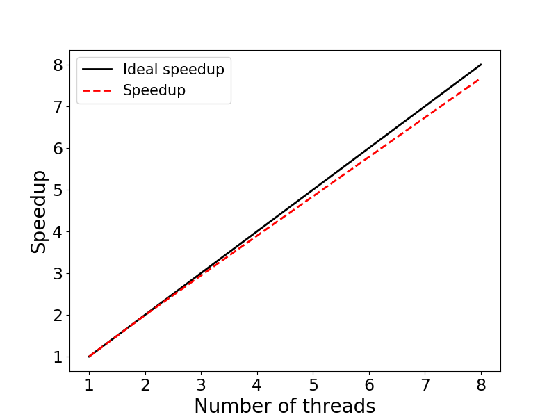

### Purpose:

**Speedup -** This example illustrates evaluating the speedup of parallel applications. The specific example is an OpenMP implementation of Monte-Carlo algorithm for calculating PI

### Contents:

* <code>omp_pi.c</code>: C source code
* <code>omp_pi.dat</code>: Output file
* <code>Makefile</code>: Makefile to compile the code
* <code>sbatch.run</code>: Batch-job submission script
* <code>speedup.py</code>: Python code to generate speedup figure
* <code>speedup.png</code>: Speedup figure

### Example Usage:

```bash
source new-modules.sh				# Set up Harvard's LMOD environment
module load gcc/4.8.2-fasrc01		# Load required software modules
make             					# Compile
sbatch sbatch.run 					# Send the job to the queue
```

### Source Code:

```c
/*
  PROGRAM: omp_pi.c
  DESCRIPTION: 
     OpenMP implementation of Monte-Carlo algorithm
     for calculating PI
  USAGE: omp_pi.x <number_of_samples> <number_of_threads>
 */
#include <stdio.h>
#include <stdlib.h>
#include <omp.h>
#include <math.h>

int main (int argc, char *argv[]) {
  int i, count, samples, nthreads, seed;
  struct drand48_data drand_buf;
  double x, y, z;
  double t0, t1, tf, PI;
  
  samples  = atoi(argv[1]);       // Number of sumples
  nthreads = atoi(argv[2]);
  omp_set_num_threads (nthreads); // Set number of threads

  printf("Number of threads: %2i\n", nthreads);

  t0 = omp_get_wtime();
  count = 0;

#pragma omp parallel private(i, x, y, z, seed, drand_buf) shared(samples)
  {
    seed = 1202107158 + omp_get_thread_num() * 1999;
    srand48_r (seed, &drand_buf);
    
#pragma omp for reduction(+:count)
    for (i=0; i<samples; i++) {
      drand48_r (&drand_buf, &x);
      drand48_r (&drand_buf, &y);
      z = x*x + y*y;
      if ( z <= 1.0 ) count++;
    }
  }

  t1 = omp_get_wtime();
  tf = t1 - t0;
  
  // Estimate PI............................................
  PI =  4.0*count/samples;

  printf("Exact value of PI: %7.5f\n", M_PI);
  printf("Estimate of PI:    %7.5f\n", PI);
  printf("Time: %7.2f sec.\n\n", tf);
  return 0;
}
}
```

### Batch-Job Submission Script:

```bash
#!/bin/bash
#SBATCH -J omp_pi
#SBATCH -o omp_pi.out
#SBATCH -e omp_pi.err
#SBATCH -p shared
#SBATCH -t 0-00:30
#SBATCH -N 1
#SBATCH -c 8
#SBATCH --mem=4000

# Set up environment
WORK_DIR=/scratch/${USER}/${SLURM_JOB_ID}
PRO=omp_pi
### or WORK_DIR=/n/regal/cs205/${USER}/${SLURM_JOB_ID}
mkdir -pv ${WORK_DIR}
cd $WORK_DIR
cp ${SLURM_SUBMIT_DIR}/${PRO}.x .
rm -rf ${PRO}.dat
touch ${PRO}.dat

# Load required software modules
source new-modules.sh
module load gcc/4.8.2-fasrc01

# Run program with 1, 2, 4, and 8 OpenMP threads
for i in 1 2 4 8
do
    echo "Number of threads: ${i}"
    srun -c ${i} ./${PRO}.x 1000000000 ${i} >> ${PRO}.dat
    echo " "
done

# Copy back the result and clean up
cp *.dat ${SLURM_SUBMIT_DIR}
rm -rf ${WORK_DIR}
```

### Example Output:

```bash
> cat omp_pi.dat 
Number of threads:  1
Exact value of PI: 3.14159
Estimate of PI:    3.14161
Time:   15.97 sec.

Number of threads:  2
Exact value of PI: 3.14159
Estimate of PI:    3.14159
Time:    7.98 sec.

Number of threads:  4
Exact value of PI: 3.14159
Estimate of PI:    3.14165
Time:    4.00 sec.

Number of threads:  8
Exact value of PI: 3.14159
Estimate of PI:    3.14153
Time:    2.13 sec.
```

### Speedup:



