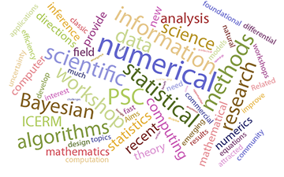

## Recipes and Use Cases

Various recipes, use cases and workflow examples.

### Contents:

* [Recipe 1](Recipe1): Particle Swarm Optimization (PSO) with Rosenbrock objective function (R implementation using the [pso](https://cran.r-project.org/web/packages/pso/index.html) package - **serial**)
* [Recipe 2](Recipe2): PSO with Rosenbrock objective function (R implementation using the [metaheuristicOpt](https://cran.r-project.org/web/packages/metaheuristicOpt/index.html) package - **serial**)
* [Recipe 3](Recipe3): Calling FORTRAN executable from Python script
* [Recipe 4](Recipe4): Using the GUROBI optimization solver with a Python interface