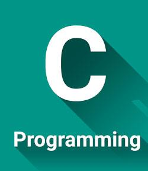

## C Programming Language


### Purpose:

Example of using C on the Harvard University FAS cluster. The specific
example compute the integer sum from 1 to N, where N is a number read
from the command line.

### Contents:

* <code>sum.c</code>: C source code
* <code>run.sbatch</code>: Example batch-job submission script
* <code>c_test_job.out</code>: STD output file

### Compile:

You can compile a C code using either a GNU or an Intel compiler. We
recommend jumping to a compute node for compiling a C program as the
compilation could take up to few seconds to a minute depending on the
complexity of the code. Additionally, it is best to utilize the `test`
partition to compile and test a program before executing its
production run on the cluster as a batch-job.

Request a compute node on the `test` partition, e.g.:
```bash
salloc -p test --nodes=1 --cpus-per-task=2 --mem=4GB --time=00:01:00
```

**GNU gcc compiler**

To get a list of currently available GNU compilers on the cluster,
execute:
```bash
module spider gcc
```

The default GNU compiler is typically the latest compiler version on
the cluster and can be loaded using `module load gcc`

For this example, we will load a specific version of the GNU compiler
and will compile the code using the `O2` optimization flag, e.g.,
```bash
module load gcc/9.5.0-fasrc01
gcc -O2 -o sum.x sum.c
``` 

**Intel icc compiler**

To get a list of currently available Intel compilers on the cluster,
execute:
```bash
module spider intel
```
To compile using a specific version of the Intel compiler, execute:
```bash
module load intel/23.0.0-fasrc01
icc -O2 -o sum.x sum.c
``` 

### C source code:

```c
//====================================================================
// Program: sum.c
//          Computes integer sum from 1 to N where N is an integer
//          read from the command line
//
// Compile: gcc -O2 -o sum.x sum.c
//
// Usage:   ./sum.x N
//====================================================================
#include <stdio.h>
#include <stdlib.h>

// Main program.......................................................
int main(int argc, char *argv[] ){
  int i;
  int j;
  int n;
  n = atoi( argv[1] );
  printf("%s %d \n", "Welcome! This program prints out the sum of 1 to", n);
  j = 0;
  for ( i = 1; i <= n; i++ ){
    j = j + i;
  }
  printf("%s %d %s %d \n", "Sum of 1 to", n, "is", j);
  printf("%s \n", "End of program.");
  return 0;
}
```

### Example batch-job submission script:

It is best practice to compile a C code separately and then use the
executable, generated during compilation, in the production run using
the `sbatch` script. If possible, avoid including the compilation
command in the `sbatch` script, which will recompile the program every
time the job is submitted. If any changes are made to the source code,
then compile the source code separately, and then submit the
production run as a batch-job.


```bash
#!/usr/bin/env bash
#SBATCH -J c_test_job
#SBATCH -o c_test_job.out
#SBATCH -e c_test_job.err
#SBATCH -p shared
#SBATCH -N 1
#SBATCH -c 1
#SBATCH -t 0-00:30
#SBATCH --mem=2G

# Load required software modules
module load gcc/9.5.0-fasrc01

# Run program
./sum.x 100
```

### Submit job:

```bash
sbatch run.sbatch
```

### Example output:

```
$ cat c_test_job.out
Welcome! This program prints out the sum of 1 to 100 
Sum of 1 to 100 is 5050 
End of program. 
```