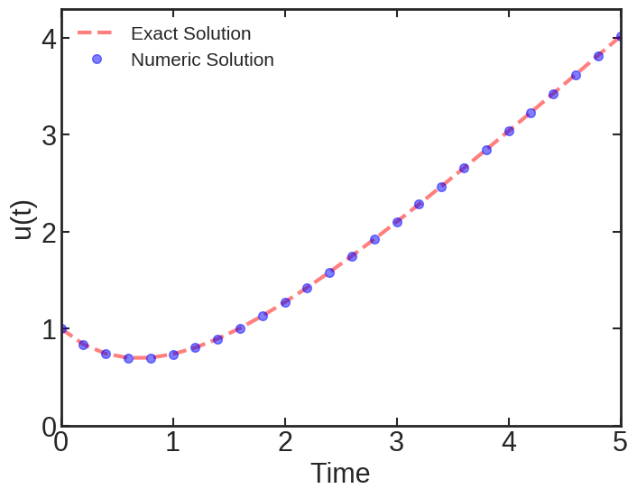

### Purpose:

This example illustrates solving differential equations numerically in Julia. Specifically, it solves an ODE after an example taken from [this](https://sam-dolan.sites.sheffield.ac.uk/mas212-course/sample-notebooks/ode_example) Python notebook, using [DifferentialEquations.jl](https://docs.sciml.ai/DiffEqDocs/stable/)


### Contents:

* <code>ode\_test.jl</code>: Julia source code
* <code>run.sbatch</code>: Batch-job submission script
* <code>results.dat</code>: Numeric results
* <code>figure.png</code>: Figure of ODE's solution
* <code>figure.py</code>: Python script for generating the figure

### Julia code:

```julia
#++++++++++++++++++++++++++++++++++++++++++++++++++++++++++++++++++++
# Program: ode_test.jl 
#++++++++++++++++++++++++++++++++++++++++++++++++++++++++++++++++++++
using DifferentialEquations
using SimpleDiffEq
using Printf
using Plots
using Plots.PlotMeasures

# --- Define the problem ---
f(u, p, t) = t - u
u0 = 1.0             # Initial conditions
tspan = (0.0, 5.0)   # Time span
prob = ODEProblem(f, u0, tspan)

# --- Solve the problem ---
dt  = 0.2
alg = RK4()
sol = solve(prob, alg, saveat=dt)

# --- Exact solution ---
function f_ex(t)
   f = t - 1.0 + ( 2.0 * exp(-t) )
   return f
end

# --- Print out solution ---
fname = "results.dat"
fo = open(fname, "w")
println(fo, "   Time     Numeric     Exact   ")
println(fo, " ------------------------------ ")
for i = 1: size(sol.t)[1]
   x = sol.t[i]
   y = sol.u[i]
   y_exact = f_ex(x)
   @printf(fo, "%8.4f %10.6f %10.6f\n", x, y, y_exact)
end
close(fo)
```

> **Note:** You may need to install the `DifferentialEquations`, `SimpleDiffEq` and `Plots` packages. Use the following command inside the Julia REPL:

```julia
julia> using Pkg
julia> Pkg.add("DifferentialEquations")
julia> Pkg.add("SimpleDiffEq")
julia> Pkg.add("Plots")
```

### Example Batch-Job Submission Script:

```bash
#!/bin/bash
#SBATCH -J ode_test
#SBATCH -o ode_test.out
#SBATCH -e ode_test.err
#SBATCH -p test
#SBATCH -N 1
#SBATCH -c 1
#SBATCH -t 0-00:30
#SBATCH --mem=4G

# Set up Julia and run the program
export PATH=$PATH:/n/holylabs/LABS/jharvard_lab/Users/jharvard/software/julia-1.9.3/bin
srun -n 1 -c 1 julia ode_test.jl
```
**NOTE:** Please remember to point the `PATH` environmental variable to the actual location of your Julia installation.

### Example Usage:

```bash
sbatch run.sbatch
```

### Example Output:

```bash
$ cat results.dat 
   Time     Numeric     Exact   
 ------------------------------ 
  0.0000   1.000000   1.000000
  0.2000   0.837462   0.837462
  0.4000   0.740639   0.740640
  0.6000   0.697624   0.697623
  0.8000   0.698660   0.698658
  1.0000   0.735763   0.735759
  1.2000   0.802393   0.802388
  1.4000   0.893198   0.893194
  1.6000   1.003802   1.003793
  1.8000   1.130613   1.130598
  2.0000   1.270681   1.270671
  2.2000   1.421625   1.421606
  2.4000   1.581455   1.581436
  2.6000   1.748569   1.748547
  2.8000   1.921645   1.921620
  3.0000   2.099603   2.099574
  3.2000   2.281551   2.281524
  3.4000   2.466785   2.466747
  3.6000   2.654677   2.654647
  3.8000   2.844781   2.844742
  4.0000   3.036672   3.036631
  4.2000   3.230027   3.229991
  4.4000   3.424601   3.424555
  4.6000   3.620150   3.620104
  4.8000   3.816498   3.816459
  5.0000   4.013510   4.013476
```

### Figure of Solution:



### Python script for generating the figure:

```python
"""
Program: figure.py
"""
import os
import numpy as np
import matplotlib as mpl
import matplotlib.pyplot as plt
plt.style.use('seaborn-white')
from matplotlib.ticker import MultipleLocator, FormatStrFormatter

def rc_params():
    """Set rcParams for this plot"""
    params = {
        'axes.linewidth':2.0,
        'xtick.major.size':6.5,
        'xtick.major.width':1.5,
        'xtick.minor.size':3.5,
        'xtick.minor.width':1.5,
        'ytick.major.size':6.5,
        'ytick.major.width':1.5,
        'ytick.minor.size':3.5,
        'ytick.minor.width':1.5,
        'xtick.labelsize':22,
        'ytick.labelsize':22,
        'xtick.direction':'in',
        'ytick.direction':'in',
        'xtick.top':True,
        'ytick.right':True
        }
    mpl.rcParams.update(params)

# Set rcParams    
rc_params()

# Data
cwd = os.getcwd()
data_path = os.path.join(cwd, 'results.dat')

# Figure
fig_path  = os.path.join(cwd, 'figure.png')

# Load data
darr = np.loadtxt(data_path, skiprows=2)
t = darr[:,0]
y = darr[:,1]
y_ex = darr[:,2]

# Plot results
fig, ax = plt.subplots(figsize=(8,6))

p1, = ax.plot(t, y_ex, linewidth = 3.0, color="red", alpha=0.5,
              linestyle='--', label='Exact Solution')

p2, = ax.plot(t, y_ex, linewidth = 3.0, color="blue", alpha=0.5,
              marker='o', markersize=7, linestyle='', label='Numeric Solution')


plt.xlim([0.0, 5.0])
plt.ylim([0.0, 4.3])
plt.xlabel('Time', fontsize=22)
plt.ylabel('u(t)', fontsize=22)
plt.legend(fontsize=15, loc="upper left", shadow=True, fancybox=True)

plt.savefig(fig_path, format='png', dpi=100, bbox_inches='tight')
```

### References:

* [Official **DifferentialEquations.jl** Documentation](https://docs.sciml.ai/DiffEqDocs/stable/)