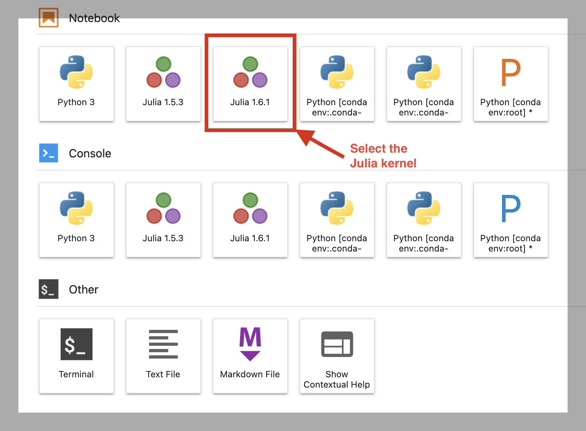
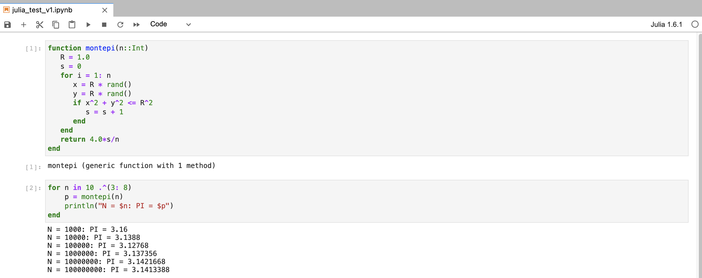

## Julia with Jupyter notebook on the cluster

This example illustrates the use of Julia kernel with Jupyter notebook
on the cluster.

### Contents:
* `Montepi-Julia.ipynb`: Notebook with Julia source code

### Install the IJulia package:

* Launch an interactive session and load the Python module:

```bash
[jharvard@holylogin01 ~]$ salloc -pty -p test --mem=4G -t 120
salloc: Pending job allocation 31172193
salloc: job 31172193 queued and waiting for resources
salloc: job 31172193 has been allocated resources
salloc: Granted job allocation 31172193
salloc: Waiting for resource configuration
salloc: Nodes holy7c26601 are ready for job

[jharvard@holy7c26601 ~]$ module load python/3.12.5-fasrc01
```

See our [documentation on
modules](https://docs.rc.fas.harvard.edu/kb/modules-intro/) to learn
more about how to use them on the cluster.

* Start `Julia` and install `IJulia` based on [these instructions](https://docs.rc.fas.harvard.edu/kb/julia/).


### Using the Julia kernel in Jupyter:

To learn how to schedule a Jupyter notebook or Jupyter Lab session via
our [interactive computing portal
(VDI)](https://vdi.rc.fas.harvard.edu/) follow [these
instructions](https://docs.rc.fas.harvard.edu/kb/vdi-apps/#Jupyter_Notebook).

From the the <code>Interactive Apps</code> dropdown menu in the VDI
portal select the <code>Jupyter notebook / Jupyterlab</code>
app. Choose the parameters of your Jupyter job and launch the
interactive session. Once the Jupyterlab interface opens, the
available kernels will be displayed.



> **NOTE:** The available Notebook kernels may differ in your
    environment depending on the actual <code>conda</code>
    environments and Julia versions installed in your user space. When
    you select the desired Julia kernel, the Julia notebook will open
    in a new tab in your browser.



### References:

* [Lmod modules](https://docs.rc.fas.harvard.edu/kb/modules-intro/)

* [Julia Programming Language](https://docs.rc.fas.harvard.edu/kb/julia/)

* [OOD](https://vdi.rc.fas.harvard.edu/)

* [OOD Jupyter Notebook](https://docs.rc.fas.harvard.edu/kb/vdi-apps/#Jupyter_Notebook)
