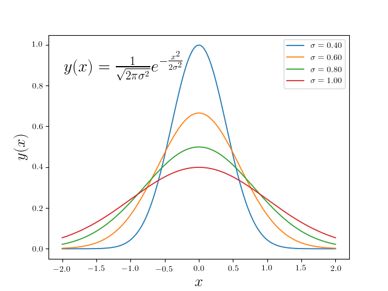

### Introduction:

Program illustrates text rendering with LaTeX and generating figures on the cluster. Please, notice you need to include the below lines in your Python script

```python
import matplotlib as mpl
mpl.use('Agg')
import matplotlib.pyplot as plt
```

### Contents:

(1) tex_demo.py: Python source code

(2) run.sbatch: Batch-job submission script for sending the job to the queue

(3) tex_demo.png: Output figure

### Example Usage:

```	bash
module load python/3.10.12-fasrc01
module load texlive/2018.06.15-fasrc01
sbatch run.sbatch
```
	
### Example Output:

The code generates a PNG figure, tex_demo.png



### Resources:

* [Matplotlib examples](https://matplotlib.org/stable/gallery/text_labels_and_annotations/tex_demo.html)
* [Customizing Matplotlib plots](https://matplotlib.org/stable/tutorials/introductory/customizing.html)
* [Matplotlib fonts](https://matplotlib.org/stable/tutorials/text/usetex.html)

### References:

* [Text rendering with LaTeX](http://matplotlib.org/users/usetex.html)
* [Writing mathematical expressions](http://matplotlib.org/users/mathtext.html#mathtext-tutorial)


