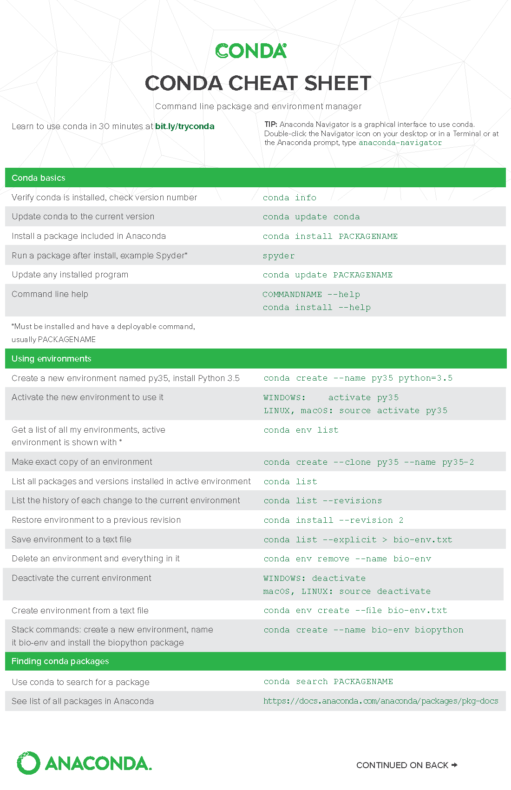
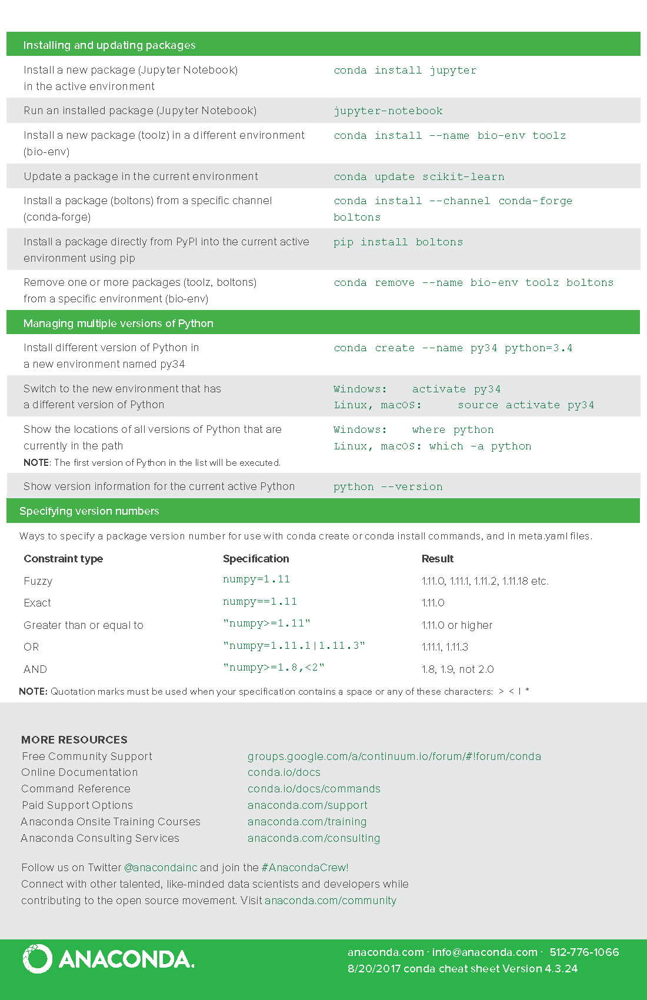

# Python (Anaconda) on the FASRC cluster


<br><br>

We like the [Anaconda](https://www.anaconda.com/products/distribution) python distribution from Continuum Analytics. It includes hundreds of the most popular packages for large-scale data processing, predictive analytics, and scientific computing (<code>numpy</code>, <code>scipy</code>,<code>ipython</code>, <code>pandas</code>, <code>scikit-learn</code>, <code>mpi4py</code>, etc.). It generally does a great job of including the latest versions of all the packages while maintaining compatibility between them all.

You can use Python and Anaconda on the cluster by running:

```bash
# Load the Python module
$ module load python/3.9.12-fasrc01

# Check Python version
$ python --version
Python 3.9.12
```

### Customizing the environment

Anaconda has a concept of *environments*; these are used to manage alternative package sets and versions. For example, if you want newer versions of some packages in the default environment, you can make a new environment with your customizations.

Load the base environment based on the version of python. To see the available versions, visit our [Portal Module Lookup](https://portal.rc.fas.harvard.edu/p3/build-reports/python).

**Create a new environment:**
```bash
$ conda create -n ENV_NAME PACKAGES
```

After loading the Anaconda module, you can use the following command to list the existing environments.

```bash
$ conda env list
```

[The Conda documentation](https://conda.io/projects/conda/en/latest/user-guide/tasks/manage-environments.html) has more details on different options. Use the following command to run the environment.

```bash
$ source activate ENV_NAME
```

If you want to use this environment all the time, add the above line to your <code>~/.bashrc</code> (or other appropriate shell config file) after the line that loads the module.

> **WARNING:** It is advised not to use <code>conda activate</code> but instead to use <code>source activate</code>.  <code>conda activate</code> will ask you to run <code>conda init</code> to modify your <code>.bashrc</code>. However doing this will permanently activate the conda environment, and will create problems later on.  Instead use <code>source activate</code>.  If you have run <code>conda</code> init and you want to undo it see this [document](https://docs.ycrc.yale.edu/clusters-at-yale/guides/conda/#conda-version-doesnt-match-the-module-loaded) for how.  If you want to maintain conda init see this [example](https://kb.iu.edu/d/axgp#conda-init).

At this point you can upgrade or install a package named PACKAGE with the following command (it’s the same whether installing or upgrading):

```bash
$ conda install PACKAGE
```

The commands <code>conda list</code> and <code>conda show</code> list installed and available packages, respectively. See the [the conda documentation](https://docs.conda.io/en/latest/index.html) for all the details. If the package is not available from conda, you can install it into your environment using pip:

```bash
$ pip install PACKAGE
```

> **Note:** Anaconda generally has the latest versions of all packages that are compatible. When you install an extra package, it will often update core packages like <code>numpy</code> and <code>scipy</code>; other packages may then downgrade them back. This is why we recommend sticking to the default environment if possible.

If you have problems updating a package that is already installed in the Anaconda environment, you might need to remove the package first and then reinstall it:

```bash
$ conda remove PACKAGE
$ conda install PACKAGE
```

This will often bypass update errors, especially with certain versions of <code>matplotlib</code>.

To stop using the custom environment, run the below command:
```bash
$ source deactivate
```

To remove old environments, you can run.

```bash
$ conda env remove -n ENV_NAME
```

### Submitting Jobs from within Conda Environments

Since Slurm clones the current environment into a submitted job, that means that jobs submitted with an active Conda Environment will have an odd environment which can lead to problems.  It is recommended that users add the 

```bash
--export=NONE
``` 

option to their submissions, this will prevent this cloning.  The submitted job will then run in a pristine environment.

### Choosing the Right Cluster Node to Install From

**If you are working on the Cannon cluster**

If you are installing packages in your home directory, it would be best to install from a Boston login node, not a Holyoke login node, because the cluster home directories are located in the Boston datacenter.  To ensure you are routed to a Boston login node when you ssh to the cluster, do the following:

```bash
ssh <your_username>@boslogin.rc.fas.harvard.edu
```

**If you are working on FASSE**

All FASSE login nodes are in Boston, so simply login to FASSE as normal:

```bash
ssh <your_username>@fasselogin.rc.fas.harvard.edu
```

## Useful Commands

The Conda Cheatsheet has other helpful commands. 




