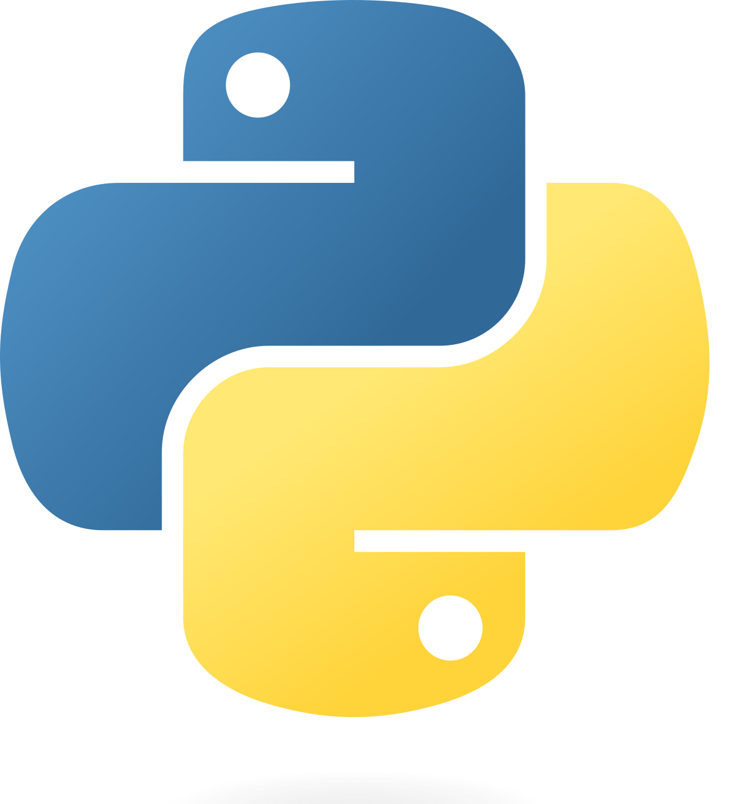

## Python

### What is Python?

[Python](https://www.python.org/) is a high-level, general-purpose programming language. Its design philosophy emphasizes code readability with the use of significant indentation.

Python is dynamically typed and garbage-collected. It supports multiple programming paradigms, including structured (particularly procedural), object-oriented and functional programming. It is often described as a "batteries included" language due to its comprehensive standard library.

### Content:

* CentOS7: [Python on the FASRC Cluster](./Python_FASRC.md)
* Rocky 8: [Speeding up conda environment management with Mamba](./Mamba.md)

### Examples:
* [Example 1](Example1/): Monte-Carlo calculation of PI
* [Example 2](Example2/): Text rendering With LaTeX

### References:

* [Official Python Documentation](https://docs.python.org/3/)
* [The Python Tutorial](https://docs.python.org/3/tutorial/index.html)
* [Software Carpentry Python Lesson](https://swcarpentry.github.io/python-novice-inflammation/index.html)
* [NumPy User Guide](https://numpy.org/doc/stable/user/index.html#user)
* [SciPy Official Documentation](https://docs.scipy.org/doc/scipy/index.html)
* [Matplotlib](https://matplotlib.org/)
* [Seaborn](https://seaborn.pydata.org/)
* [Pandas](https://pandas.pydata.org/)

