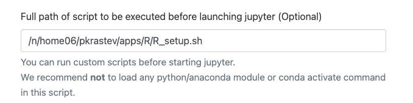
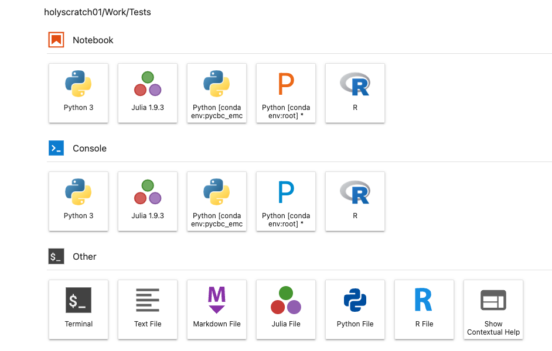
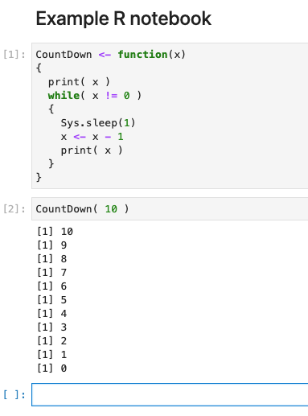
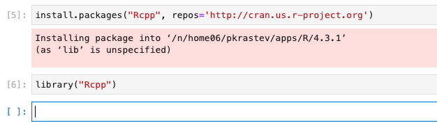

# Using R in Jupyter Notebooks

This document walks you  through the steps to set up and use R in Jupyter notebooks in the  [OpenOnDemand VDI portal](https://rcood.rc.fas.harvard.edu).

## Setting up R Kernel in Jupyter Lab

Complete the below steps to install R kernel and use it in Jupyter Lab:

* Load the required software modules, e.g.,
```bash
module load R/4.3.1-fasrc01
module load python/3.10.12-fasrc01
```

* Set up a local R library, e.g.,
```bash
mkdir $HOME/apps/R/4.3.1
export R_LIBS_USER=$HOME/apps/R/4.3.1
```

* Install `IRkernel` in R, e.g.,
```R
# --- Install IRkernel in R ---
install.packages("IRkernel")
# --- Run IRkernel in R ---
IRkernel::installspec()
```

* Copy the `IRkernel` directory to your `Jupyter` data directory. for example, if your `IRkernel` directory is in `$HOME/apps/R/4.3.1/IRkernel`, do:

```bash
cp -R $HOME/apps/R/4.3.1/IRkernel $HOME/.local/share/jupyter/
```

* Change the R path (the first "R") in the `$HOME/.local/share/jupyter/IRkernel/kernelspec /kernel.json` file to. e.g., 

```bash
/n/sw/helmod-rocky8/apps/Core/R/4.3.1-fasrc01/bin/R
```
or other `R`. For instance, if you use `R` that comes with the `R/4.3.1-fasrc01` software module, the `kernel.json` should look like the below:

```json 
{"argv": ["/n/sw/helmod-rocky8/apps/Core/R/4.3.1-fasrc01/bin/R", "--slave", "-e", "IRkernel::main()", "--args", "{connection_file}"],
 "display_name":"R",
 "language":"R"
}
```

## Use the R kernel in Jupyter Lab

* Pick up the Jupyter Lab app in the OpenOnDemand portal. Refer to [these](https://docs.rc.fas.harvard.edu/kb/virtual-desktop/) instructions.

* Set up OpenOnDemand to use the IRkernel

You will need to set up R to point to the you local R library, and also load an appropriate R software module. This can be done by preparing and executing a setup script prior launching the Jupyter app. For instance, you can prepare a script, e.g., `R_setup.sh`, with the below contents

```bash
#!/bin/bash
module load R/4.3.1-fasrc01
export R_LIBS_USER=${HOME}/apps/R/4.3.1
```
and put it in the `$HOME/apps/R` directory. Then, in the Jupyter Lab app menu, under the `Full path of script to be executed before launching jupyter (Optional)` option, enter the full path to your setup script as illustrated below:



* Launch the Jupyter Lab app

Upon launching the Jupyter Lab app, you should see the R kernel among the available options, e.g.,



* Use R in a Jupyter notebook, e.g.,



## Install R Packages in Jupyter

You can also install R packages directly in a Jupyter notebook, e.g.,

