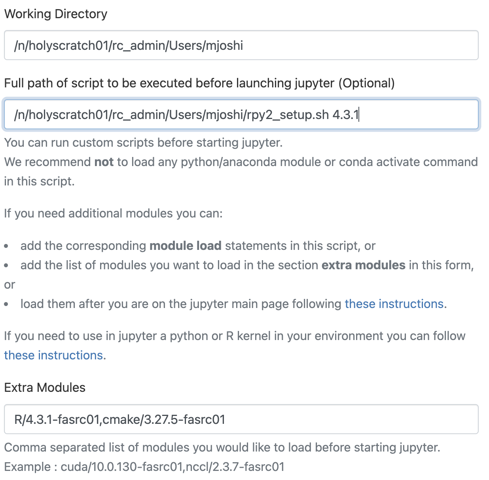
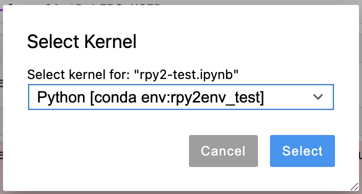

# Installing rpy2 package on Cannon

Here, we describe the steps to install the rpy2 package and use R in
Jupyter notebooks on the [OpenOnDemand VDI
portal](https://rcood.rc.fas.harvard.edu) using that package.

## Create a conda environment, install rpy2 package, and load that
   environment by selecting the corresponding kernel to start using R
   in the notebook

Create a conda environment and install the rpy2 package:

* Request a compute node:
```bash
salloc -p test -t 02:00:00 -n1 --mem 10000
```

* Load the required software module to create the conda environment:
```bash
module load python/3.10.12-fasrc01
```

* Choose a desired location to store the conda environment, e.g.,
  $HOME or your Lab directory, if you have access to it. As an
  example, we have chosen
```bash
/n/holyscratch01/rc_admin/Users/<username>
```

* Create a base conda environment with `python 3.11` at the desired
  location using the `--prefix` flag:
```bash
conda create --prefix=/n/holyscratch01/rc_admin/Users/<username>/rpy2env python=3.11 -y
```

* Activate conda environment:
```bash
source activate rpy2env
```

* Install other essential python packages, including `jupyter`:
```bash
conda install jupyter numpy matplotlib pandas scikit-learn scipy -y
```

* Install `[rpy2](https://rviews.rstudio.com/2022/05/25/calling-r-from-python-with-rpy2/)` package:
```bash
pip install rpy2
conda install r-ggplot2 
```

* Launch the Jupyter app on the OpenOnDemand VDI portal using
  [these](https://docs.rc.fas.harvard.edu/kb/virtual-desktop/)
  instructions.

You will need to set up R to point to your local R library and load
the R software module along with cmake.

* Prepare a setup script to point to the local R library that can be
executed prior to launching the Jupyter app. A sample script,
`rpy2_setup.sh`, has been provided here as part of the installation
process. It takes the version of the R module being loaded as its
command line argument. You can put this script in your working
directory. Then, in the Jupyter Lab app menu, under the `Full path of
script to be executed before launching jupyter (Optional)` option,
enter the full path to your setup script along with the command line
argument as illustrated below:




* Load the conda environment by selecting the corresponding kernel:

Once you open your Jupyter notebook, you can load your conda
environment by clicking the top right corner of the notebook to select
the kernel, as shown below:



Once you open the kernel's drop-down menu, you should be able to see
the rpy2 conda environment you just created prior to launching the
Jupyter app. Select that as the kernel and the rpy2 conda environment
will now be available to use from within the notebook.

## Install R Packages in Jupyter

One can install R packages directly in a Jupyter notebook using rpy2's
*utile* feature. A sample notebook, rpy2-test.ipynb, has been provided
here to demonstrate package installation using the util feature.
