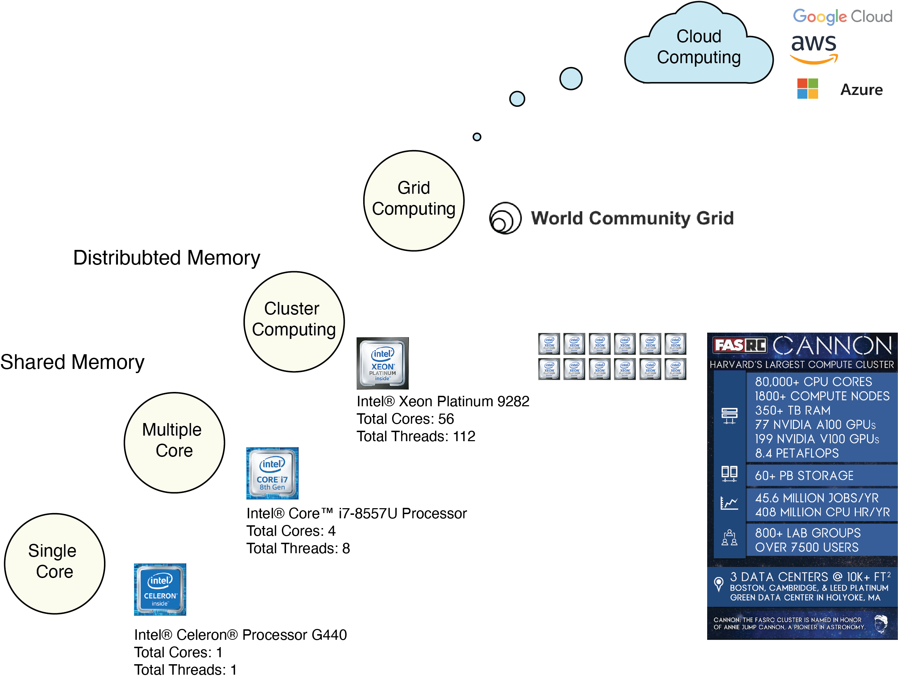

# Large Data Processing in R Workshop

* Naeem Khoshnevis 

## Summary

R is a language and environment for statistical computing and graphics, which is created by statisticians Ross Ihaka and Robert Gentleman. It was released in 1995 as open-source software. The base R is limited to a single thread on the CPU and in-memory computation. However, R has been used in numerous projects because of a well-organized community (e.g., CRAN, Rstudio, tidyverse) and wrapper packages to connect to many advanced APIs. This workshop presents some common problems in using large data in R and possible solutions. 

    

## Computational Resources

Systems with different computational configurations are more accessible than before. Sometimes, having too many options can become overwhelming. This workshop also presents solving a simple, embarrassingly parallel problem on different computational resources; these resources include shared and distributed memory systems. 

    

## Problems

- [Working with large data that does not fit into memory]()
- [Processing Single instruction multiple data problem on shared and distributed memory systems]()