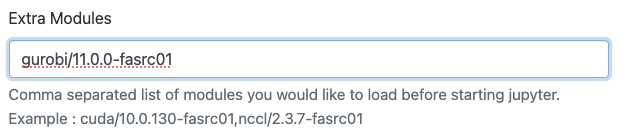

# Gurobi

[Gurobi](https://www.gurobi.com/) is an optimization library.

## Purpose

1. How to access Gurobi shell

2. Example of using the [GUROBI](https://www.gurobi.com/) optimization solver
   with a Python interface from a batch job and from a Jupyter Notebook. 

For other Gurobi applications, see [Gurobi
documentation](https://www.gurobi.com/documentation/).

## Access Gurobi shell

```bash
[jharvard@holylogin01 ~]$ salloc --partition test --time 01:00:00 --mem 8G -c 4
[jharvard@holy8a24402 ~]$ module load gurobi
[jharvard@holy8a24402 ~]$ gurobi.sh
Python 3.11.4 (main, Aug 11 2023, 09:26:19) [GCC 8.5.0 20210514 (Red Hat 8.5.0-18)] on linux
Type "help", "copyright", "credits" or "license" for more information.
Set parameter TokenServer to value "rclic.rc.fas.harvard.edu"
Set parameter LogFile to value "gurobi.log"

Gurobi Interactive Shell (linux64), Version 11.0.0
Copyright (c) 2023, Gurobi Optimization, LLC
Type "help()" for help

gurobi>
```

## Gurobi in Python

### Content

* <code>gurobi_test.py</code>: Python source code
* <code>runscript.sh</code>: Batch-job submission script
* <code>CurveFitting.lp</code>: Model formulation file
* <code>test.out</code>: Output file

### Install Gurobi as a Python package

Create a conda/mamba environment and install Gurobi inside the conda
environment:

```bash
# request interactive job
[jharvard@holylogin01 ~]$ salloc --partition test --time 01:00:00 --mem 8G -c 4

# load modules and set environmental variables
[jharvard@holy8a24401 ~]$ module load python
[jharvard@holy8a24401 ~]$ export PYTHONNOUSERSITE=yes

# create conda/mamba environment
# note that ipykernel is only needed for Jupyter Notebooks
[jharvard@holy8a24401 ~]$ mamba create -n gurobi_env -c gurobi gurobi=11.0.0 ipykernel -y
```

## Use Gurobi in Jupyter Notebooks

You can use the conda environment `gurobi_env` on a Jupyter Notebook on Open
OnDemand .

1. Go to the OOD dashboard ([Cannon OOD](https://rcood.rc.fas.harvard.edu/), [FASSE
OOD](https://fasseood.rc.fas.harvard.edu/))
2. Click on "Jupyter Notebook"
3. Before launching a Jupyter Notebook job, in the "Extra Modules" field, type `gurobi/11.0.0-fasrc01` or `gurobi/9.5.2-fasrc01`, for example: 

4. Click on the "Launch" button
5. Click on "Connect to Jupyter"
6. Open a Jupyter Notebook
7. On the top menu, click Kernel -> Change Kernel -> Select gurobi_env 


Gurobi provides a [Colab curve_fitting](https://colab.research.google.com/github/Gurobi/modeling-examples/blob/master/curve_fitting/curve_fitting.ipynb) Jupyter notebook example.

## Batch job

This specific example illustrates curve fitting and is adopted from [Gurobi
docs](https://www.gurobi.com/jupyter_models/curve-fitting/).

Python code

```python
import gurobipy as gp
from gurobipy import GRB

# tested with Python 3.7.0 & Gurobi 9.1.0
# Sample data: values of independent variable x and dependent variable y
observations, x, y = gp.multidict({
    ('1'): [0,1],
    ('2'): [0.5,0.9],
    ('3'): [1,0.7],
    ('4'): [1.5,1.5],
    ('5'): [1.9,2],
    ('6'): [2.5,2.4],
    ('7'): [3,3.2],
    ('8'): [3.5,2],
    ('9'): [4,2.7],
    ('10'): [4.5,3.5],
    ('11'): [5,1],
    ('12'): [5.5,4],
    ('13'): [6,3.6],
    ('14'): [6.6,2.7],
    ('15'): [7,5.7],
    ('16'): [7.6,4.6],
    ('17'): [8.5,6],
    ('18'): [9,6.8],
    ('19'): [10,7.3]
})

model = gp.Model('CurveFitting')

# Constant term of the function f(x). This is a free continuous variable that can take positive and negative values.
a = model.addVar(lb=-GRB.INFINITY, ub=GRB.INFINITY, vtype=GRB.CONTINUOUS, name="a")

# Coefficient of the linear term of the function f(x). This is a free continuous variable that can take positive
# and negative values.
b = model.addVar(lb=-GRB.INFINITY, ub=GRB.INFINITY, vtype=GRB.CONTINUOUS, name="b")

# Non-negative continuous variables that capture the positive deviations
u = model.addVars(observations, vtype=GRB.CONTINUOUS, name="u")

# Non-negative continuous variables that capture the negative deviations
v = model.addVars(observations, vtype=GRB.CONTINUOUS, name="v")

# Non-negative continuous variables that capture the value of the maximum deviation
z = model.addVar(vtype=GRB.CONTINUOUS, name="z")

# Deviation constraints

deviations = model.addConstrs( (b*x[i] + a + u[i] - v[i] == y[i] for i in observations), name='deviations')

# Objective function of problem 1

model.setObjective(u.sum('*') + v.sum('*'))

# Verify model formulation

model.write('CurveFitting.lp')

# Run optimization engine

model.optimize()

# Output report

print("\n\n_________________________________________________________________________________")
print(f"The best straight line that minimizes the absolute value of the deviations is:")
print("_________________________________________________________________________________")
```

Model formulation file: <code>CurveFitting.lp</code>

```
\ Model CurveFitting
\ LP format - for model browsing. Use MPS format to capture full model detail.
Minimize
  u[1] + u[2] + u[3] + u[4] + u[5] + u[6] + u[7] + u[8] + u[9] + u[10]
   + u[11] + u[12] + u[13] + u[14] + u[15] + u[16] + u[17] + u[18] + u[19]
   + v[1] + v[2] + v[3] + v[4] + v[5] + v[6] + v[7] + v[8] + v[9] + v[10]
   + v[11] + v[12] + v[13] + v[14] + v[15] + v[16] + v[17] + v[18] + v[19]
   + 0 z
Subject To
 deviations[1]: a + u[1] - v[1] = 1
 deviations[2]: a + 0.5 b + u[2] - v[2] = 0.9
 deviations[3]: a + b + u[3] - v[3] = 0.7
 deviations[4]: a + 1.5 b + u[4] - v[4] = 1.5
 deviations[5]: a + 1.9 b + u[5] - v[5] = 2
 deviations[6]: a + 2.5 b + u[6] - v[6] = 2.4
 deviations[7]: a + 3 b + u[7] - v[7] = 3.2
 deviations[8]: a + 3.5 b + u[8] - v[8] = 2
 deviations[9]: a + 4 b + u[9] - v[9] = 2.7
 deviations[10]: a + 4.5 b + u[10] - v[10] = 3.5
 deviations[11]: a + 5 b + u[11] - v[11] = 1
 deviations[12]: a + 5.5 b + u[12] - v[12] = 4
 deviations[13]: a + 6 b + u[13] - v[13] = 3.6
 deviations[14]: a + 6.6 b + u[14] - v[14] = 2.7
 deviations[15]: a + 7 b + u[15] - v[15] = 5.7
 deviations[16]: a + 7.6 b + u[16] - v[16] = 4.6
 deviations[17]: a + 8.5 b + u[17] - v[17] = 6
 deviations[18]: a + 9 b + u[18] - v[18] = 6.8
 deviations[19]: a + 10 b + u[19] - v[19] = 7.3
Bounds
 a free
 b free
End
```

Example batch-job submission script:

```bash
#!/bin/bash
#SBATCH -J gurobitest    # job name
#SBATCH -o test.out      # standard output file
#SBATCH -e test.err      # standard error file
#SBATCH -p test          # partition
#SBATCH -c 1             # number of cores
#SBATCH -t 0-00:30       # time in D-HH:MM
#SBATCH --mem=4000       # memory in MB

# Set up software environment
module load python
module load gurobi
source activate gurobi_env

# Run program
srun -c $SLURM_CPUS_PER_TASK python gurobi_test.py
```

Submit job

```bash
[jharvard@holylogin01 Libraries]$ sbatch runscript.sh
```

Example Output:

```
[jharvard@holylogin01 Gurobi]$ cat test.out
Set parameter TokenServer to value "rclic.rc.fas.harvard.edu"
Gurobi Optimizer version 11.0.0 build v11.0.0rc2 (linux64 - "Rocky Linux 8.7 (Green Obsidian)")

CPU model: Intel(R) Xeon(R) Platinum 8480CL, instruction set [SSE2|AVX|AVX2|AVX512]
Thread count: 112 physical cores, 112 logical processors, using up to 32 threads

Optimize a model with 19 rows, 41 columns and 75 nonzeros
Model fingerprint: 0x0bec2f7b
Coefficient statistics:
  Matrix range     [5e-01, 1e+01]
  Objective range  [1e+00, 1e+00]
  Bounds range     [0e+00, 0e+00]
  RHS range        [7e-01, 7e+00]
Presolve removed 0 rows and 1 columns
Presolve time: 0.00s
Presolved: 19 rows, 40 columns, 75 nonzeros

Iteration    Objective       Primal Inf.    Dual Inf.      Time
       0      handle free variables                          0s
      20    1.1466250e+01   0.000000e+00   0.000000e+00      0s

Solved in 20 iterations and 0.00 seconds (0.00 work units)
Optimal objective  1.146625000e+01


_________________________________________________________________________________
The best straight line that minimizes the absolute value of the deviations is:
_________________________________________________________________________________
y = 0.6375x + (0.5813)
```

