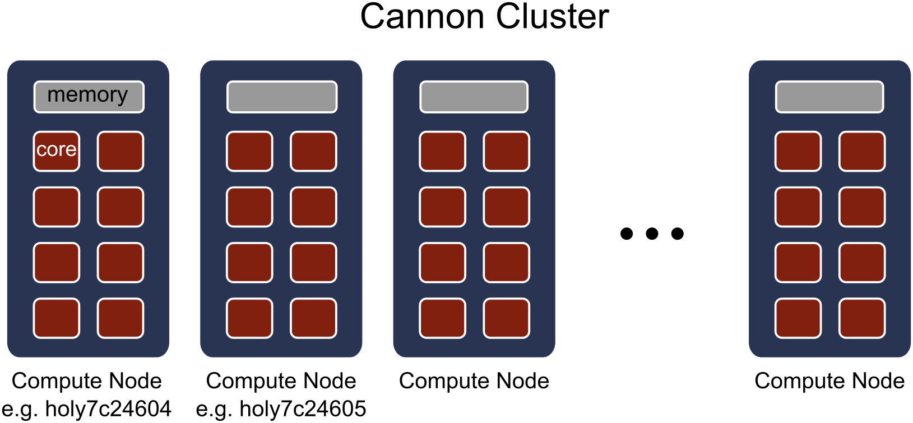
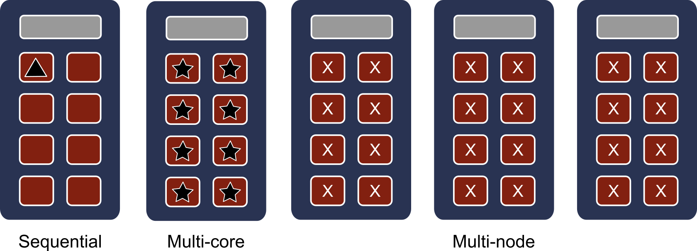

# R Parallel

## Purpose

Here, we briefly explain different ways to use R in parallel on the Harvard University FASRC Cannon cluster. Parallel computing may be necessary to speed up a code or to deal with large datasets.

How does parallel computing can help you? It can divide the workload into chunks and each worker (i.e. core) will take one chunk. The goal of using parallel computing is to reduce the total computational time by having each worker (i.e. core) process its workload in parallel with other workers.

## Cannon cluster basics

Cannon has 1800+ compute nodes with 80,000+ CPU cores. Each compute node is equivalent to a computer and typically made up of CPU cores, memory, local storage, and sometimes a GPU card.

    

## Sequential *vs.* multi-core *vs.* multi-node

A sequential (or serial) code uses one single CPU core and each instruction is processed in sequence.

A multi-core (and single-node) code uses one compute node (i.e. one "computer") and it can use any number of cores that comprises a node. In Cannon, depending on the [partition](https://docs.rc.fas.harvard.edu/kb/running-jobs/), the number of cores varies from 32 to 64. In addition, multi-core codes can take advantage of the shared memory between the cores.

    

Below we provide a summary of R parallel packages that can be used in Cannon.

### Single-node, multi-core (shared memory)

* parallel
* snow
 
### Multi-node, distributed memory

* Rmpi
* pbdMPI
* future

### Hybrid: Multi-node + shared-memory

* future(??)

### Processing large datasets

## Resources

* For R basics, refer to [R-Basics](https://docs.rc.fas.harvard.edu/kb/r-basics/)
* For R package installations, refer to:
  * General package installs: [R-Packages](https://docs.rc.fas.harvard.edu/kb/r-packages/)
  * Packages [sp, rgdal, rgeos, sf, and INLA](https://github.com/fasrc/User_Codes/blob/master/Languages/R/rgdal.md)
  * Packages [ENMTools, ecospat, raster, rJava](https://github.com/fasrc/User_Codes/blob/master/Languages/R/ENMTools.md)
  * Package [rstan](https://github.com/fasrc/User_Codes/blob/master/Languages/R/rstan.md)
* Parallel R:
  * HPC @ Louisiana State University [training materials](http://www.hpc.lsu.edu/training/weekly-materials/2017-Fall/HPC_Parallel_R_Fall2017.pdf)
  * HPC @ Norwegian University of Science and Technology [training materials](https://www.hpc.ntnu.no/parallel-r-for-hpc-system/)
  * [R Programming for Data Science](https://bookdown.org/rdpeng/rprogdatascience/parallel-computation.html#) by Roger D. Peng.

