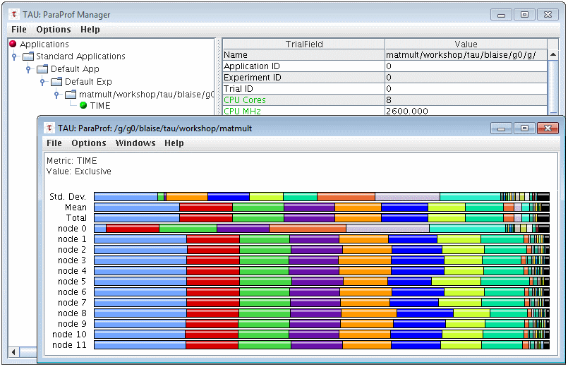
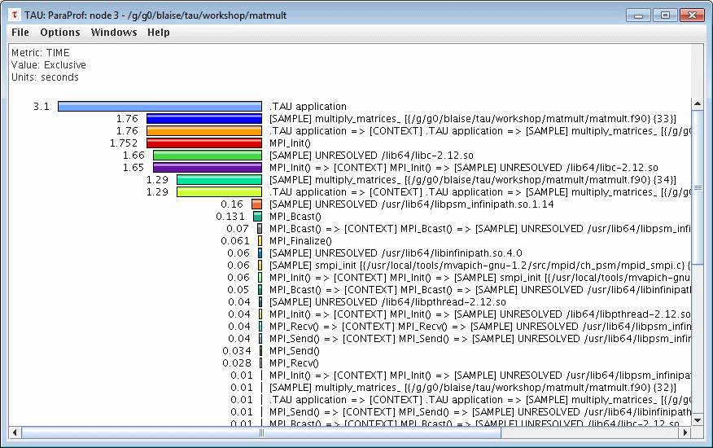
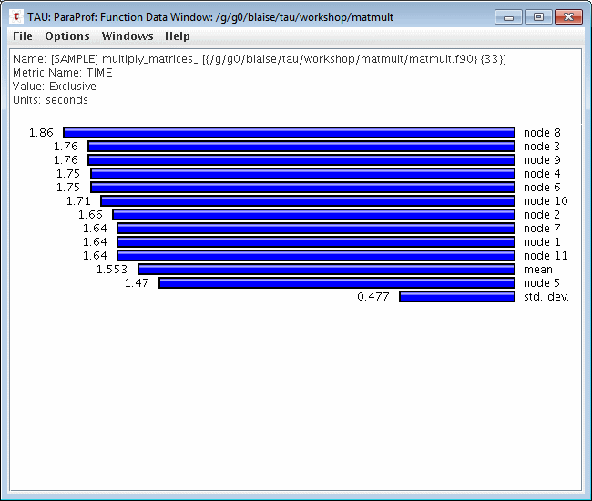
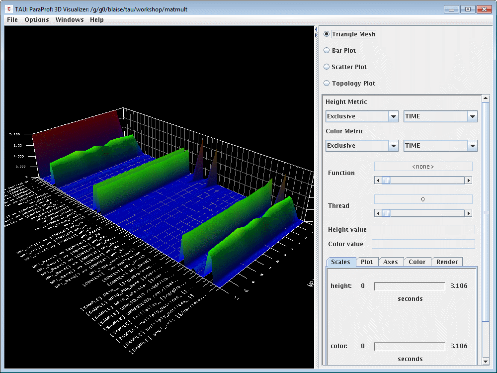
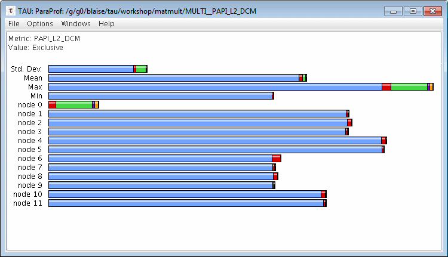
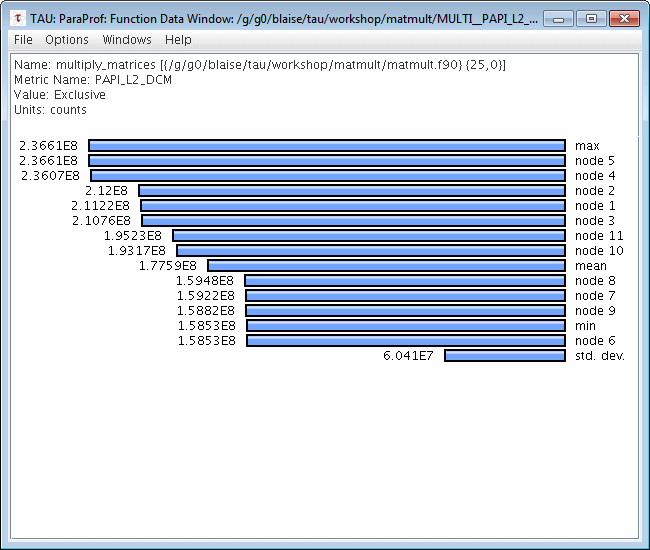

## Profiling mpi4py (MPI for Python)

The below instructions are intended to help you get started with TAU on the FAS cluster for profiling <code>mpy4py</code> applications.

### Quick Start

TAU is a sophisticated, full-featured toolkit. Here we discuss only a subset of TAU's features at a very "basic level". Users will need to consult the [official TAU documentation](https://www.cs.uoregon.edu/research/tau/docs.php) to learn more.

**Profiling**

The easiest and fastest way to profile a <code>mpi4py</code> application is to use the <code>tau_python</code> command. It automatically instruments your executable at run time, and requires no modifications to Python source code.

* Setup up your TAU environment on the FAS cluster

<pre>
$ module load gcc/9.3.0-fasrc01 openmpi/4.0.2-fasrc01 tau/2.29-fasrc01
</pre>

* Set up your <code>conda</code> environment and install <code>mpi4py</code> through <code>pip</code>. **NOTE:** <code>mpi4py</code> needs to be compiled with the same flavor / version of MPI used to build TAU, e.g.,

<pre>
$ conda create -n python3_tau python numpy pip wheel
$ source activate python_tau
(python_tau) $ pip install mpi4py
</pre>

* Run the <code>mpy4py</code> application. In this example we use the code <code>mpi4py_test.py</code> from [here](https://github.com/fasrc/User_Codes/tree/master/Parallel_Computing/Python/mpi4py/Example1).

Example batch-job submission script:
<pre>
#!/bin/bash
#SBATCH -J mpi4py_test
#SBATCH -o mpi4py_test.out
#SBATCH -e mpi4py_test.err
#SBATCH -p test
#SBATCH -n 4
#SBATCH -t 30
#SBATCH --mem-per-cpu=4000

# Set up environment
module load gcc/9.3.0-fasrc01 openmpi/4.0.2-fasrc01 tau/2.29-fasrc01
source activate python_tau

# Run program
srun -n 4 --mpi=pmi2 tau_python mpi4py_test.py
</pre>

Submit the batch-job submission script:
<pre>
sbatch run.sbatch
</pre>

* Following completion of your job, you will have a set of files named <code>profile.#.*</code> where # denotes the MPI rank. Viewing these files is discussed in the Output section below.

**Output**

TAU profiling output consists of a set of files named <code>profile.X.Y.Z</code>  where: 
X = MPI rank number 
Y = context 
Z = thread number 

*pprof* 
To get a quick, text based summary of your job's profile data, the TAU <code>pprof</code> utility can be used. By default, it will process all of the <code>profile.*</code> files in the current directory and produce a report showing profile data for each rank/context/thread. An example for one MPI rank is shown below:

<pre>
$ pprof
Reading Profile files in profile.*

NODE 0;CONTEXT 0;THREAD 0:
---------------------------------------------------------------------------------------
%Time    Exclusive    Inclusive       #Call      #Subrs  Inclusive Name
              msec   total msec                          usec/call
---------------------------------------------------------------------------------------
100.0        3,006        4,361           1           6    4361739 .TAU application
 37.7            2        1,645           5         178     329147 <module>
 29.7        0.483        1,294           5           5     258810 exec
 28.3        0.756        1,236          10          60     123609 _find_and_load
 28.3        0.477        1,234          10          30     123452 _find_and_load_unlocked
 26.7        0.699        1,166           7          42     166640 _load_unlocked
 25.9        0.245        1,131          13          13      87039 _call_with_frames_removed
 25.9         0.16        1,131          17          23      66553 _handle_fromlist
 25.9        0.031        1,131           4           3     282819 __import__
 25.4        0.265        1,107           7          14     158151 exec_module
 16.5            2          720           3          10     240298 exec_dynamic
 13.6        0.438          592           7          25      84595 module_from_spec
 13.5        0.041          590           7           6      84360 create_module
 13.5          590          590           3           1     196787 create_dynamic
  8.6          375          375           1           0     375869 MPI_Init_thread()
  4.4            1          193          60         474       3230 find_spec
  3.5        0.738          154           4          32      38684 get_code
  3.5          120          151           4           4      37960 get_data
  2.5          110          110          57           0       1938 stat
  2.3        0.644           98           8          72      12305 _find_spec
  2.2        0.851           98          15         173       6538 _get_spec
  1.7        0.085           74          51          51       1451 _path_stat
  1.7        0.117           73          10          10       7353 _path_isfile
  1.7        0.039           73          11          11       6675 _path_is_mode_type
  1.4        0.875           60           1          21      60705 find_module
  1.1        0.114           46           1           2      46765 Finalize
  1.1           46           46           1           0      46650 MPI_Finalize()
  0.8        0.228           36           6           7       6133 isfile
  0.7           31           31           5           1       6232 read
  0.5           21           21           2           1      10820 open
  0.4        0.123           18           1           3      18649 _fill_cache
  0.4           18           18           1           0      18522 listdir
  0.2        0.113            9           4           4       2426 Barrier
  0.2            9            9           4           0       2398 MPI_Barrier()
  0.1        0.678            6         178         456         35 <listcomp>
  0.1        0.625            5         104         133         53 _compile
  0.1        0.285            5         110         207         48 match
  0.1         0.32            4           1           7       4095 compile
  0.0        0.415            2           1           4       2072 parse
  0.0        0.206            1           1           3       1689 _code
  0.0          0.2            1           1           5       1538 _parse_sub
  0.0        0.236            1           4          16        380 _compile_bytecode
  0.0            1            1           1          53       1331 _parse
  0.0        0.556            1         173         346          8 _path_join
  0.0            1            1           4           0        315 loads
  0.0            1            1           8           8        150 __build_class__
  0.0        0.494            1           7          66        170 _init_module_attrs
  0.0        0.289            1          41          44         26 __enter__
  0.0        0.527        0.912           1          13        912 _compile_info
  0.0         0.28        0.882          43           2         21 _path_importer_cache
  0.0        0.546        0.689          49          26         14 __init__
  0.0        0.131        0.595           1           1        595 _path_hooks
  0.0        0.134        0.594          11           7         54 cached
  0.0        0.415        0.593          10          30         59 _get_module_lock
  0.0        0.222        0.578           1           6        578 detect_encoding
  0.0        0.297        0.533          41          48         13 __exit__
  0.0        0.266        0.523           3          29        174 _optimize_charset
  0.0        0.441        0.477           7          28         68 join
  0.0        0.204        0.464           1           2        464 path_hook_for_FileFinder
  0.0        0.138         0.46           7          14         66 _get_cached
  0.0        0.174        0.387           8          40         48 cache_from_source
  0.0        0.199        0.325           4           8         81 _classify_pyc
  0.0        0.314         0.32           1           3        320 get_suffixes
  0.0        0.281        0.281           2           0        140 compile
  0.0        0.116         0.24           1           3        240 __and__
  0.0        0.214        0.234           1           3        234 _mk_bitmap
  0.0        0.208        0.223           2           4        112 find_cookie
  0.0        0.163        0.186           7          14         27 spec_from_file_location
  0.0        0.166        0.175          10          10         18 acquire
  0.0        0.173        0.173         354           0          0 rstrip
  0.0        0.164        0.164         181           0          1 _verbose_message
  0.0        0.159        0.159         105           0          2 match
  0.0        0.121        0.144           7          28         21 any
  0.0        0.127        0.141          12          12         12 _r_long
  0.0        0.138        0.138         176           0          1 isinstance
  0.0        0.126        0.137           8          16         17 _path_split
  0.0        0.135        0.135         181           0          1 join
  0.0        0.125         0.13           2           2         65 _uniq
  0.0        0.104        0.127           2           2         64 read_or_stop
  0.0        0.124        0.124         164           0          1 <genexpr>
  0.0        0.118        0.123           2           5         62 getwidth
  0.0        0.117        0.122           2           2         61 __call__
  0.0        0.117        0.122           5           8         24 extend
  0.0        0.116         0.12           4           4         30 _check_name_wrapper
  0.0        0.112        0.113           1           1        113 Get_size
  0.0        0.106        0.109           1           1        109 Get_processor_name
  0.0        0.104        0.108           1           1        108 decode
  0.0        0.104        0.105           1           1        105 _get_literal_prefix
  0.0        0.101        0.102           1           1        102 Get_rank
  0.0        0.094        0.094          69           0          1 hasattr
  0.0        0.075        0.075          42           0          2 getattr
  0.0        0.013         0.07           4           4         18 path_stats
  0.0        0.059        0.067          10          10          7 release
  0.0        0.066        0.066           1           0         66 _Unpickler
  0.0         0.04        0.066          10          30          7 cb
  0.0        0.056        0.056           1           0         56 dir
  0.0        0.055        0.055          69           0          1 rpartition
  0.0        0.019        0.041          13          13          3 get
  0.0         0.02         0.04           4           8         10 _validate_timestamp_pyc
  0.0        0.036        0.036          44           0          1 acquire_lock
  0.0        0.033        0.036          51           2          1 len
  0.0        0.035        0.035          44           0          1 release_lock
  0.0        0.031        0.031          17           0          2 __next
  0.0        0.031        0.031          42           0          1 append
  0.0        0.029        0.029           2           0         14 print
  0.0         0.02        0.028          10          11          3 __getitem__
  0.0        0.028        0.028          36           0          1 _relax_case
  0.0        0.023        0.027           7           6          4 parent
  0.0        0.004        0.024           1           1         24 _path_isdir
  0.0        0.023        0.023           1           0         23 _Pickler
  0.0        0.023        0.023           2           0         12 readline
  0.0        0.022        0.022           8           0          3 is_builtin
  0.0        0.013        0.021           3          11          7 _compile_charset
  0.0        0.019        0.019           4           0          5 _fix_co_filename
  0.0        0.019        0.019          21           0          1 get
  0.0        0.019        0.019           4           0          5 update
  0.0        0.012        0.018           7           7          3 _get_sep
  0.0        0.017        0.017          20           0          1 allocate_lock
  0.0        0.017        0.017          20           0          1 get_ident
  0.0        0.016        0.016          22           0          1 fspath
  0.0        0.015        0.015          17           0          1 endswith
  0.0        0.014        0.014          12           0          1 from_bytes
  0.0        0.014        0.014          10           0          1 startswith
  0.0        0.013        0.013          11           0          1 find
  0.0        0.012        0.012           4           0          3 _new_module
  0.0        0.012        0.012           9           0          1 is_frozen
  0.0        0.004        0.011           1           2         11 _simple
  0.0        0.009        0.011           4           4          3 tell
  0.0        0.006        0.009           3           3          3 append
  0.0        0.005        0.008           4           4          2 __len__
  0.0        0.007        0.007           3           0          2 MPI_Finalized()
  0.0        0.007        0.007           2           0          4 format
  0.0        0.007        0.007           1           0          7 getcwd
  0.0        0.007        0.007           7           0          1 has_location
  0.0        0.005        0.007           2           2          4 isstring
  0.0        0.007        0.007           5           0          1 min
  0.0        0.005        0.006           1           1          6 _get_charset_prefix
  0.0        0.006        0.006           7           0          1 ord
  0.0        0.005        0.005           1           0          5 _Framer
  0.0        0.005        0.005           2           0          2 __new__
  0.0        0.004        0.005           1           1          5 fix_flags
  0.0        0.005        0.005           2           0          2 fromkeys
  0.0        0.004        0.005           2           2          2 groups
  0.0        0.005        0.005           1           0          5 new_module
  0.0        0.004        0.004           4           0          1 get_filename
  0.0        0.004        0.004           3           0          1 items
  0.0        0.004        0.004           1           0          4 utf_8_decode
  0.0        0.003        0.003           2           0          2 MPI_Comm_set_errhandler()
  0.0        0.003        0.003           1           0          3 MPI_Get_processor_name()
  0.0        0.003        0.003           1           0          3 _Unframer
  0.0        0.003        0.003           2           0          2 decode
  0.0        0.003        0.003           1           0          3 translate
  0.0        0.002        0.002           1           0          2 PickleError
  0.0        0.002        0.002           1           0          2 PicklingError
  0.0        0.002        0.002           1           0          2 __setitem__
  0.0        0.002        0.002           2           0          1 _get_iscased
  0.0        0.002        0.002           1           0          2 setattr
  0.0        0.001        0.001           1           0          1 MPI_Comm_rank()
  0.0        0.001        0.001           1           0          1 MPI_Comm_size()
  0.0        0.001        0.001           1           0          1 S_ISREG
  0.0        0.001        0.001           1           0          1 UnpicklingError
  0.0        0.001        0.001           1           0          1 _Stop

NODE 1;CONTEXT 0;THREAD 0:
---------------------------------------------------------------------------------------
%Time    Exclusive    Inclusive       #Call      #Subrs  Inclusive Name
              msec   total msec                          usec/call
---------------------------------------------------------------------------------------
100.0        3,004        4,358           1           6    4358039 .TAU application
 37.7            2        1,643           5         177     328699 <module>
 29.6        0.492        1,291           5           5     258346 exec
 28.4        0.762        1,235          10          60     123574 _find_and_load
 28.3        0.499        1,234          10          30     123414 _find_and_load_unlocked
 27.0        0.727        1,174           7          42     167845 _load_unlocked
 25.8        0.255        1,122          13          13      86384 _call_with_frames_removed
 25.8        0.149        1,122          17          23      66052 _handle_fromlist
 25.8        0.021        1,122           4           3     280690 __import__
 25.6        0.255        1,115           7          14     159424 exec_module
 16.5            2          720           3          10     240298 exec_dynamic
 13.6        0.452          591           7          25      84560 module_from_spec
 13.5        0.033          590           7           6      84318 create_module
 13.5          590          590           3           1     196686 create_dynamic
  8.6          375          375           1           0     375865 MPI_Init_thread()
  4.0            1          175          60         474       2926 find_spec
  3.7         0.76          163           4          32      40807 get_code
  3.7          129          160           4           4      40097 get_data
  2.5          109          109          57           0       1921 stat
  2.1        0.669           89           8          72      11194 _find_spec
  2.0        0.851           89          15         173       5942 _get_spec
  1.7        0.094           73          51          51       1434 _path_stat
  1.7        0.123           72          10          10       7262 _path_isfile
  1.7        0.036           72          11          11       6593 _path_is_mode_type
  1.4        0.907           61           1          21      61020 find_module
  1.0        0.113           44           1           2      44816 Finalize
  1.0           44           44           1           0      44702 MPI_Finalize()
  0.8        0.234           36           6           7       6116 isfile
  0.7           30           31           5           1       6215 read
  0.5           21           21           2           1      10982 open
  0.2         0.11           10           1           3      10140 _fill_cache
  0.2           10           10           1           0      10027 listdir
  0.2        0.121            9           4           4       2423 Barrier
  0.2            9            9           4           0       2392 MPI_Barrier()
  0.1         0.66            6         178         456         35 <listcomp>
  0.1        0.634            5         104         133         54 _compile
  0.1        0.282            5         110         207         50 match
  0.1        0.328            4           1           7       4229 compile
  0.0        0.431            2           1           4       2134 parse
  0.0        0.218            1           1           3       1754 _code
  0.0        0.217            1           1           5       1581 _parse_sub
  0.0        0.251            1           4          16        378 _compile_bytecode
  0.0            1            1           1          53       1358 _parse
  0.0        0.577            1         173         346          8 _path_join
  0.0            1            1           4           0        308 loads
  0.0            1            1           8           8        153 __build_class__
  0.0        0.518            1           7          66        175 _init_module_attrs
  0.0        0.293            1          41          44         27 __enter__
  0.0        0.547         0.95           1          13        950 _compile_info
  0.0        0.285        0.901          43           2         21 _path_importer_cache
  0.0        0.557        0.704          49          26         14 __init__
  0.0        0.417        0.614          10          30         61 _get_module_lock
  0.0        0.129        0.609           1           1        609 _path_hooks
  0.0         0.13        0.597          11           7         54 cached
  0.0        0.229        0.584           1           6        584 detect_encoding
  0.0        0.307        0.561          41          48         14 __exit__
  0.0        0.279        0.547           3          29        182 _optimize_charset
  0.0        0.492        0.525           7          28         75 join
  0.0        0.208         0.48           1           2        480 path_hook_for_FileFinder
  0.0        0.139        0.467           7          14         67 _get_cached
  0.0         0.45         0.45          69           0          7 hasattr
  0.0        0.167        0.386           8          40         48 cache_from_source
  0.0        0.323        0.327           1           3        327 get_suffixes
  0.0        0.284        0.284           2           0        142 compile
  0.0        0.131        0.259           4           8         65 _classify_pyc
  0.0        0.124        0.247           1           3        247 __and__
  0.0        0.223        0.245           1           3        245 _mk_bitmap
  0.0        0.205         0.22           2           4        110 find_cookie
  0.0        0.188        0.188         354           0          1 rstrip
  0.0        0.161        0.188           7          14         27 spec_from_file_location
  0.0        0.174        0.184          10          10         18 acquire
  0.0        0.167        0.167         181           0          1 _verbose_message
  0.0        0.162        0.162         105           0          2 match
  0.0        0.132        0.151           7          28         22 any
  0.0        0.144        0.144         176           0          1 isinstance
  0.0        0.127        0.143           8          16         18 _path_split
  0.0        0.128        0.143          12          12         12 _r_long
  0.0         0.14         0.14         181           0          1 join
  0.0        0.109         0.13           2           2         65 read_or_stop
  0.0        0.121        0.126           2           2         63 _uniq
  0.0        0.115        0.124           5           8         25 extend
  0.0        0.115        0.121           2           5         60 getwidth
  0.0        0.113         0.12           2           2         60 __call__
  0.0        0.117         0.12           4           4         30 _check_name_wrapper
  0.0        0.118        0.118         164           0          1 <genexpr>
  0.0        0.113        0.116           1           1        116 Get_processor_name
  0.0        0.112        0.113           1           1        113 Get_size
  0.0         0.11        0.111           1           1        111 Get_rank
  0.0        0.104        0.108           1           1        108 decode
  0.0        0.104        0.105           1           1        105 _get_literal_prefix
  0.0        0.086        0.086          42           0          2 getattr
  0.0        0.067        0.074          10          10          7 release
  0.0        0.047        0.068          10          30          7 cb
  0.0        0.011        0.068           4           4         17 path_stats
  0.0        0.062        0.062           1           0         62 _Unpickler
  0.0        0.052        0.052          69           0          1 rpartition
  0.0        0.047        0.047           1           0         47 dir
  0.0        0.044        0.044          44           0          1 release_lock
  0.0        0.023        0.043          13          13          3 get
  0.0         0.02         0.04           4           8         10 _validate_timestamp_pyc
  0.0        0.037         0.04          51           2          1 len
  0.0        0.036        0.036          42           0          1 append
  0.0        0.004        0.033           1           1         33 _path_isdir
  0.0        0.033        0.033          44           0          1 acquire_lock
  0.0        0.015         0.03           3          11         10 _compile_charset
  0.0        0.024        0.028           7           6          4 parent
  0.0        0.019        0.027          10          11          3 __getitem__
  0.0        0.027        0.027          17           0          2 __next
  0.0        0.023        0.023          36           0          1 _relax_case
  0.0        0.022        0.022           8           0          3 is_builtin
  0.0        0.021        0.021           1           0         21 _Pickler
  0.0        0.021        0.021          17           0          1 endswith
  0.0        0.021        0.021          22           0          1 fspath
  0.0        0.021        0.021           2           0         10 readline
  0.0        0.019        0.019          20           0          1 allocate_lock
  0.0        0.019        0.019           4           0          5 update
  0.0        0.018        0.018           4           0          4 _fix_co_filename
  0.0        0.018        0.018          21           0          1 get
  0.0        0.017        0.017          20           0          1 get_ident
  0.0        0.015        0.015          12           0          1 from_bytes
  0.0        0.008        0.014           7           7          2 _get_sep
  0.0        0.014        0.014           4           0          4 _new_module
  0.0        0.013        0.013          10           0          1 startswith
  0.0        0.012        0.012          11           0          1 find
  0.0        0.012        0.012           9           0          1 is_frozen
  0.0        0.012        0.012           1           0         12 print
  0.0        0.004        0.011           1           2         11 _simple
  0.0        0.008        0.011           4           4          3 tell
  0.0        0.005        0.009           4           4          2 __len__
  0.0        0.006        0.008           3           3          3 append
  0.0        0.008        0.008           2           0          4 format
  0.0        0.007        0.007           3           0          2 MPI_Finalized()
  0.0        0.007        0.007           2           0          4 __new__
  0.0        0.007        0.007           1           0          7 getcwd
  0.0        0.007        0.007           5           0          1 min
  0.0        0.005        0.006           1           1          6 _get_charset_prefix
  0.0        0.004        0.006           2           2          3 isstring
  0.0        0.005        0.005           1           0          5 _Framer
  0.0        0.005        0.005           1           1          5 fix_flags
  0.0        0.005        0.005           2           0          2 fromkeys
  0.0        0.005        0.005           7           0          1 has_location
  0.0        0.005        0.005           1           0          5 new_module
  0.0        0.005        0.005           7           0          1 ord
  0.0        0.004        0.004           1           0          4 _Unframer
  0.0        0.002        0.004           2           2          2 groups
  0.0        0.004        0.004           1           0          4 translate
  0.0        0.004        0.004           1           0          4 utf_8_decode
  0.0        0.003        0.003           2           0          2 MPI_Comm_set_errhandler()
  0.0        0.003        0.003           1           0          3 MPI_Get_processor_name()
  0.0        0.003        0.003           2           0          2 decode
  0.0        0.003        0.003           4           0          1 get_filename
  0.0        0.003        0.003           1           0          3 setattr
  0.0        0.002        0.002           1           0          2 PickleError
  0.0        0.002        0.002           1           0          2 S_ISREG
  0.0        0.002        0.002           1           0          2 _Stop
  0.0        0.002        0.002           1           0          2 __setitem__
  0.0        0.002        0.002           2           0          1 _get_iscased
  0.0        0.002        0.002           3           0          1 items
  0.0        0.001        0.001           1           0          1 MPI_Comm_rank()
  0.0        0.001        0.001           1           0          1 MPI_Comm_size()
  0.0        0.001        0.001           1           0          1 PicklingError
  0.0        0.001        0.001           1           0          1 UnpicklingError

NODE 2;CONTEXT 0;THREAD 0:
---------------------------------------------------------------------------------------
%Time    Exclusive    Inclusive       #Call      #Subrs  Inclusive Name
              msec   total msec                          usec/call
---------------------------------------------------------------------------------------
100.0        3,012        4,357           1           6    4357507 .TAU application
 37.7            2        1,644           5         177     328914 <module>
 29.7        0.498        1,292           5           5     258552 exec
 28.4         0.76        1,235          10          60     123598 _find_and_load
 28.3        0.494        1,234          10          30     123441 _find_and_load_unlocked
 26.8        0.726        1,166           7          42     166628 _load_unlocked
 26.0        0.241        1,131          13          13      87041 _call_with_frames_removed
 26.0        0.152        1,131          17          23      66554 _handle_fromlist
 26.0         0.02        1,131           4           3     282824 __import__
 25.3        0.248        1,102           7          14     157438 exec_module
 16.5            2          720           3          10     240296 exec_dynamic
 13.4        0.437          583           7          25      83362 module_from_spec
 13.4        0.041          581           7           6      83124 create_module
 13.3          581          581           3           1     193896 create_dynamic
  8.7          379          379           1           0     379953 MPI_Init_thread()
  4.5            1          195          60         474       3259 find_spec
  3.6        0.712          158           4          32      39614 get_code
  3.6          133          155           4           4      38922 get_data
  2.4          102          102          57           0       1799 stat
  2.3        0.652           99           8          72      12418 _find_spec
  2.3        0.845           98          15         173       6596 _get_spec
  1.7        0.084           74          51          51       1469 _path_stat
  1.7        0.121           74          10          10       7444 _path_isfile
  1.7        0.035           74          11          11       6759 _path_is_mode_type
  1.2         0.87           51           1          21      51943 find_module
  1.0        0.116           45           1           2      45592 Finalize
  1.0           45           45           1           0      45475 MPI_Finalize()
  0.6         0.23           27           6           7       4662 isfile
  0.5           22           22           5           1       4441 read
  0.5           21           21           2           1      10868 open
  0.4        0.123           18           1           3      18667 _fill_cache
  0.4           18           18           1           0      18541 listdir
  0.2        0.112            9           4           4       2431 Barrier
  0.2            9            9           4           0       2403 MPI_Barrier()
  0.1        0.669            6         178         456         34 <listcomp>
  0.1        0.597            5         104         133         51 _compile
  0.1        0.277            5         110         207         47 match
  0.1        0.316            4           1           7       4009 compile
  0.0        0.399            2           1           4       2032 parse
  0.0        0.195            1           1           3       1647 _code
  0.0        0.214            1           1           5       1516 _parse_sub
  0.0        0.232            1           4          16        374 _compile_bytecode
  0.0        0.582            1         173         346          8 _path_join
  0.0            1            1           1          53       1295 _parse
  0.0            1            1           4           0        310 loads
  0.0        0.491            1           7          66        173 _init_module_attrs
  0.0            1            1           8           8        146 __build_class__
  0.0        0.272            1          41          44         26 __enter__
  0.0        0.513        0.889           1          13        889 _compile_info
  0.0         0.28        0.887          43           2         21 _path_importer_cache
  0.0        0.555        0.702          49          26         14 __init__
  0.0        0.128        0.616          11           7         56 cached
  0.0        0.132        0.599           1           1        599 _path_hooks
  0.0        0.409        0.596          10          30         60 _get_module_lock
  0.0        0.219        0.574           1           6        574 detect_encoding
  0.0        0.293        0.532          41          48         13 __exit__
  0.0        0.265        0.519           3          29        173 _optimize_charset
  0.0        0.136        0.488           7          14         70 _get_cached
  0.0        0.205        0.467           1           2        467 path_hook_for_FileFinder
  0.0        0.428        0.459           7          28         66 join
  0.0        0.168        0.416           8          40         52 cache_from_source
  0.0        0.311        0.316           1           3        316 get_suffixes
  0.0        0.283        0.283           2           0        142 compile
  0.0        0.135        0.259           4           8         65 _classify_pyc
  0.0        0.213        0.234           1           3        234 _mk_bitmap
  0.0        0.108        0.224           1           3        224 __and__
  0.0        0.203        0.219           2           4        110 find_cookie
  0.0        0.157        0.185           7          14         26 spec_from_file_location
  0.0        0.176        0.183          10          10         18 acquire
  0.0        0.181        0.181         354           0          1 rstrip
  0.0        0.169        0.169         181           0          1 _verbose_message
  0.0        0.156        0.156         105           0          1 match
  0.0        0.124        0.145           7          28         21 any
  0.0        0.143        0.143         176           0          1 isinstance
  0.0        0.122        0.138           8          16         17 _path_split
  0.0        0.125        0.138          12          12         12 _r_long
  0.0        0.109        0.131           2           2         66 read_or_stop
  0.0         0.13         0.13         181           0          1 join
  0.0        0.118        0.127           5           8         25 extend
  0.0        0.117        0.123           2           5         62 getwidth
  0.0        0.112        0.117           2           2         58 _uniq
  0.0        0.113        0.116           4           4         29 _check_name_wrapper
  0.0        0.108        0.113           2           2         56 __call__
  0.0        0.109        0.112           1           1        112 Get_processor_name
  0.0         0.11        0.111           1           1        111 Get_size
  0.0        0.106         0.11           1           1        110 decode
  0.0        0.108        0.108         164           0          1 <genexpr>
  0.0        0.104        0.105           1           1        105 Get_rank
  0.0        0.098        0.099           1           1         99 _get_literal_prefix
  0.0        0.098        0.098          69           0          1 hasattr
  0.0        0.083        0.083          42           0          2 getattr
  0.0        0.063        0.072          10          10          7 release
  0.0        0.043        0.066          10          30          7 cb
  0.0        0.011        0.065           4           4         16 path_stats
  0.0        0.059        0.059           1           0         59 _Unpickler
  0.0        0.053        0.053          69           0          1 rpartition
  0.0        0.047        0.047           1           0         47 dir
  0.0        0.021        0.043          13          13          3 get
  0.0        0.039        0.042          51           2          1 len
  0.0         0.02        0.038           4           8         10 _validate_timestamp_pyc
  0.0        0.033        0.033          44           0          1 acquire_lock
  0.0        0.019         0.03          10          11          3 __getitem__
  0.0         0.03         0.03          17           0          2 __next
  0.0         0.03         0.03          44           0          1 release_lock
  0.0        0.029        0.029           8           0          4 is_builtin
  0.0         0.02        0.028           7           6          4 parent
  0.0        0.026        0.026          36           0          1 _relax_case
  0.0        0.026        0.026          42           0          1 append
  0.0        0.003        0.024           1           1         24 _path_isdir
  0.0        0.013        0.022           3          11          7 _compile_charset
  0.0        0.022        0.022           2           0         11 readline
  0.0        0.021        0.021           1           0         21 _Pickler
  0.0         0.02         0.02          21           0          1 get
  0.0        0.019        0.019           4           0          5 _fix_co_filename
  0.0        0.019        0.019          22           0          1 fspath
  0.0        0.018        0.018          20           0          1 allocate_lock
  0.0        0.017        0.017          17           0          1 endswith
  0.0        0.017        0.017           4           0          4 update
  0.0        0.016        0.016          20           0          1 get_ident
  0.0        0.009        0.015           7           7          2 _get_sep
  0.0        0.015        0.015           9           0          2 is_frozen
  0.0        0.013        0.013          12           0          1 from_bytes
  0.0        0.012        0.012           4           0          3 _new_module
  0.0        0.012        0.012           1           0         12 print
  0.0        0.003        0.011           1           2         11 _simple
  0.0        0.011        0.011          11           0          1 find
  0.0         0.01         0.01          10           0          1 startswith
  0.0        0.006         0.01           4           4          2 tell
  0.0        0.006        0.009           4           4          2 __len__
  0.0        0.007        0.008           3           3          3 append
  0.0        0.008        0.008           2           0          4 format
  0.0        0.008        0.008           1           0          8 getcwd
  0.0        0.005        0.007           2           2          4 isstring
  0.0        0.007        0.007           5           0          1 min
  0.0        0.006        0.006           3           0          2 MPI_Finalized()
  0.0        0.005        0.006           1           1          6 _get_charset_prefix
  0.0        0.005        0.005           1           0          5 _Framer
  0.0        0.005        0.005           2           0          2 __new__
  0.0        0.004        0.005           1           1          5 fix_flags
  0.0        0.005        0.005           2           0          2 fromkeys
  0.0        0.005        0.005           2           2          2 groups
  0.0        0.005        0.005           1           0          5 new_module
  0.0        0.005        0.005           7           0          1 ord
  0.0        0.004        0.004           1           0          4 _Unframer
  0.0        0.004        0.004           7           0          1 has_location
  0.0        0.004        0.004           1           0          4 utf_8_decode
  0.0        0.003        0.003           1           0          3 MPI_Get_processor_name()
  0.0        0.003        0.003           2           0          2 decode
  0.0        0.003        0.003           4           0          1 get_filename
  0.0        0.003        0.003           3           0          1 items
  0.0        0.003        0.003           1           0          3 translate
  0.0        0.002        0.002           2           0          1 MPI_Comm_set_errhandler()
  0.0        0.002        0.002           1           0          2 PickleError
  0.0        0.002        0.002           1           0          2 _Stop
  0.0        0.002        0.002           1           0          2 __setitem__
  0.0        0.002        0.002           2           0          1 _get_iscased
  0.0        0.002        0.002           1           0          2 setattr
  0.0        0.001        0.001           1           0          1 MPI_Comm_rank()
  0.0        0.001        0.001           1           0          1 MPI_Comm_size()
  0.0        0.001        0.001           1           0          1 PicklingError
  0.0        0.001        0.001           1           0          1 S_ISREG
  0.0        0.001        0.001           1           0          1 UnpicklingError

NODE 3;CONTEXT 0;THREAD 0:
---------------------------------------------------------------------------------------
%Time    Exclusive    Inclusive       #Call      #Subrs  Inclusive Name
              msec   total msec                          usec/call
---------------------------------------------------------------------------------------
100.0        3,005        4,358           1           6    4358487 .TAU application
 37.5            2        1,632           5         177     326532 <module>
 29.6         0.51        1,291           5           5     258266 exec
 28.4        0.765        1,235          10          60     123584 _find_and_load
 28.3        0.507        1,234          10          30     123422 _find_and_load_unlocked
 26.8        0.742        1,166           7          42     166636 _load_unlocked
 26.0        0.255        1,131          13          13      87034 _call_with_frames_removed
 26.0         0.15        1,131          17          23      66549 _handle_fromlist
 26.0         0.02        1,131           4           3     282801 __import__
 25.4        0.261        1,107           7          14     158178 exec_module
 16.5            2          720           3          10     240296 exec_dynamic
 13.3        0.458          581           7          25      83063 module_from_spec
 13.3        0.041          579           7           6      82821 create_module
 13.3          579          579           3           1     193189 create_dynamic
  8.6          375          375           1           0     375886 MPI_Init_thread()
  4.5            1          194          60         474       3235 find_spec
  3.8        0.736          164           4          32      41155 get_code
  3.7          131          161           4           4      40444 get_data
  2.5          110          110          57           0       1930 stat
  2.3        0.667           98           8          72      12332 _find_spec
  2.3        0.867           98          15         173       6551 _get_spec
  1.7         0.09           73          51          51       1443 _path_stat
  1.7        0.146           73          10          10       7316 _path_isfile
  1.7        0.034           73          11          11       6639 _path_is_mode_type
  1.4        0.914           60           1          21      60908 find_module
  1.0        0.114           44           1           2      44158 Finalize
  1.0           44           44           1           0      44043 MPI_Finalize()
  0.8        0.236           36           6           7       6120 isfile
  0.7           30           30           5           1       6158 read
  0.5           21           21           2           1      10922 open
  0.4        0.119           18           1           3      18560 _fill_cache
  0.4           18           18           1           0      18438 listdir
  0.2        0.114            9           4           4       2456 Barrier
  0.2            9            9           4           0       2428 MPI_Barrier()
  0.2            1            6         178         456         39 <listcomp>
  0.1        0.632            5         104         133         54 _compile
  0.1        0.275            5         110         207         50 match
  0.1        0.337            4           1           7       4252 compile
  0.0        0.438            2           1           4       2124 parse
  0.0        0.582            1         173         346         11 _path_join
  0.0        0.228            1           1           3       1778 _code
  0.0        0.219            1           1           5       1567 _parse_sub
  0.0        0.241            1           4          16        379 _compile_bytecode
  0.0            1            1           1          53       1341 _parse
  0.0            1            1           4           0        311 loads
  0.0            1            1           8           8        153 __build_class__
  0.0        0.509            1           7          66        174 _init_module_attrs
  0.0        0.294            1          41          44         27 __enter__
  0.0        0.561         0.96           1          13        960 _compile_info
  0.0        0.284        0.917          43           2         21 _path_importer_cache
  0.0        0.587        0.738          49          26         15 __init__
  0.0        0.137        0.626           1           1        626 _path_hooks
  0.0        0.417        0.607          10          30         61 _get_module_lock
  0.0        0.138        0.604          11           7         55 cached
  0.0         0.23        0.587           1           6        587 detect_encoding
  0.0        0.307        0.551          41          48         13 __exit__
  0.0        0.273        0.544           3          29        181 _optimize_charset
  0.0        0.476        0.506           7          28         72 join
  0.0        0.214        0.489           1           2        489 path_hook_for_FileFinder
  0.0        0.144        0.466           7          14         67 _get_cached
  0.0        0.169        0.386           8          40         48 cache_from_source
  0.0        0.316        0.321           1           3        321 get_suffixes
  0.0        0.286        0.286           2           0        143 compile
  0.0        0.136        0.264           4           8         66 _classify_pyc
  0.0        0.127        0.251           1           3        251 __and__
  0.0        0.226        0.247           1           3        247 _mk_bitmap
  0.0        0.202         0.22           2           4        110 find_cookie
  0.0         0.18        0.188          10          10         19 acquire
  0.0         0.16        0.186           7          14         27 spec_from_file_location
  0.0        0.183        0.183         354           0          1 rstrip
  0.0        0.177        0.177         105           0          2 match
  0.0        0.176        0.176         181           0          1 _verbose_message
  0.0        0.148        0.164          12          12         14 _r_long
  0.0        0.152        0.152         176           0          1 isinstance
  0.0        0.127        0.148           7          28         21 any
  0.0        0.128        0.143           8          16         18 _path_split
  0.0        0.131        0.131         181           0          1 join
  0.0        0.107        0.131           2           2         66 read_or_stop
  0.0        0.124         0.13           2           5         65 getwidth
  0.0        0.121        0.128           5           8         26 extend
  0.0        0.121        0.127           2           2         64 _uniq
  0.0        0.118        0.122           4           4         30 _check_name_wrapper
  0.0        0.116        0.121           2           2         60 __call__
  0.0        0.112        0.116           1           1        116 Get_processor_name
  0.0        0.114        0.115           1           1        115 Get_size
  0.0        0.112        0.113           1           1        113 Get_rank
  0.0        0.109         0.11           1           1        110 _get_literal_prefix
  0.0        0.105        0.105         164           0          1 <genexpr>
  0.0        0.099        0.103           1           1        103 decode
  0.0        0.101        0.101          69           0          1 hasattr
  0.0        0.079        0.079          42           0          2 getattr
  0.0        0.061         0.07          10          10          7 release
  0.0        0.044        0.065          10          30          6 cb
  0.0        0.011        0.064           4           4         16 path_stats
  0.0        0.062        0.062           1           0         62 _Unpickler
  0.0         0.02         0.06           4           8         15 _validate_timestamp_pyc
  0.0        0.047        0.047           1           0         47 dir
  0.0        0.046        0.046          69           0          1 rpartition
  0.0         0.04        0.043          51           2          1 len
  0.0         0.02        0.041          13          13          3 get
  0.0        0.041        0.041          44           0          1 release_lock
  0.0        0.019         0.03          10          11          3 __getitem__
  0.0        0.029        0.029          17           0          2 __next
  0.0        0.025        0.029           7           6          4 parent
  0.0        0.028        0.028          44           0          1 acquire_lock
  0.0        0.003        0.024           1           1         24 _path_isdir
  0.0        0.024        0.024           8           0          3 is_builtin
  0.0        0.024        0.024           2           0         12 readline
  0.0        0.023        0.023           1           0         23 _Pickler
  0.0        0.018        0.023           3          11          8 _compile_charset
  0.0        0.022        0.022           4           0          6 _fix_co_filename
  0.0         0.02         0.02          36           0          1 _relax_case
  0.0         0.02         0.02          20           0          1 allocate_lock
  0.0        0.018        0.018          42           0          0 append
  0.0        0.018        0.018          22           0          1 fspath
  0.0        0.017        0.017          17           0          1 endswith
  0.0        0.017        0.017          21           0          1 get
  0.0        0.017        0.017          20           0          1 get_ident
  0.0        0.017        0.017           4           0          4 update
  0.0        0.016        0.016           4           0          4 _new_module
  0.0        0.016        0.016          12           0          1 from_bytes
  0.0        0.009        0.014           7           7          2 _get_sep
  0.0        0.014        0.014           9           0          2 is_frozen
  0.0        0.013        0.013          11           0          1 find
  0.0        0.004        0.012           1           2         12 _simple
  0.0        0.012        0.012           1           0         12 print
  0.0        0.012        0.012          10           0          1 startswith
  0.0        0.007         0.01           4           4          2 tell
  0.0        0.008        0.009           3           3          3 append
  0.0        0.009        0.009           2           0          4 format
  0.0        0.006        0.008           4           4          2 __len__
  0.0        0.007        0.007           3           0          2 MPI_Finalized()
  0.0        0.007        0.007           1           0          7 getcwd
  0.0        0.007        0.007           5           0          1 min
  0.0        0.006        0.006           2           0          3 fromkeys
  0.0        0.004        0.006           2           2          3 isstring
  0.0        0.005        0.005           1           0          5 _Framer
  0.0        0.005        0.005           2           0          2 __new__
  0.0        0.004        0.005           1           1          5 _get_charset_prefix
  0.0        0.004        0.005           1           1          5 fix_flags
  0.0        0.005        0.005           7           0          1 has_location
  0.0        0.005        0.005           1           0          5 new_module
  0.0        0.004        0.004           1           0          4 MPI_Get_processor_name()
  0.0        0.004        0.004           1           0          4 _Unframer
  0.0        0.004        0.004           2           0          2 decode
  0.0        0.004        0.004           4           0          1 get_filename
  0.0        0.002        0.004           2           2          2 groups
  0.0        0.004        0.004           7           0          1 ord
  0.0        0.004        0.004           1           0          4 utf_8_decode
  0.0        0.003        0.003           3           0          1 items
  0.0        0.003        0.003           1           0          3 translate
  0.0        0.002        0.002           2           0          1 MPI_Comm_set_errhandler()
  0.0        0.002        0.002           1           0          2 PickleError
  0.0        0.002        0.002           1           0          2 _Stop
  0.0        0.002        0.002           1           0          2 __setitem__
  0.0        0.002        0.002           2           0          1 _get_iscased
  0.0        0.002        0.002           1           0          2 setattr
  0.0        0.001        0.001           1           0          1 MPI_Comm_rank()
  0.0        0.001        0.001           1           0          1 MPI_Comm_size()
  0.0        0.001        0.001           1           0          1 PicklingError
  0.0        0.001        0.001           1           0          1 S_ISREG
  0.0        0.001        0.001           1           0          1 UnpicklingError

FUNCTION SUMMARY (total):
---------------------------------------------------------------------------------------
%Time    Exclusive    Inclusive       #Call      #Subrs  Inclusive Name
              msec   total msec                          usec/call
---------------------------------------------------------------------------------------
100.0       12,029       17,435           4          24    4358943 .TAU application
 37.7            8        6,566          20         709     328323 <module>
 29.7            1        5,169          20          20     258493 exec
 28.4            3        4,943          40         240     123591 _find_and_load
 28.3            1        4,937          40         120     123432 _find_and_load_unlocked
 26.8            2        4,674          28         168     166937 _load_unlocked
 25.9        0.996        4,517          52          52      86875 _call_with_frames_removed
 25.9        0.611        4,517          68          92      66427 _handle_fromlist
 25.9        0.092        4,516          16          12     282284 __import__
 25.4            1        4,432          28          56     158298 exec_module
 16.5            8        2,883          12          40     240297 exec_dynamic
 13.5            1        2,349          28         100      83895 module_from_spec
 13.4        0.156        2,342          28          24      83656 create_module
 13.4        2,341        2,341          12           4     195139 create_dynamic
  8.6        1,507        1,507           4           0     376893 MPI_Init_thread()
  4.4            6          758         240        1896       3162 find_spec
  3.7            2          641          16         128      40065 get_code
  3.6          515          629          16          16      39356 get_data
  2.5          432          432         228           0       1897 stat
  2.2            2          385          32         288      12062 _find_spec
  2.2            3          384          60         692       6407 _get_spec
  1.7        0.353          295         204         204       1449 _path_stat
  1.7        0.507          293          40          40       7344 _path_isfile
  1.7        0.144          293          44          44       6667 _path_is_mode_type
  1.3            3          234           4          84      58644 find_module
  1.0        0.457          181           4           8      45333 Finalize
  1.0          180          180           4           0      45218 MPI_Finalize()
  0.8        0.928          138          24          28       5758 isfile
  0.7          114          115          20           4       5761 read
  0.5           86           87           8           4      10898 open
  0.4        0.475           66           4          12      16504 _fill_cache
  0.4           65           65           4           0      16382 listdir
  0.2         0.46           38          16          16       2434 Barrier
  0.2           38           38          16           0       2406 MPI_Barrier()
  0.1            3           25         712        1824         36 <listcomp>
  0.1            2           22         416         532         53 _compile
  0.1            1           21         440         828         49 match
  0.1            1           16           4          28       4146 compile
  0.0            1            8           4          16       2090 parse
  0.0        0.847            6           4          12       1717 _code
  0.0         0.85            6           4          20       1550 _parse_sub
  0.0         0.96            6          16          64        378 _compile_bytecode
  0.0            2            5         692        1384          8 _path_join
  0.0            4            5           4         212       1331 _parse
  0.0            4            4          16           0        311 loads
  0.0            2            4          28         264        173 _init_module_attrs
  0.0            4            4          32          32        151 __build_class__
  0.0            1            4         164         176         26 __enter__
  0.0            2            3           4          52        928 _compile_info
  0.0            1            3         172           8         21 _path_importer_cache
  0.0            2            2         196         104         14 __init__
  0.0        0.529            2           4           4        607 _path_hooks
  0.0         0.53            2          44          28         55 cached
  0.0            1            2          40         120         60 _get_module_lock
  0.0          0.9            2           4          24        581 detect_encoding
  0.0            1            2         164         192         13 __exit__
  0.0            1            2          12         116        178 _optimize_charset
  0.0            1            1          28         112         70 join
  0.0        0.831            1           4           8        475 path_hook_for_FileFinder
  0.0        0.557            1          28          56         67 _get_cached
  0.0        0.678            1          32         160         49 cache_from_source
  0.0            1            1           4          12        321 get_suffixes
  0.0            1            1           8           0        142 compile
  0.0        0.601            1          16          32         69 _classify_pyc
  0.0        0.475        0.962           4          12        240 __and__
  0.0        0.876         0.96           4          12        240 _mk_bitmap
  0.0        0.818        0.882           8          16        110 find_cookie
  0.0        0.641        0.745          28          56         27 spec_from_file_location
  0.0        0.743        0.743         276           0          3 hasattr
  0.0        0.696         0.73          40          40         18 acquire
  0.0        0.725        0.725        1416           0          1 rstrip
  0.0        0.676        0.676         724           0          1 _verbose_message
  0.0        0.654        0.654         420           0          2 match
  0.0        0.504        0.588          28         112         21 any
  0.0        0.528        0.586          48          48         12 _r_long
  0.0        0.577        0.577         704           0          1 isinstance
  0.0        0.503        0.561          32          64         18 _path_split
  0.0        0.536        0.536         724           0          1 join
  0.0        0.429        0.519           8           8         65 read_or_stop
  0.0        0.471        0.501          20          32         25 extend
  0.0        0.479          0.5           8           8         62 _uniq
  0.0        0.474        0.497           8          20         62 getwidth
  0.0        0.464        0.478          16          16         30 _check_name_wrapper
  0.0        0.454        0.476           8           8         60 __call__
  0.0        0.455        0.455         656           0          1 <genexpr>
  0.0         0.44        0.453           4           4        113 Get_processor_name
  0.0        0.448        0.452           4           4        113 Get_size
  0.0        0.427        0.431           4           4        108 Get_rank
  0.0        0.413        0.429           4           4        107 decode
  0.0        0.415        0.419           4           4        105 _get_literal_prefix
  0.0        0.323        0.323         168           0          2 getattr
  0.0         0.25        0.283          40          40          7 release
  0.0        0.046        0.267          16          16         17 path_stats
  0.0        0.174        0.265          40         120          7 cb
  0.0        0.249        0.249           4           0         62 _Unpickler
  0.0        0.206        0.206         276           0          1 rpartition
  0.0        0.197        0.197           4           0         49 dir
  0.0         0.08        0.178          16          32         11 _validate_timestamp_pyc
  0.0        0.083        0.168          52          52          3 get
  0.0        0.149        0.161         204           8          1 len
  0.0         0.15         0.15         176           0          1 release_lock
  0.0         0.13         0.13         176           0          1 acquire_lock
  0.0        0.117        0.117          68           0          2 __next
  0.0        0.077        0.115          40          44          3 __getitem__
  0.0        0.092        0.112          28          24          4 parent
  0.0        0.111        0.111         168           0          1 append
  0.0        0.014        0.105           4           4         26 _path_isdir
  0.0        0.097        0.097         144           0          1 _relax_case
  0.0        0.097        0.097          32           0          3 is_builtin
  0.0        0.059        0.096          12          44          8 _compile_charset
  0.0         0.09         0.09           8           0         11 readline
  0.0        0.088        0.088           4           0         22 _Pickler
  0.0        0.078        0.078          16           0          5 _fix_co_filename
  0.0        0.074        0.074          80           0          1 allocate_lock
  0.0        0.074        0.074          88           0          1 fspath
  0.0        0.074        0.074          84           0          1 get
  0.0        0.072        0.072          16           0          4 update
  0.0         0.07         0.07          68           0          1 endswith
  0.0        0.067        0.067          80           0          1 get_ident
  0.0        0.065        0.065           5           0         13 print
  0.0        0.038        0.061          28          28          2 _get_sep
  0.0        0.058        0.058          48           0          1 from_bytes
  0.0        0.054        0.054          16           0          3 _new_module
  0.0        0.053        0.053          36           0          1 is_frozen
  0.0        0.049        0.049          44           0          1 find
  0.0        0.049        0.049          40           0          1 startswith
  0.0        0.015        0.045           4           8         11 _simple
  0.0         0.03        0.042          16          16          3 tell
  0.0        0.022        0.034          16          16          2 __len__
  0.0        0.027        0.034          12          12          3 append
  0.0        0.032        0.032           8           0          4 format
  0.0        0.029        0.029           4           0          7 getcwd
  0.0        0.028        0.028          20           0          1 min
  0.0        0.027        0.027          12           0          2 MPI_Finalized()
  0.0        0.018        0.026           8           8          3 isstring
  0.0        0.019        0.023           4           4          6 _get_charset_prefix
  0.0        0.022        0.022           8           0          3 __new__
  0.0        0.021        0.021           8           0          3 fromkeys
  0.0        0.021        0.021          28           0          1 has_location
  0.0         0.02         0.02           4           0          5 _Framer
  0.0        0.017         0.02           4           4          5 fix_flags
  0.0         0.02         0.02           4           0          5 new_module
  0.0         0.02         0.02          28           0          1 ord
  0.0        0.013        0.018           8           8          2 groups
  0.0        0.016        0.016           4           0          4 utf_8_decode
  0.0        0.015        0.015           4           0          4 _Unframer
  0.0        0.014        0.014          16           0          1 get_filename
  0.0        0.013        0.013           4           0          3 MPI_Get_processor_name()
  0.0        0.013        0.013           8           0          2 decode
  0.0        0.013        0.013           4           0          3 translate
  0.0        0.012        0.012          12           0          1 items
  0.0         0.01         0.01           8           0          1 MPI_Comm_set_errhandler()
  0.0        0.009        0.009           4           0          2 setattr
  0.0        0.008        0.008           4           0          2 PickleError
  0.0        0.008        0.008           4           0          2 __setitem__
  0.0        0.008        0.008           8           0          1 _get_iscased
  0.0        0.007        0.007           4           0          2 _Stop
  0.0        0.005        0.005           4           0          1 PicklingError
  0.0        0.005        0.005           4           0          1 S_ISREG
  0.0        0.004        0.004           4           0          1 MPI_Comm_rank()
  0.0        0.004        0.004           4           0          1 MPI_Comm_size()
  0.0        0.004        0.004           4           0          1 UnpicklingError

FUNCTION SUMMARY (mean):
---------------------------------------------------------------------------------------
%Time    Exclusive    Inclusive       #Call      #Subrs  Inclusive Name
              msec   total msec                          usec/call
---------------------------------------------------------------------------------------
100.0        3,007        4,358           1           6    4358943 .TAU application
 37.7            2        1,641           5      177.25     328323 <module>
 29.7        0.496        1,292           5           5     258493 exec
 28.4        0.761        1,235          10          60     123591 _find_and_load
 28.3        0.494        1,234          10          30     123432 _find_and_load_unlocked
 26.8        0.724        1,168           7          42     166937 _load_unlocked
 25.9        0.249        1,129          13          13      86875 _call_with_frames_removed
 25.9        0.153        1,129          17          23      66427 _handle_fromlist
 25.9        0.023        1,129           4           3     282284 __import__
 25.4        0.257        1,108           7          14     158298 exec_module
 16.5            2          720           3          10     240297 exec_dynamic
 13.5        0.446          587           7          25      83895 module_from_spec
 13.4        0.039          585           7           6      83656 create_module
 13.4          585          585           3           1     195139 create_dynamic
  8.6          376          376           1           0     376893 MPI_Init_thread()
  4.4            1          189          60         474       3162 find_spec
  3.7        0.737          160           4          32      40065 get_code
  3.6          128          157           4           4      39356 get_data
  2.5          108          108          57           0       1897 stat
  2.2        0.658           96           8          72      12062 _find_spec
  2.2        0.854           96          15         173       6407 _get_spec
  1.7       0.0882           73          51          51       1449 _path_stat
  1.7        0.127           73          10          10       7344 _path_isfile
  1.7        0.036           73          11          11       6667 _path_is_mode_type
  1.3        0.891           58           1          21      58644 find_module
  1.0        0.114           45           1           2      45333 Finalize
  1.0           45           45           1           0      45218 MPI_Finalize()
  0.8        0.232           34           6           7       5758 isfile
  0.7           28           28           5           1       5761 read
  0.5           21           21           2           1      10898 open
  0.4        0.119           16           1           3      16504 _fill_cache
  0.4           16           16           1           0      16382 listdir
  0.2        0.115            9           4           4       2434 Barrier
  0.2            9            9           4           0       2406 MPI_Barrier()
  0.1        0.802            6         178         456         36 <listcomp>
  0.1        0.622            5         104         133         53 _compile
  0.1         0.28            5         110         207         49 match
  0.1        0.325            4           1           7       4146 compile
  0.0        0.421            2           1           4       2090 parse
  0.0        0.212            1           1           3       1717 _code
  0.0        0.212            1           1           5       1550 _parse_sub
  0.0         0.24            1           4          16        378 _compile_bytecode
  0.0        0.574            1         173         346          8 _path_join
  0.0            1            1           1          53       1331 _parse
  0.0            1            1           4           0        311 loads
  0.0        0.503            1           7          66        173 _init_module_attrs
  0.0            1            1           8           8        151 __build_class__
  0.0        0.287            1          41          44         26 __enter__
  0.0        0.537        0.928           1          13        928 _compile_info
  0.0        0.282        0.897          43           2         21 _path_importer_cache
  0.0        0.561        0.708          49          26         14 __init__
  0.0        0.132        0.607           1           1        607 _path_hooks
  0.0        0.133        0.603          11           7         55 cached
  0.0        0.414        0.603          10          30         60 _get_module_lock
  0.0        0.225        0.581           1           6        581 detect_encoding
  0.0        0.301        0.544          41          48         13 __exit__
  0.0        0.271        0.533           3          29        178 _optimize_charset
  0.0        0.459        0.492           7          28         70 join
  0.0        0.208        0.475           1           2        475 path_hook_for_FileFinder
  0.0        0.139         0.47           7          14         67 _get_cached
  0.0         0.17        0.394           8          40         49 cache_from_source
  0.0        0.316        0.321           1           3        321 get_suffixes
  0.0        0.283        0.283           2           0        142 compile
  0.0         0.15        0.277           4           8         69 _classify_pyc
  0.0        0.119         0.24           1           3        240 __and__
  0.0        0.219         0.24           1           3        240 _mk_bitmap
  0.0        0.204        0.221           2           4        110 find_cookie
  0.0         0.16        0.186           7          14         27 spec_from_file_location
  0.0        0.186        0.186          69           0          3 hasattr
  0.0        0.174        0.182          10          10         18 acquire
  0.0        0.181        0.181         354           0          1 rstrip
  0.0        0.169        0.169         181           0          1 _verbose_message
  0.0        0.164        0.164         105           0          2 match
  0.0        0.126        0.147           7          28         21 any
  0.0        0.132        0.146          12          12         12 _r_long
  0.0        0.144        0.144         176           0          1 isinstance
  0.0        0.126         0.14           8          16         18 _path_split
  0.0        0.134        0.134         181           0          1 join
  0.0        0.107         0.13           2           2         65 read_or_stop
  0.0        0.118        0.125           5           8         25 extend
  0.0         0.12        0.125           2           2         62 _uniq
  0.0        0.118        0.124           2           5         62 getwidth
  0.0        0.116        0.119           4           4         30 _check_name_wrapper
  0.0        0.114        0.119           2           2         60 __call__
  0.0        0.114        0.114         164           0          1 <genexpr>
  0.0         0.11        0.113           1           1        113 Get_processor_name
  0.0        0.112        0.113           1           1        113 Get_size
  0.0        0.107        0.108           1           1        108 Get_rank
  0.0        0.103        0.107           1           1        107 decode
  0.0        0.104        0.105           1           1        105 _get_literal_prefix
  0.0       0.0808       0.0808          42           0          2 getattr
  0.0       0.0625       0.0707          10          10          7 release
  0.0       0.0115       0.0668           4           4         17 path_stats
  0.0       0.0435       0.0663          10          30          7 cb
  0.0       0.0622       0.0622           1           0         62 _Unpickler
  0.0       0.0515       0.0515          69           0          1 rpartition
  0.0       0.0493       0.0493           1           0         49 dir
  0.0         0.02       0.0445           4           8         11 _validate_timestamp_pyc
  0.0       0.0208        0.042          13          13          3 get
  0.0       0.0372       0.0403          51           2          1 len
  0.0       0.0375       0.0375          44           0          1 release_lock
  0.0       0.0325       0.0325          44           0          1 acquire_lock
  0.0       0.0293       0.0293          17           0          2 __next
  0.0       0.0192       0.0288          10          11          3 __getitem__
  0.0        0.023        0.028           7           6          4 parent
  0.0       0.0278       0.0278          42           0          1 append
  0.0       0.0035       0.0262           1           1         26 _path_isdir
  0.0       0.0243       0.0243          36           0          1 _relax_case
  0.0       0.0243       0.0243           8           0          3 is_builtin
  0.0       0.0147        0.024           3          11          8 _compile_charset
  0.0       0.0225       0.0225           2           0         11 readline
  0.0        0.022        0.022           1           0         22 _Pickler
  0.0       0.0195       0.0195           4           0          5 _fix_co_filename
  0.0       0.0185       0.0185          20           0          1 allocate_lock
  0.0       0.0185       0.0185          22           0          1 fspath
  0.0       0.0185       0.0185          21           0          1 get
  0.0        0.018        0.018           4           0          4 update
  0.0       0.0175       0.0175          17           0          1 endswith
  0.0       0.0168       0.0168          20           0          1 get_ident
  0.0       0.0163       0.0163        1.25           0         13 print
  0.0       0.0095       0.0152           7           7          2 _get_sep
  0.0       0.0145       0.0145          12           0          1 from_bytes
  0.0       0.0135       0.0135           4           0          3 _new_module
  0.0       0.0132       0.0132           9           0          1 is_frozen
  0.0       0.0123       0.0123          11           0          1 find
  0.0       0.0123       0.0123          10           0          1 startswith
  0.0      0.00375       0.0112           1           2         11 _simple
  0.0       0.0075       0.0105           4           4          3 tell
  0.0       0.0055       0.0085           4           4          2 __len__
  0.0      0.00675       0.0085           3           3          3 append
  0.0        0.008        0.008           2           0          4 format
  0.0      0.00725      0.00725           1           0          7 getcwd
  0.0        0.007        0.007           5           0          1 min
  0.0      0.00675      0.00675           3           0          2 MPI_Finalized()
  0.0       0.0045       0.0065           2           2          3 isstring
  0.0      0.00475      0.00575           1           1          6 _get_charset_prefix
  0.0       0.0055       0.0055           2           0          3 __new__
  0.0      0.00525      0.00525           2           0          3 fromkeys
  0.0      0.00525      0.00525           7           0          1 has_location
  0.0        0.005        0.005           1           0          5 _Framer
  0.0      0.00425        0.005           1           1          5 fix_flags
  0.0        0.005        0.005           1           0          5 new_module
  0.0        0.005        0.005           7           0          1 ord
  0.0      0.00325       0.0045           2           2          2 groups
  0.0        0.004        0.004           1           0          4 utf_8_decode
  0.0      0.00375      0.00375           1           0          4 _Unframer
  0.0       0.0035       0.0035           4           0          1 get_filename
  0.0      0.00325      0.00325           1           0          3 MPI_Get_processor_name()
  0.0      0.00325      0.00325           2           0          2 decode
  0.0      0.00325      0.00325           1           0          3 translate
  0.0        0.003        0.003           3           0          1 items
  0.0       0.0025       0.0025           2           0          1 MPI_Comm_set_errhandler()
  0.0      0.00225      0.00225           1           0          2 setattr
  0.0        0.002        0.002           1           0          2 PickleError
  0.0        0.002        0.002           1           0          2 __setitem__
  0.0        0.002        0.002           2           0          1 _get_iscased
  0.0      0.00175      0.00175           1           0          2 _Stop
  0.0      0.00125      0.00125           1           0          1 PicklingError
  0.0      0.00125      0.00125           1           0          1 S_ISREG
  0.0        0.001        0.001           1           0          1 MPI_Comm_rank()
  0.0        0.001        0.001           1           0          1 MPI_Comm_size()
  0.0        0.001        0.001           1           0          1 UnpicklingError
</pre>

*ParaProf* 
ParaProf is TAU's graphical profile analysis utility. To use <code>ParaProf</code>:

(1) Start a GUI session through [FAS VDI portal](https://vdi.rc.fas.harvard.edu/pun/sys/dashboard).

(2) Go to the directory containing the <code>profile.*</code> files.

(3) If you have not already done so, load the TAU environment and then issue the <code>paraprof</code> command:

<pre>
$ module load gcc/9.3.0-fasrc01 openmpi/4.0.2-fasrc01 tau/2.29-fasrc01
$ paraprof
</pre>

(4) A manager window and profile summary window will appear. Left/right clicking on items in the summary window allows you to view different types of information, as do the various menu selections.

ParaProf includes many features for diving more deeply into your application's behavior - see the [TAU Documentation](https://www.cs.uoregon.edu/research/tau/docs.php) for details. A few representative screenshots are provided below:

