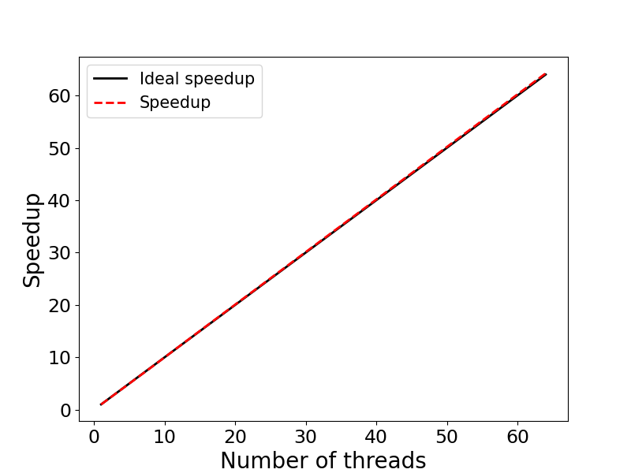

# Exercise 3: Scaling - OpenMP 

This example illustrates evaluating the speedup of parallel applications. 
The specific example is an OpenMP (OMP) implementation of a Monte-Carlo algorithm for 
calculating $\pi$ in parallel. We will run the program on 1, 2, 4, 8, 16, 32, and 64
OMP threads, calculate the speedup and create a speedup figure.

## Contents:

* <code>omp_pi.c</code>: C source code
* <code>Makefile</code>: Makefile to compile the code
* <code>run.sbatch</code>: Batch-job submission script
* <code>scaling_results.txt</code>: Scaling results / Timing
* <code>speedup.py</code>: Python code to generate speedup figure
* <code>speedup.png</code>: Speedup figure

### Step 1: Compile the source code

The code is compiled with

```bash
module load gcc/14.2.0-fasrc01 	# Load required software modules
make             			    # Compile
```
using the `Makefile`:

```makefile
#=================================================
# Makefile
#=================================================
CFLAGS   = -c -O2 -fopenmp
COMPILER = gcc
PRO         = omp_pi
OBJECTS     = ${PRO}.o

${PRO}.x : $(OBJECTS)
	$(COMPILER) -o ${PRO}.x $(OBJECTS) -fopenmp

%.o : %.c
	$(COMPILER) $(CFLAGS) $(<F)

clean :
	rm -fr *.o *.x *.out *.err *.dat
```
This will generate the executable `omp_pi.x`. The C source code is included below:

```c
/*
  PROGRAM: omp_pi.c
  DESCRIPTION: 
     OpenMP implementation of Monte-Carlo algorithm
     for calculating PI
  USAGE: omp_pi.x <number_of_samples> <number_of_threads>
 */
#include <stdio.h>
#include <stdlib.h>
#include <omp.h>
#include <math.h>

int main (int argc, char *argv[]) {
  int i, count, samples, nthreads, seed;
  struct drand48_data drand_buf;
  double x, y, z;
  double t0, t1, tf, PI;
  
  samples  = atoi(argv[1]);       // Number of sumples
  nthreads = atoi(argv[2]);
  omp_set_num_threads (nthreads); // Set number of threads

  printf("Number of threads: %2i\n", nthreads);

  t0 = omp_get_wtime();
  count = 0;

#pragma omp parallel private(i, x, y, z, seed, drand_buf) shared(samples)
  {
    seed = 1202107158 + omp_get_thread_num() * 1999;
    srand48_r (seed, &drand_buf);
    
#pragma omp for reduction(+:count)
    for (i=0; i<samples; i++) {
      drand48_r (&drand_buf, &x);
      drand48_r (&drand_buf, &y);
      z = x*x + y*y;
      if ( z <= 1.0 ) count++;
    }
  }

  t1 = omp_get_wtime();
  tf = t1 - t0;
  
  // Estimate PI............................................
  PI =  4.0*count/samples;

  printf("Exact value of PI: %7.5f\n", M_PI);
  printf("Estimate of PI:    %7.5f\n", PI);
  printf("Time: %7.2f sec.\n\n", tf);
  return 0;
}
```
### Step 2: Create a job submission script 

Below is an example batch-job submission script for this exercise. Use this
script to run the program with 1, 2, 4, 8, 16, 32, and 64 OMP threads. 

```bash
#!/bin/bash
#SBATCH -J omp_pi
#SBATCH -o omp_pi.out
#SBATCH -e omp_pi.err
#SBATCH -t 0-00:30
#SBATCH -p test
#SBATCH -N 1
#SBATCH -c 64
#SBATCH --mem=4G

PRO=omp_pi

# --- Load required software modules ---
module load gcc/14.2.0-fasrc01
unset OMP_NUM_THREADS

# --- Run program with 1, 2, 4, 8, 16, 32, and 64 OpenMP threads ---
echo "Number of threads: ${i}"
srun -c ${SLURM_CPUS_PER_TASK} ./${PRO}.x 1000000000 ${SLURM_CPUS_PER_TASK} > ${PRO}.dat
```

### Step 3: Submit the Job

If the job-submission script is named `run.sbatch`, for instance, the job is submitted
to the queue with:

```bash
sbatch run.sbatch
```

### Step 4: Check the job status and output

Upon job completion, the results are recorded in the file `omp_pi.dat`.
You can check the job status with `sacct`, e.g.,

```bash
sacct -j 6282602
JobID           JobName  Partition    Account  AllocCPUS      State ExitCode 
------------ ---------- ---------- ---------- ---------- ---------- -------- 
6282602          omp_pi       test   rc_admin          4  COMPLETED      0:0 
6282602.bat+      batch              rc_admin          4  COMPLETED      0:0 
6282602.ext+     extern              rc_admin          4  COMPLETED      0:0
```

and output with. e.g.,

```bash
cat omp_pi.dat
Number of threads:  4
Exact value of PI: 3.14159
Estimate of PI:    3.14165
Time:    2.74 sec.
```

### Step 5: Speedup figure

For each run, we record the runtime in a file, e.g., `scaling_results.txt`. An example 
is given below:

```bash
cat scaling_results.txt 
 1 10.92
 2 5.47
 4 2.74
 8 1.37
16 0.68
32 0.34
64 0.17
```

This file is used by a Python code, `speedup.py`, to generate the speedup 
figure `speedup.png`:



We see that the program displays an excellent strong scaling up to 64 OMP threads.

Below we include the Python code used to calculate the speedup and generate the speedup
figure, and also an example submission script to send the figure-generating job to the queue.

**Python source code:**

```python
"""
Program: speedup.py
         Code generates speedup plot
         for nthreads = [1, 2, 4 ,8, 16, 32, 64]
"""
import numpy as np
import matplotlib.pyplot as plt
import matplotlib as mpl

mpl.rcParams['xtick.labelsize'] = 17
mpl.rcParams['ytick.labelsize'] = 17

# Get data
infile = "scaling_results.txt"
darr = np.loadtxt(infile, skiprows=0)
nproc    = darr[:,0]
walltime = darr[:,1]

# Compute speedup and parallel efficiency
speedup = []
efficiency = []
for i in range(len(walltime)):
    s = walltime[0] / walltime[i]
    e = 100 * s / (2**i)
    speedup.append(s)
    efficiency.append(e)

# Print out results
print ("    Nthreads  Walltime  Speedup  Efficiency (%)")
for i in range(len(walltime)):
    print ("%8d %11.2f %8.2f %11.2f" % \
        (nproc[i], walltime[i], speedup[i], efficiency[i]))
    
# Speedup figure
fig, ax = plt.subplots(figsize=(8,6))
p1 = plt.plot(nproc, nproc, linewidth = 2.0, color="black",
        linestyle='-', label='Ideal speedup')
p2 = plt.plot(nproc, speedup, linewidth = 2.0, color="red",
        linestyle='--', label='Speedup')
plt.xlabel('Number of threads', fontsize=20)
plt.ylabel('Speedup', fontsize=20)
plt.legend(fontsize=15,loc=2)

plt.savefig('speedup.png', format='png')
```

> **NOTE:** To generate the scaling figure, you will need to load a Python 
module and activate a `conda` environment, e.g., `speedup_env`, containing the `numpy` and `matplotlib` packages. If not already, please create the `speedup_env` conda environment.

**Submission script for the figure-generating job:**

```bash
#!/bin/bash
#SBATCH -J speedup
#SBATCH -o speedup.out
#SBATCH -e speedup.err
#SBATCH -t 0-00:30
#SBATCH -p test
#SBATCH -c 1
#SBATCH --mem=4G

# --- Set up environment ---
module load python/3.12.8-fasrc01
source activate speedup_env 

# --- Run the python code speedup.py ---
python speedup.py
```

If we name the above script `run_speedup.sbatch`, for instance, the job is submitted to the queue as usual with:

```bash
sbatch run_speedup.sbatch
```
In addition to the speedup, the python code computes also the parallel efficiency $E(n)=S(n)/n$, which measures how efficiently you parallelize your code. Here $S(n)=T(1)/T(n)$ is the speedup, $n$ is the number of parallel processes (threads), $T(1)$ is the time to complete the program on one thread, and $T(n)$ is the time to complete the program on $n$ threads. 

Table with the results is given below:

```bash
cat speedup.out 
    Nthreads  Walltime  Speedup  Efficiency (%)
       1       10.92     1.00      100.00
       2        5.47     2.00       99.82
       4        2.74     3.99       99.64
       8        1.37     7.97       99.64
      16        0.68    16.06      100.00
      32        0.34    32.12      100.00
      64        0.17    64.24      100.00
```