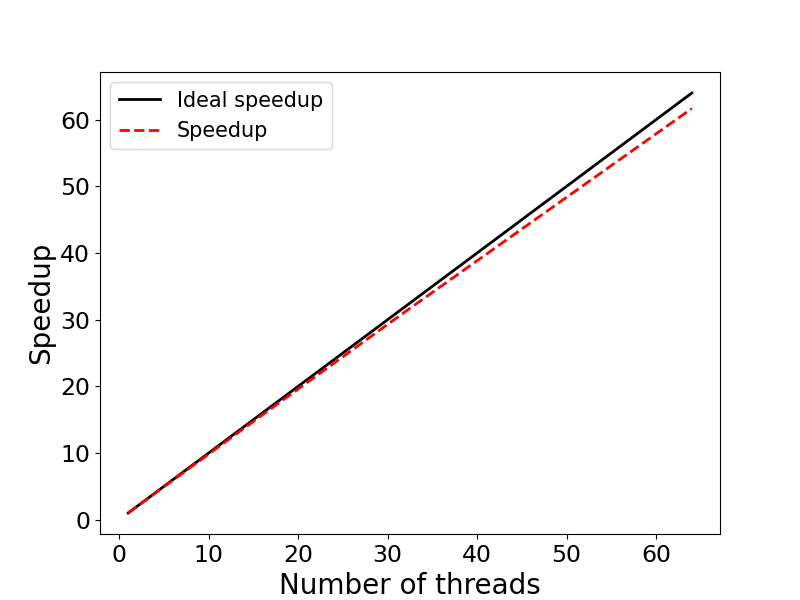

# Exercise 3: Scaling - OpenMP 

This example illustrates evaluating the speedup of parallel applications. 
The specific example is an OpenMP (OMP) implementation of a Monte-Carlo algorithm for 
calculating $\pi$ in parallel. We will run the program on 1, 2, 4, 8, 16, 32, and 64
OMP threads, calculate the speedup and create a speedup figure. This is a Fortran implementation.

## Contents:

* <code>omp_pi.f90</code>: Fortran source code
* <code>Makefile</code>: Makefile to compile the code
* <code>run.sbatch</code>: Batch-job submission script
* <code>scaling_results.txt</code>: Scaling results / Timing
* <code>speedup.py</code>: Python code to generate speedup figure
* <code>speedup.png</code>: Speedup figure

### Step 1: Compile the source code

The code is compiled with

```bash
module load gcc/14.2.0-fasrc01	   # Load required software modules
make             			       # Compile
```
using the `Makefile`:

```makefile
#=================================================
# Makefile
#=================================================
CFLAGS   = -c -O2 -fopenmp
COMPILER = gfortran
PRO         = omp_pi
OBJECTS     = ${PRO}.o

${PRO}.x : $(OBJECTS)
	$(COMPILER) -o ${PRO}.x $(OBJECTS) -fopenmp

%.o : %.f90
	$(COMPILER) $(CFLAGS) $(<F)

clean :
	rm -fr *.o *.x *.out *.err *.dat
```
This will generate the executable `omp_pi.x`. The C source code is included below:

```fortran
!+++++++++++++++++++++++++++++++++++++++++++++++++++++++++++++++++++++
! Program: omp_pi.f90
!          OpenMP implementation of Monte-Carlo algorithm for calculating PI
!          Translated from omp_pi.c, adapted for gfortran
!
! Compile: gfortran -o omp_pi.x omp_pi.f90 -O2 -fopenmp
! 
! Run:     ./omp_pi.x <number_of_samples> <number_of_threads>
!          OMP_NUM_THREADS=<number_of_threads> ./omp_pi.x (optional override)
!+++++++++++++++++++++++++++++++++++++++++++++++++++++++++++++++++++++
PROGRAM omp_pi
  USE OMP_LIB   ! OpenMP library
  IMPLICIT NONE
  
  INTEGER(4) :: i, count, samples, nthreads, tid
  INTEGER(4) :: seed_size
  INTEGER(4), ALLOCATABLE :: seed(:)
  REAL(8)    :: x, y, z
  REAL(8)    :: t0, t1, tf, PI
  REAL(8), PARAMETER :: PI_EXACT = 3.14159265358979323846D0
  CHARACTER(LEN=20) :: arg1, arg2
  
  ! Get command-line arguments
  CALL GET_COMMAND_ARGUMENT(1, arg1)
  CALL GET_COMMAND_ARGUMENT(2, arg2)
  READ(arg1, *) samples   ! Number of samples
  READ(arg2, *) nthreads  ! Number of threads
  
  CALL OMP_SET_NUM_THREADS(nthreads)
  
  WRITE(*,'(A,I2)') "Number of threads: ", nthreads
  
  t0 = OMP_GET_WTIME()
  count = 0
  
  !$OMP PARALLEL PRIVATE(i, x, y, z, tid, seed) SHARED(samples)
    tid = OMP_GET_THREAD_NUM()
    
    ! Thread-specific seed for intrinsic RNG
    CALL RANDOM_SEED(SIZE=seed_size)
    ALLOCATE(seed(seed_size))
    seed = 1202107158 + tid * 1999  ! Match C seeding strategy
    CALL RANDOM_SEED(PUT=seed)
    DEALLOCATE(seed)
    
    !$OMP DO REDUCTION(+:count)
    DO i = 0, samples - 1           ! Match C loop range (0 to samples-1)
      CALL RANDOM_NUMBER(x)
      CALL RANDOM_NUMBER(y)
      z = x*x + y*y
      IF (z <= 1.0D0) count = count + 1
    END DO
    !$OMP END DO
  !$OMP END PARALLEL
  
  t1 = OMP_GET_WTIME()
  tf = t1 - t0
  
  ! Estimate PI
  PI = 4.0D0 * REAL(count, KIND=8) / REAL(samples, KIND=8)
  
  WRITE(*,'(A,F7.5)') "Exact value of PI: ", PI_EXACT
  WRITE(*,'(A,F7.5)') "Estimate of PI:    ", PI
  WRITE(*,'(A,F7.2,A)') "Time: ", tf, " sec."
  
END PROGRAM omp_pi
```
### Step 2: Create a job submission script 

Below is an example batch-job submission script for this exercise. Use this
script to run the program with 1, 2, 4, 8, 16, 32, and 64 OMP threads. 

```bash
#!/bin/bash
#SBATCH -J omp_pi
#SBATCH -o omp_pi.out
#SBATCH -e omp_pi.err
#SBATCH -t 0-00:30
#SBATCH -p test
#SBATCH -N 1
#SBATCH -c 1
#SBATCH --mem=4G

PRO=omp_pi

# --- Load required software modules ---
module load gcc/14.2.0-fasrc01
unset OMP_NUM_THREADS

# --- Run program with 1, 2, 4, 8, 16, 32, and 64 OpenMP threads ---
echo "Number of threads: ${i}"
srun -c ${SLURM_CPUS_PER_TASK} ./${PRO}.x 1000000000 ${SLURM_CPUS_PER_TASK} > ${PRO}.dat
```

### Step 3: Submit the Job

If the job-submission script is named `run.sbatch`, for instance, the job is submitted
to the queue with:

```bash
sbatch run.sbatch
```

### Step 4: Check the job status and output

Upon job completion, the results are recorded in the file `omp_pi.dat`.
You can check the job status with `sacct`, e.g.,

```bash
sacct -j 6836205
JobID           JobName  Partition    Account  AllocCPUS      State ExitCode 
------------ ---------- ---------- ---------- ---------- ---------- -------- 
6836205          omp_pi       test   rc_admin          4  COMPLETED      0:0 
6836205.bat+      batch              rc_admin          4  COMPLETED      0:0 
6836205.ext+     extern              rc_admin          4  COMPLETED      0:0 
6836205.0      omp_pi.x              rc_admin          4  COMPLETED      0:0
```

and output with. e.g.,

```bash
cat omp_pi.dat 
Number of threads:  4
Exact value of PI: 3.14159
Estimate of PI:    3.14158
Time:    6.23 sec.
```

### Step 5: Speedup figure

For each run, we record the runtime in a file, e.g., `scaling_results.txt`. An example 
is given below:

```bash
cat scaling_results.txt 
 1 24.67
 2 12.39
 4 6.23
 8 3.13
16 1.57
32 0.79
64 0.40
```

This file is used by a Python code, `speedup.py`, to generate the speedup 
figure `speedup.png`:



We see that the program displays an excellent strong scaling up to 64 OMP threads.

Below we include the Python code used to calculate the speedup and generate the speedup
figure, and also an example submission script to send the figure-generating job to the queue.

**Python source code:**

```python
"""
Program: speedup.py
         Code generates speedup plot
         for nthreads = [1, 2, 4 ,8, 16, 32, 64]
"""
import numpy as np
import matplotlib.pyplot as plt
import matplotlib as mpl

mpl.rcParams['xtick.labelsize'] = 17
mpl.rcParams['ytick.labelsize'] = 17

with open('scaling_results.txt','r') as f: 
     nproc,walltime = zip(*[ (int(i.strip().split(' ')[0]),float(i.strip().split(' ')[1])) for i in f.readlines()])

nproc      = list(nproc)
walltime   = list(walltime)

speedup = []
efficiency = []
for i in range(len(walltime)):
    s = walltime[0] / walltime[i]
    e = 100 * s / (2**i)
    speedup.append(s)
    efficiency.append(e)

# Print out results
print ("    Nthreads  Walltime  Speedup  Efficiency (%)")
for i in range(len(walltime)):
    print ("%8d %11.2f %8.2f %11.2f" % \
        (nproc[i], walltime[i], speedup[i], efficiency[i]))
    

fig, ax = plt.subplots(figsize=(8,6))
p1 = plt.plot(nproc, nproc, linewidth = 2.0, color="black",
        linestyle='-', label='Ideal speedup')
p2 = plt.plot(nproc, speedup, linewidth = 2.0, color="red",
        linestyle='--', label='Speedup')
plt.xlabel('Number of threads', fontsize=20)
plt.ylabel('Speedup', fontsize=20)
plt.legend(fontsize=15,loc=2)

plt.savefig('speedup.png', format='png')
```

> **NOTE:** To generate the scaling figure, you will need to load a Python 
module and activate a `conda` environment, e.g., `python-3.10_env`, 
(see below) containing the `numpy` and `matplotlib` packages.

Below is an example `conda` environment, e.g.,

```bash
module load python/3.10.13-fasrc01
mamba create -n python-3.10_env python=3.10 pip wheel numpy scipy matplotlib pandas seaborn h5py
```

**Submission script for the figure-generating job:**

```bash
#!/bin/bash
#SBATCH -J speedup
#SBATCH -o speedup.out
#SBATCH -e speedup.err
#SBATCH -t 0-00:30
#SBATCH -p test
#SBATCH -c 1
#SBATCH --mem=4G

# --- Set up environment ---
module load python/3.10.13-fasrc01
source activate python-3.10_env

# --- Run the python code speedup.py ---
python speedup.py
```

If we name the above script `run_speedup.sbatch`, for instance, the job is submitted to the queue as usual with:

```bash
sbatch run_speedup.sbatch
```
In addition to the speedup, the python code computes also the parallel efficiency $E(n)=S(n)/n$, which measures how efficiently you parallelize your code. Here $S(n)=T(1)/T(n)$ is the speedup, $n$ is the number of parallel processes (threads), $T(1)$ is the time to complete the program on one thread, and $T(n)$ is the time to complete the program on $n$ threads. 

Table with the results is given below:

```bash
cat speedup.out 
    Nthreads  Walltime  Speedup  Efficiency (%)
       1       24.67     1.00      100.00
       2       12.39     1.99       99.56
       4        6.23     3.96       99.00
       8        3.13     7.88       98.52
      16        1.57    15.71       98.21
      32        0.79    31.23       97.59
      64        0.40    61.68       96.37
```