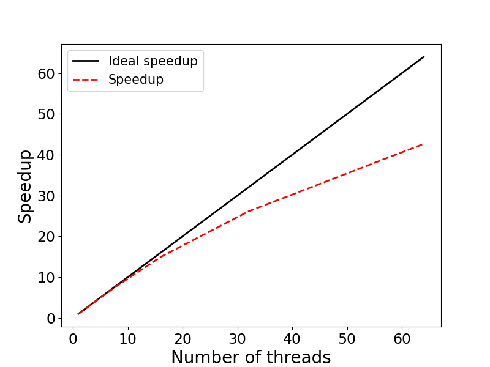

# Exercise 3: Scaling - OpenMP 

This example illustrates evaluating the speedup of parallel applications. 
The specific example is a Python implementation of a Monte-Carlo algorithm for 
calculating $\pi$ in parallel using `multiprocessing`. We will run the program on 1, 2, 4, 8, 16, 32, and 64 parallel processes, calculate the speedup and create a speedup figure.

## Contents:

* <code>mp_pi.py</code>: Python source code
* <code>run.sbatch</code>: Batch-job submission script
* <code>scaling_results.txt</code>: Scaling results / Timing
* <code>speedup.py</code>: Python code to generate speedup figure
* <code>speedup.png</code>: Speedup figure

### Step 1: Review the Python source code

The Python source code `mp_pi.py` is included below:

```python
#!/usr/bin/env python3
#+++++++++++++++++++++++++++++++++++++++++++++++++++++++++++++++++++++
# Program: mp_pi.py
#          Parallel Monte-Carlo algorithm for calculating PI using multiprocessing
#          Translated from omp_pi.c
#
# Usage:   python mp_pi.py <number_of_samples> <number_of_processes>
#+++++++++++++++++++++++++++++++++++++++++++++++++++++++++++++++++++++
import sys
import math
import time
from multiprocessing import Pool

def lcg_rand(seed):
    a = 69069
    c = 1
    m = 2147483647
    seed = (a * seed + c) % m
    return seed, float(seed) / m

def calc_pi_chunk(args):
    samples, seed_base, process_id = args
    count = 0
    seed = seed_base + process_id * 1999
    
    for i in range(samples):
        seed, rx = lcg_rand(seed)
        seed, ry = lcg_rand(seed)
        x = rx
        y = ry
        z = x * x + y * y
        
        if z <= 1.0:
            count += 1
    
    return count

def main():
    if len(sys.argv) != 3:
        print("Usage: python mp_pi.py <number_of_samples> <number_of_processes>")
        sys.exit(1)
    
    total_samples = int(sys.argv[1])
    nprocesses = int(sys.argv[2])
    
    samples_per_process = total_samples // nprocesses
    remainder = total_samples % nprocesses
    tasks = []
    base_seed = 1202107158
    
    for i in range(nprocesses):
        chunk_size = samples_per_process + (1 if i < remainder else 0)
        tasks.append((chunk_size, base_seed, i))
    
    t0 = time.perf_counter()
    with Pool(processes=nprocesses) as pool:
        results = pool.map(calc_pi_chunk, tasks)
    
    total_count = sum(results)
    tf = time.perf_counter() - t0
    
    pi_estimate = 4.0 * total_count / total_samples
    
    print(f"Number of processes: {nprocesses:2d}")
    print(f"Exact value of PI: {math.pi:7.5f}")
    print(f"Estimate of PI:    {pi_estimate:7.5f}")
    print(f"Time: {tf:7.2f} sec.")

if __name__ == "__main__":
    main()
```
### Step 2: Create a job submission script 

Below is an example batch-job submission script for this exercise. Use this
script to run the program with 1, 2, 4, 8, 16, 32, and 64 OMP threads. 

```bash
#!/bin/bash
#SBATCH -J mp_pi
#SBATCH -o mp_pi.out
#SBATCH -e mp_pi.err
#SBATCH -t 0-00:30
#SBATCH -p test
#SBATCH -N 1
#SBATCH -c 16
#SBATCH --mem=4G

PRO=mp_pi

# --- Load required software modules ---
module load python/3.10.13-fasrc01 
unset OMP_NUM_THREADS

# --- Run program with 1, 2, 4, 8, 16, 32, and 64 OpenMP threads ---
echo "Number of threads: ${SLURM_CPUS_PER_TASK}"
srun -c ${SLURM_CPUS_PER_TASK} python ${PRO}.py 30000000 ${SLURM_CPUS_PER_TASK} > ${PRO}.dat
```

### Step 3: Submit the Job

If the job-submission script is named `run.sbatch`, for instance, the job is submitted
to the queue with:

```bash
sbatch run.sbatch
```

### Step 4: Check the job status and output

Upon job completion, the results are recorded in the file `mp_pi.dat`.
You can check the job status with `sacct`, e.g.,

```bash
sacct -j 6788229
JobID           JobName  Partition    Account  AllocCPUS      State ExitCode 
------------ ---------- ---------- ---------- ---------- ---------- -------- 
6788229           mp_pi       test   rc_admin         16  COMPLETED      0:0 
6788229.bat+      batch              rc_admin         16  COMPLETED      0:0 
6788229.ext+     extern              rc_admin         16  COMPLETED      0:0 
6788229.0        python              rc_admin         16  COMPLETED      0:0 
```

and output with. e.g.,

```bash
cat mp_pi.dat 
Number of processes: 16
Exact value of PI: 3.14159
Estimate of PI:    3.14145
Time:    1.18 sec..
```

### Step 5: Speedup figure

For each run, we record the runtime in a file, e.g., `scaling_results.txt`. An example 
is given below:

```bash
cat scaling_results.txt 
 1 17.49
 2 8.90
 4 4.41
 8 2.23
16 1.17
32 0.67
64 0.41
```

This file is used by a Python code, `speedup.py`, to generate the speedup 
figure `speedup.png`:



We see that the program displays an excellent strong scaling up to 16 threads, and
good scaling up to 64 threads.

Below we include the Python code used to calculate the speedup and generate the speedup
figure, and also an example submission script to send the figure-generating job to the queue.

**Python source code:**

```python
"""
Program: speedup.py
         Code generates speedup plot
         for nthreads = [1, 2, 4 ,8, 16, 32, 64]
"""
import numpy as np
import matplotlib.pyplot as plt
import matplotlib as mpl

mpl.rcParams['xtick.labelsize'] = 17
mpl.rcParams['ytick.labelsize'] = 17

with open('scaling_results.txt','r') as f: 
     nproc,walltime = zip(*[ (int(i.strip().split(' ')[0]),float(i.strip().split(' ')[1])) for i in f.readlines()])

nproc      = list(nproc)
walltime   = list(walltime)

speedup = []
efficiency = []
for i in range(len(walltime)):
    s = walltime[0] / walltime[i]
    e = 100 * s / (2**i)
    speedup.append(s)
    efficiency.append(e)

# Print out results
print ("    Nthreads  Walltime  Speedup  Efficiency (%)")
for i in range(len(walltime)):
    print ("%8d %11.2f %8.2f %11.2f" % \
        (nproc[i], walltime[i], speedup[i], efficiency[i]))
    

fig, ax = plt.subplots(figsize=(8,6))
p1 = plt.plot(nproc, nproc, linewidth = 2.0, color="black",
        linestyle='-', label='Ideal speedup')
p2 = plt.plot(nproc, speedup, linewidth = 2.0, color="red",
        linestyle='--', label='Speedup')
plt.xlabel('Number of threads', fontsize=20)
plt.ylabel('Speedup', fontsize=20)
plt.legend(fontsize=15,loc=2)

plt.savefig('speedup.png', format='png')
```

> **NOTE:** To generate the scaling figure, you will need to load a Python 
module and activate a `conda` environment, e.g., `python-3.10_env`, 
(see below) containing the `numpy` and `matplotlib` packages.

Below is an example `conda` environment, e.g.,

```bash
module load python/3.10.13-fasrc01
mamba create -n python-3.10_env python=3.10 pip wheel numpy scipy matplotlib pandas seaborn h5py
```

**Submission script for the figure-generating job:**

```bash
#!/bin/bash
#SBATCH -J speedup
#SBATCH -o speedup.out
#SBATCH -e speedup.err
#SBATCH -t 0-00:30
#SBATCH -p test
#SBATCH -c 1
#SBATCH --mem=4G

# --- Set up environment ---
module load python/3.10.13-fasrc01
source activate python-3.10_env

# --- Run the python code speedup.py ---
python speedup.py
```

If we name the above script `run_speedup.sbatch`, for instance, the job is submitted to the queue as usual with:

```bash
sbatch run_speedup.sbatch
```
In addition to the speedup, the python code computes also the parallel efficiency $E(n)=S(n)/n$, which measures how efficiently you parallelize your code. Here $S(n)=T(1)/T(n)$ is the speedup, $n$ is the number of parallel processes (threads), $T(1)$ is the time to complete the program on one thread, and $T(n)$ is the time to complete the program on $n$ threads. 

Table with the results is given below:

```bash
cat speedup.out 
    Nthreads  Walltime  Speedup  Efficiency (%)
       1       17.49     1.00      100.00
       2        8.90     1.97       98.26
       4        4.41     3.97       99.15
       8        2.23     7.84       98.04
      16        1.17    14.95       93.43
      32        0.67    26.10       81.58
      64        0.41    42.66       66.65
```