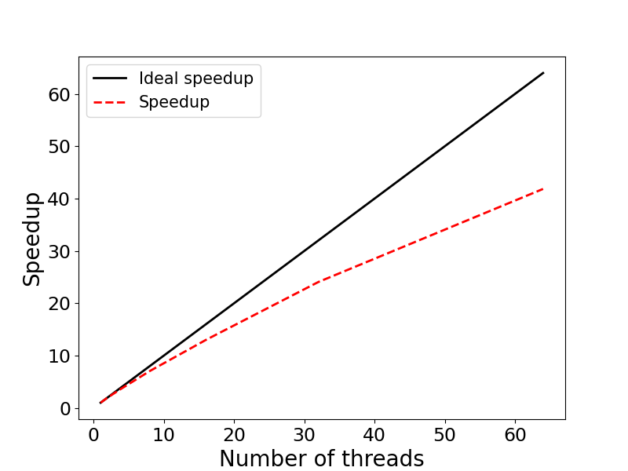

# Exercise 3: Scaling - OpenMP 

This example illustrates evaluating the speedup of parallel applications. 
The specific example is a R implementation of a Monte-Carlo algorithm for 
calculating $\pi$ in parallel using the `parallel` R package. We will run the program on 1, 2, 4, 8, 16, 32, and 64 parallel processes, calculate the speedup and create a speedup figure.

## Contents:

* <code>mp_pi.R</code>: R source code
* <code>run.sbatch</code>: Batch-job submission script
* <code>scaling_results.txt</code>: Scaling results / Timing
* <code>speedup.py</code>: Python code to generate speedup figure
* <code>speedup.png</code>: Speedup figure

### Step 1: Review the R source code

The R source code `mp_pi.py` is included below:

```r
#!/usr/bin/env Rscript

# Program: mp_pi.R
# Parallel Monte-Carlo PI calculation using R's parallel package

# Function to generate random numbers using LCG
lcg_rand <- function(seed) {
  a <- 69069
  c <- 1
  m <- 2147483647
  seed <- (a * seed + c) %% m
  return(list(seed = seed, value = seed / m))
}

# Function to calculate PI for a chunk of samples
calc_pi_chunk <- function(args) {
  samples <- args$samples
  seed_base <- args$seed_base
  pid <- args$pid
  
  count <- 0
  seed <- seed_base + pid * 1999
  
  for (i in 1:samples) {
    result <- lcg_rand(seed)
    seed <- result$seed
    x <- result$value
    
    result <- lcg_rand(seed)
    seed <- result$seed
    y <- result$value
    
    z <- x * x + y * y
    if (z <= 1) count <- count + 1
  }
  
  return(count)
}

# Main function
main <- function() {
  # Parse command-line arguments
  args <- commandArgs(trailingOnly = TRUE)
  if (length(args) != 2) {
    cat("Usage: Rscript mp_pi.R <number_of_samples> <number_of_processes>\n")
    quit(status = 1)
  }
  
  total_samples <- as.integer(args[1])
  nprocesses <- as.integer(args[2])
  
  # Set up parallel cluster
  library(parallel)
  cl <- makeCluster(nprocesses)
  
  # Split samples across processes
  samples_per_proc <- total_samples %/% nprocesses
  remainder <- total_samples %% nprocesses
  tasks <- list()
  base_seed <- 1202107158
  
  for (i in 1:nprocesses) {
    chunk_size <- samples_per_proc + (if (i <= remainder) 1 else 0)
    tasks[[i]] <- list(samples = chunk_size, seed_base = base_seed, pid = i - 1)
  }
  
  # Timing start
  t0 <- Sys.time()
  
  # Export functions to cluster
  clusterExport(cl, c("lcg_rand", "calc_pi_chunk"))
  
  # Run in parallel
  results <- parLapply(cl, tasks, calc_pi_chunk)
  
  # Stop cluster
  stopCluster(cl)
  
  # Combine results
  total_count <- sum(unlist(results))
  tf <- as.numeric(Sys.time() - t0, units = "secs")
  
  # Estimate PI
  pi_estimate <- 4.0 * total_count / total_samples
  
  # Output results
  cat(sprintf("Number of processes: %2d\n", nprocesses))
  cat(sprintf("Exact value of PI: %.5f\n", pi))
  cat(sprintf("Estimate of PI:    %.5f\n", pi_estimate))
  cat(sprintf("Time: %.2f sec.\n", tf))
}

# Execute main
main()
```
### Step 2: Create a job submission script 

Below is an example batch-job submission script for this exercise. Use this
script to run the program with 1, 2, 4, 8, 16, 32, and 64 parallel processes. 

```bash
#!/bin/bash
#SBATCH -J mp_pi
#SBATCH -o mp_pi.out
#SBATCH -e mp_pi.err
#SBATCH -t 0-00:30
#SBATCH -p test
#SBATCH -N 1
#SBATCH -c 2
#SBATCH --mem=4G

PRO=mp_pi

# --- Load required software modules ---
module load R/4.4.3-fasrc01
unset OMP_NUM_THREADS

# --- Run program with 1, 2, 4, 8, 16, 32, and 64 OpenMP threads ---
echo "Number of threads: ${SLURM_CPUS_PER_TASK}"
srun -c ${SLURM_CPUS_PER_TASK} Rscript ${PRO}.R 10000000  ${SLURM_CPUS_PER_TASK} > ${PRO}.dat
```

### Step 3: Submit the Job

If the job-submission script is named `run.sbatch`, for instance, the job is submitted
to the queue with:

```bash
sbatch run.sbatch
```

### Step 4: Check the job status and output

Upon job completion, the results are recorded in the file `mp_pi.dat`.
You can check the job status with `sacct`, e.g.,

```bash
JobID           JobName  Partition    Account  AllocCPUS      State ExitCode 
------------ ---------- ---------- ---------- ---------- ---------- -------- 
6856431           mp_pi       test   rc_admin         16  COMPLETED      0:0 
6856431.bat+      batch              rc_admin         16  COMPLETED      0:0 
6856431.ext+     extern              rc_admin         16  COMPLETED      0:0 
6856431.0       Rscript              rc_admin         16  COMPLETED      0:0
```

and output with. e.g.,

```bash
cat mp_pi.dat 
Number of processes: 16
Exact value of PI: 3.14159
Estimate of PI:    3.14012
Time: 1.83 sec.
```

### Step 5: Speedup figure

For each run, we record the runtime in a file, e.g., `scaling_results.txt`. An example 
is given below:

```bash
cat scaling_results.txt 
 1 19.25
 2 9.70
 4 5.17
 8 2.73
16 1.48
32 0.80
64 0.46
```

This file is used by a Python code, `speedup.py`, to generate the speedup 
figure `speedup.png`:



We see that the program displays an excellent strong scaling up to 16 threads, and
good scaling up to 64 threads.

Below we include the Python code used to calculate the speedup and generate the speedup
figure, and also an example submission script to send the figure-generating job to the queue.

**Python source code:**

```python
"""
Program: speedup.py
         Code generates speedup plot
         for nthreads = [1, 2, 4 ,8, 16, 32, 64]
"""
import numpy as np
import matplotlib.pyplot as plt
import matplotlib as mpl

mpl.rcParams['xtick.labelsize'] = 17
mpl.rcParams['ytick.labelsize'] = 17

with open('scaling_results.txt','r') as f: 
     nproc,walltime = zip(*[ (int(i.strip().split(' ')[0]),float(i.strip().split(' ')[1])) for i in f.readlines()])

nproc      = list(nproc)
walltime   = list(walltime)

speedup = []
efficiency = []
for i in range(len(walltime)):
    s = walltime[0] / walltime[i]
    e = 100 * s / (2**i)
    speedup.append(s)
    efficiency.append(e)

# Print out results
print ("    Nthreads  Walltime  Speedup  Efficiency (%)")
for i in range(len(walltime)):
    print ("%8d %11.2f %8.2f %11.2f" % \
        (nproc[i], walltime[i], speedup[i], efficiency[i]))
    

fig, ax = plt.subplots(figsize=(8,6))
p1 = plt.plot(nproc, nproc, linewidth = 2.0, color="black",
        linestyle='-', label='Ideal speedup')
p2 = plt.plot(nproc, speedup, linewidth = 2.0, color="red",
        linestyle='--', label='Speedup')
plt.xlabel('Number of threads', fontsize=20)
plt.ylabel('Speedup', fontsize=20)
plt.legend(fontsize=15,loc=2)

plt.savefig('speedup.png', format='png')
```

> **NOTE:** To generate the scaling figure, you will need to load a Python 
module and activate a `conda` environment, e.g., `python-3.10_env`, 
(see below) containing the `numpy` and `matplotlib` packages.

Below is an example `conda` environment, e.g.,

```bash
module load python/3.10.13-fasrc01
mamba create -n python-3.10_env python=3.10 pip wheel numpy scipy matplotlib pandas seaborn h5py
```

**Submission script for the figure-generating job:**

```bash
#!/bin/bash
#SBATCH -J speedup
#SBATCH -o speedup.out
#SBATCH -e speedup.err
#SBATCH -t 0-00:30
#SBATCH -p test
#SBATCH -c 1
#SBATCH --mem=4G

# --- Set up environment ---
module load python/3.10.13-fasrc01
source activate python-3.10_env

# --- Run the python code speedup.py ---
python speedup.py
```

If we name the above script `run_speedup.sbatch`, for instance, the job is submitted to the queue as usual with:

```bash
sbatch run_speedup.sbatch
```
In addition to the speedup, the python code computes also the parallel efficiency $E(n)=S(n)/n$, which measures how efficiently you parallelize your code. Here $S(n)=T(1)/T(n)$ is the speedup, $n$ is the number of parallel processes (threads), $T(1)$ is the time to complete the program on one thread, and $T(n)$ is the time to complete the program on $n$ threads. 

Table with the results is given below:

```bash
cat speedup.out 
    Nthreads  Walltime  Speedup  Efficiency (%)
       1       19.25     1.00      100.00
       2        9.70     1.98       99.23
       4        5.17     3.72       93.09
       8        2.73     7.05       88.14
      16        1.48    13.01       81.29
      32        0.80    24.06       75.20
      64        0.46    41.85       65.39
```