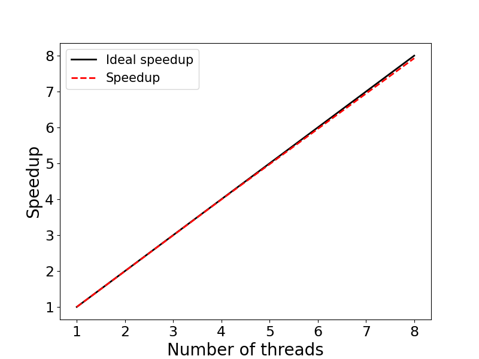

# Exercise 3: Scaling - OpenMP 

This example illustrates evaluating the speedup of parallel applications. 
The specific example is an OpenMP (OMP) implementation of a Monte-Carlo algorithm for 
calculating $\pi$ in parallel. The program is run on 1, 2, 4, and 8 OMP threads and then we 
create a speedup figure.

## Contents:

* <code>omp_pi.c</code>: C source code
* <code>omp_pi.dat</code>: Output file
* <code>Makefile</code>: Makefile to compile the code
* <code>run.sbatch</code>: Batch-job submission script
* <code>speedup.py</code>: Python code to generate speedup figure
* <code>speedup.png</code>: Speedup figure

### Step 1: Compile the source code

The code is compiled with

```bash
module load intel/24.2.1-fasrc01	# Load required software modules
make             			        # Compile
```
using the `Makefile`:

```makefile
#=================================================
# Makefile
#=================================================
CFLAGS   = -c -O2 -qopenmp
COMPILER = icx
PRO         = omp_pi
OBJECTS     = ${PRO}.o

${PRO}.x : $(OBJECTS)
	$(COMPILER) -o ${PRO}.x $(OBJECTS) -qopenmp

%.o : %.c
	$(COMPILER) $(CFLAGS) $(<F)

clean :
	rm -fr *.o *.x *.out *.err *.dat scaling_results.txt
```
This will generate the executable `omp_pi.x`. The C source code is included below:

```c
/*
  PROGRAM: omp_pi.c
  DESCRIPTION: 
     OpenMP implementation of Monte-Carlo algorithm
     for calculating PI
  USAGE: omp_pi.x <number_of_samples> <number_of_threads>
 */
#include <stdio.h>
#include <stdlib.h>
#include <omp.h>
#include <math.h>

int main (int argc, char *argv[]) {
  int i, count, samples, nthreads, seed;
  struct drand48_data drand_buf;
  double x, y, z;
  double t0, t1, tf, PI;
  
  samples  = atoi(argv[1]);       // Number of sumples
  nthreads = atoi(argv[2]);
  omp_set_num_threads (nthreads); // Set number of threads

  printf("Number of threads: %2i\n", nthreads);

  t0 = omp_get_wtime();
  count = 0;

#pragma omp parallel private(i, x, y, z, seed, drand_buf) shared(samples)
  {
    seed = 1202107158 + omp_get_thread_num() * 1999;
    srand48_r (seed, &drand_buf);
    
#pragma omp for reduction(+:count)
    for (i=0; i<samples; i++) {
      drand48_r (&drand_buf, &x);
      drand48_r (&drand_buf, &y);
      z = x*x + y*y;
      if ( z <= 1.0 ) count++;
    }
  }

  t1 = omp_get_wtime();
  tf = t1 - t0;
  
  // Estimate PI............................................
  PI =  4.0*count/samples;

  printf("Exact value of PI: %7.5f\n", M_PI);
  printf("Estimate of PI:    %7.5f\n", PI);
  printf("Time: %7.2f sec.\n\n", tf);
  return 0;
}
```
### Step 2: Create a job submission script 

Below is an example batch-job submission script for this exercise.
The job reserves 8 cores on a single node and then runs the program with 1, 2, 4 and 8
OMP threads. It also extracts the required data from the output file `omp_pi.dat`
into a text file, `scaling_results.txt`, which is then used to generate a speedup figure.

```bash
#!/bin/bash
#SBATCH -J omp_pi
#SBATCH -o omp_pi.out
#SBATCH -e omp_pi.err
#SBATCH -t 0-00:30
#SBATCH -p test
#SBATCH -N 1
#SBATCH -c 8
#SBATCH --mem=4G

PRO=omp_pi
rm -rf ${PRO}.dat speedup.png
touch ${PRO}.dat

# --- Load required software modules ---
module load holygpu7c26205
unset OMP_NUM_THREADS
# --- Run program with 1, 2, 4, and 8 OpenMP threads ---
for i in 1 2 4 8 
do
    echo "Number of threads: ${i}"
    ./${PRO}.x 500000000 ${i} >> ${PRO}.dat
    echo " "
done

# --- Generate "scaling_results.txt" data file ---
cat omp_pi.dat  | grep -e Time  -e Number | awk -F ":" '{if ($1 ~ "Time" ) {print $2}else{printf "%d ",$2}}' | awk '{print $1,$2}' > scaling_results.txt

#  --- Generate speedup figure ---
sleep 2
module load python/3.10.13-fasrc01
source activate python-3.10_env
python speedup.py
```

> **NOTE:** To generate the scaling figure, you will need to load a Python 
module and activate a `conda` environment, e.g., `python-3.10_env`, 
(see below) containing the `numpy` and `matplotlib` packages.

Below is an example `conda` environment, e.g.,

```bash
module load python/3.10.13-fasrc01
mamba create -n python-3.10_env python=3.10 pip wheel numpy scipy matplotlib pandas seaborn h5py
```

### Step 3: Submit the Job

If the job-submission script is named `run.sbatch`, for instance, the job is submitted
to the queue with:

```bash
sbatch run.sbatch
```

### Step 4: Check the job status and output

You can check the job status with `sacct`, e.g.,

```bash
sacct -j 3905326
JobID           JobName  Partition    Account  AllocCPUS      State ExitCode 
------------ ---------- ---------- ---------- ---------- ---------- -------- 
3905326          omp_pi       test   rc_admin          8  COMPLETED      0:0 
3905326.bat+      batch              rc_admin          8  COMPLETED      0:0 
3905326.ext+     extern              rc_admin          8  COMPLETED      0:0 
```

and output:  

```bash
cat omp_pi.dat
Number of threads:  1
Exact value of PI: 3.14159
Estimate of PI:    3.14152
Time:    5.47 sec.

Number of threads:  2
Exact value of PI: 3.14159
Estimate of PI:    3.14160
Time:    2.74 sec.

Number of threads:  4
Exact value of PI: 3.14159
Estimate of PI:    3.14159
Time:    1.37 sec.

Number of threads:  8
Exact value of PI: 3.14159
Estimate of PI:    3.14151
Time:    0.69 sec.
```

### Step 5: Speedup figure

The job uses a Python code ,`speedup.py`, to generate the speedup figure `speedup.png`:



We see that the program displays an excellent strong scaling up to 8 OMP threads.

### Python source code

```python
"""
Program: speedup.py
         Code generates speedup plot
         for nthreads = [1, 2, 4 ,8]
"""
import numpy as np
import matplotlib.pyplot as plt
import matplotlib as mpl

mpl.rcParams['xtick.labelsize'] = 17
mpl.rcParams['ytick.labelsize'] = 17

with open('scaling_results.txt','r') as f: 
     nproc,walltime = zip(*[ (int(i.strip().split(' ')[0]),float(i.strip().split(' ')[1])) for i in f.readlines()])

nproc      = list(nproc)
walltime   = list(walltime)

speedup = []
efficiency = []
for i in range(len(walltime)):
    s = walltime[0] / walltime[i]
    e = 100 * s / (2**i)
    speedup.append(s)
    efficiency.append(e)

# Print out results
print ("    Nthreads  Walltime  Speedup  Efficiency (%)")
for i in range(len(walltime)):
    print ("%8d %11.2f %8.2f %11.2f" % \
        (nproc[i], walltime[i], speedup[i], efficiency[i]))
    

fig, ax = plt.subplots(figsize=(8,6))
p1 = plt.plot(nproc, nproc, linewidth = 2.0, color="black",
        linestyle='-', label='Ideal speedup')
p2 = plt.plot(nproc, speedup, linewidth = 2.0, color="red",
        linestyle='--', label='Speedup')
plt.xlabel('Number of threads', fontsize=20)
plt.ylabel('Speedup', fontsize=20)
plt.legend(fontsize=15,loc=2)

plt.savefig('speedup.png', format='png')
```