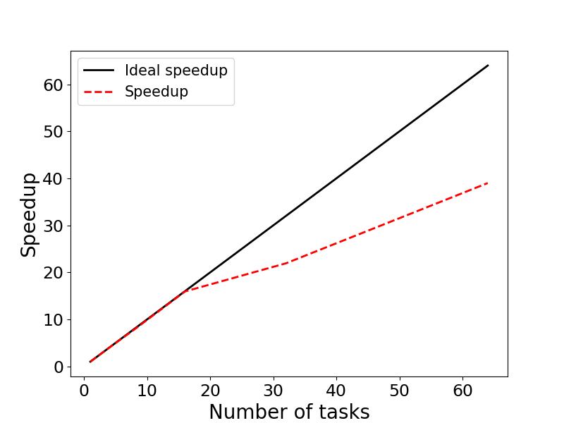

# Exercise 4: Scaling - MPI

This example illustrates evaluating the speedup of parallel applications. 
The specific example is a MPI implementation of a Monte-Carlo algorithm for calculating 
$\pi$ in parallel. In this exercise, we will run the program with 1, 2, 4, 8, 16, 32, and 64
MPI tasks, and evaluate the speedup and scaling of the application.

We will also generate a speedup figure with the provided Python script.

## Contents:

* <code>pi_monte_carlo.f90</code>: Fortran source code
* <code>pi_monte_carlo.out</code>: Output file (from the Fortran code) 
* <code>Makefile</code>: Makefile to compile the code
* <code>run.sbatch</code>: Batch-job submission script (to submit the Fortran code)
* <code>speedup_mpi.py</code>: Python code to generate speedup figure
* <code>speedup.png</code>: Speedup figure
* <code>run_speedup.sbatch</code>: Submission script for the Python code
* <code>scaling_results.txt</code>: Table with execution times (used to compute speed)
* <code>speedup_figure.out</code>: Table with speedup and parallel efficiency  

### Step 1: Compile the source code

The code is compiled with:

```bash
module load intel/24.2.1-fasrc01 openmpi/5.0.5-fasrc01
make
```

using the `Makefile`:

```makefile
#==========================================================
# Make file
#==========================================================
F90CFLAGS   = -c -O2
F90COMPILER = mpif90
PRO         = pi_monte_carlo
OBJECTS     = pi_monte_carlo.o

${PRO}.x : $(OBJECTS)
	$(F90COMPILER) -o ${PRO}.x $(OBJECTS)

%.o : %.f90
	$(F90COMPILER) $(F90CFLAGS) $(<F)

clean : 
	rm -f *.o *.x *.out *.err
```

This will generate the executable `pi_monte_carlo.x`. The Fortran source code used in
this exercise is included below:

```fortran
!+++++++++++++++++++++++++++++++++++++++++++++++++++++++++++++++++++++
! Program: pi_monte_carlo.f90
!          Calculate PI via parallel Monte-Carlo algorithm
!
! Compile: mpif90 -o pi_monte_carlo.x pi_monte_carlo.f90 -O2
! 
! Run:     mpirun -np <Number_of_MPI_ranks> ./pi_monte_carlo.x
!+++++++++++++++++++++++++++++++++++++++++++++++++++++++++++++++++++++
program pi_monte_carlo
  use ifport
  implicit none
  include 'mpif.h'
  integer(4) :: iseed
  integer(4) :: icomm
  integer(4) :: iproc
  integer(4) :: nproc
  integer(4) :: ierr
  integer(8) :: iproc8
  integer(8) :: nproc8
  integer(8) :: i
  integer(8) :: n
  integer(8) :: n_tot
  integer(8) :: sample_number
  real(8)    :: r
  real(8)    :: x
  real(8)    :: y
  real(8)    :: pi_comp
  real(8)    :: pi_err
  real(8)    :: t1
  real(8)    :: t2
  real(8)    :: t_tot
  real(8)    :: randval

  real(8), parameter :: pi=3.141592653589793238462643d0

  ! Initialize MPI....................................................
  call MPI_INIT(ierr)
  icomm = MPI_COMM_WORLD
  call MPI_COMM_SIZE(icomm,nproc,ierr)
  call MPI_COMM_RANK(icomm,iproc,ierr)

  t1 = MPI_WTIME(ierr)

  iseed = -99                ! Seed for random number generator
  r = 1.0d0                  ! Unit circle
  sample_number = 3000000000 ! Number of samples
  randval =  rand(iseed)     ! Iinitialize the random number generator 
 
  ! Convert to INTEGER8...............................................
  iproc8 = iproc
  nproc8 = nproc

  ! Parallel Monte-Carlo sampling.....................................
  n = 0
  do i = 1+iproc8, sample_number, nproc8 
     x = r * rand()
     y = r * rand()
     if ( x**2 + y**2 <= r**2 ) then
        n = n + 1
     end if
  end do

  ! Get total number of hits..........................................
  call MPI_REDUCE(n, n_tot, 1, MPI_INTEGER8, MPI_SUM, 0, icomm, ierr)

  ! Calculate approximated PI.........................................
  pi_comp = 4.0d0 * n_tot / sample_number

  ! Error.............................................................
  pi_err = ( ( dabs(pi-pi_comp) ) / pi ) * 100.0d0

  t2 = MPI_WTIME(ierr)

  t_tot = t2 - t1

  ! Print out result..................................................
  if ( iproc == 0 ) then
     write(6,'(1x,a,4x,i5)') 'Number of MPI ranks:', nproc
     write(6,'(1x,a,4x,f10.8)') 'Exact PI:', pi
     write(6,'(1x,a,1x,f10.8)') 'Computed PI:', pi_comp
     write(6,'(1x,a,7x,f7.5,a)') 'Error:', pi_err, '%'
     write(6,'(1x,a,1x,f5.2,1x,a)') 'Total time:', t_tot, 'sec'
  end if

  ! Shut down MPI.....................................................
  call MPI_FINALIZE(ierr)

  stop

end program pi_monte_carlo
```

### Step 2: Create a job submission script

Below is an example batch-job submission script for this exercise.

```bash
#!/bin/bash
#SBATCH -J pi_monte_carlo
#SBATCH -o pi_monte_carlo.out
#SBATCH -e pi_monte_carlo.err
#SBATCH -p test
#SBATCH -t 30
#SBATCH -n 1
#SBATCH --mem-per-cpu=1G

# Load required modules
module load intel/24.2.1-fasrc01 openmpi/5.0.5-fasrc01

# Run program
srun -n $SLURM_NTASKS --mpi=pmix ./pi_monte_carlo.x
```

### Step 3: Submit the job

If the job-submission script is named `run.sbatch`, for instance, the job is submitted
to the queue with:

```bash
sbatch run.sbatch
```
### Step 4: Run the job with different number of MPI tasks

We will use the above script to run the job with 1, 2, 4, 8, 16, 32, and MPI tasks. For each
case we will look at the STD output file `pi_monte_carlo.out`, and note the execution time
(the last line `Total time:`). Example output is given below:

```bash
cat pi_monte_carlo.out 
 Number of MPI ranks:       32
 Exact PI:    3.14159265
 Computed PI: 3.14183189
 Error:       0.00762%
 Total time:  3.71 sec
```

For each case we will collect the execution times in a text file `scaling_results.txt` as 
the one below:

```bash
cat scaling_results.txt 
 1  74.10 
 2  37.09
 4  18.55 
 8  9.41 
16  4.65
32  3.38
64  1.90
```

>**NOTE:** You could use your favorite text editor on the cluster, e.g., `Emacs`, `Vim`,
etc., to create the text file.

### Step 5: Generate Speedup figure

We will use a Python code ,`speedup_mpi.py`, to generate the speedup figure `speedup.png`.

> **NOTE:** To generate the scaling figure, you will need to load a Python 
module and activate a `conda` environment, e.g., `python-3.10_env`, 
(see below) containing the `numpy` and `matplotlib` packages.

Below is an example `conda` environment, e.g.,

```bash
module load python/3.10.13-fasrc01
mamba create -n python-3.10_env python=3.10 pip wheel numpy scipy matplotlib pandas seaborn h5py
```
You can use a batch-job submission script, as the one below, to generate the speedup figure:

```bash
#!/bin/bash
#SBATCH -J speedup_figure
#SBATCH -o speedup_figure.out
#SBATCH -e speedup_figure.err
#SBATCH -p test
#SBATCH -t 30
#SBATCH -c 1
#SBATCH -n 1
#SBATCH --mem=4G

# Setup envirionment
module load python/3.10.13-fasrc01
source activate python-3.10_env

# Run program
python speedup_mpi.py
```

If you name the above script `run_speedup.sbatch`, for instance, the job is
submitted as usual with:

```bash
sbatch run_speedup.sbatch
```

Upon execution the job will generate the speedup figure `speedup.png`:



We see that the program displays an excellent strong scaling up to 16 MPI ranks. 
After this the speedup diverges from the linear trend. For instance, with 64 MPI tasks
the application achieves parallel efficiency of about 61%.

```bash
cat speedup_figure.out 
    Ntasks    Walltime  Speedup  Efficiency (%)
       1       74.10     1.00      100.00
       2       37.09     2.00       99.89
       4       18.55     3.99       99.87
       8        9.41     7.87       98.43
      16        4.65    15.94       99.60
      32        3.38    21.92       68.51
      64        1.90    39.00       60.94
```

Below is the Python source code used to generate the speedup figure.

### Python source code

```python
"""
Program: speedup.py
         Code generates speedup plot
         for nthreads = [1, 2, 4 ,8]
"""
import numpy as np
import matplotlib.pyplot as plt
import matplotlib as mpl

mpl.rcParams['xtick.labelsize'] = 17
mpl.rcParams['ytick.labelsize'] = 17

with open('scaling_results.txt','r') as f: 
     nproc,walltime = zip(*[ (int(i.strip().split(' ')[0]),float(i.strip().split(' ')[1])) for i in f.readlines()])

nproc      = list(nproc)
walltime   = list(walltime)

speedup = []
efficiency = []
for i in range(len(walltime)):
    s = walltime[0] / walltime[i]
    e = 100 * s / (2**i)
    speedup.append(s)
    efficiency.append(e)

# Print out results
print ("    Ntasks    Walltime  Speedup  Efficiency (%)")
for i in range(len(walltime)):
    print ("%8d %11.2f %8.2f %11.2f" % \
        (nproc[i], walltime[i], speedup[i], efficiency[i]))
    

fig, ax = plt.subplots(figsize=(8,6))
p1 = plt.plot(nproc, nproc, linewidth = 2.0, color="black",
        linestyle='-', label='Ideal speedup')
p2 = plt.plot(nproc, speedup, linewidth = 2.0, color="red",
        linestyle='--', label='Speedup')
plt.xlabel('Number of tasks', fontsize=20)
plt.ylabel('Speedup', fontsize=20)
plt.legend(fontsize=15,loc=2)

plt.savefig('speedup.png', format='png')
#plt.show()
```