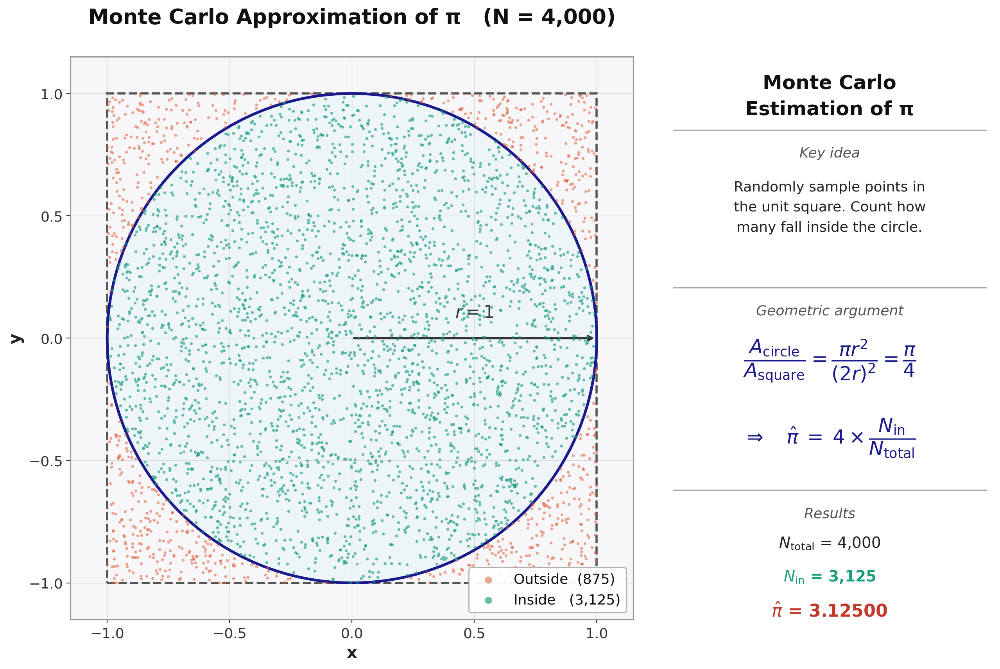
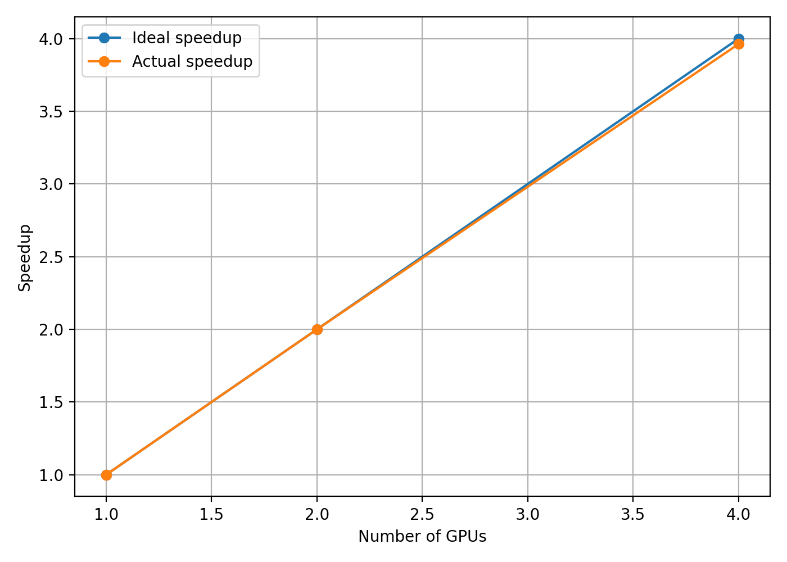

# Exercise 2: Multi-GPU Monte Carlo Pi — Single-Node Scaling

This exercise demonstrates near-linear speedup by distributing a Monte Carlo
computation across 1, 2, and 4 GPUs on a single node using MPI + CUDA.

## Algorithm

The value of π is estimated by sampling random points uniformly in the unit
square and counting how many fall inside the unit circle:

$$\pi \approx 4 \times \frac{\text{hits inside circle}}{\text{total samples}}$$

<p align="center">
  
</p>

Each MPI rank owns an independent subset of the total sample count. Within each
rank, a CUDA kernel distributes the samples across GPU threads. Every thread
uses a unique seed derived from a SplitMix64 hash so that the random streams
are statistically independent across ranks and across threads within a rank.
After the kernel completes, a two-pass warp-shuffle reduction aggregates the
per-thread hit counts to a single scalar on the GPU, and `MPI_Reduce` sums the
per-rank scalars on rank 0.

## Implementation Details

| Component | Description |
|-----------|-------------|
| `mpi_cuda_pi_mc.cu` | Full MPI + CUDA source |
| RNG | Linear-congruential generator scrambled with SplitMix64 |
| Reduction | Iterative warp-shuffle reduction (no shared-memory tree) |
| Launch config | `cudaOccupancyMaxPotentialBlockSize` — adapts to the GPU |
| GPU mapping | `MPI_Comm_split_type(SHARED)` maps each local rank to a distinct GPU |

## Scaling Results

All runs use **10 trillion samples** (`10,000,000,000,000`) on an A100 node.

| GPUs | Wall time (s) | Speedup |
|------|---------------|---------|
| 1    | 45.21         | 1.00×   |
| 2    | 22.61         | 2.00×   |
| 4    | 11.41         | 3.96×   |

<p align="center">
  
</p>

The speedup tracks the ideal line closely because the computation is
embarrassingly parallel — each GPU works independently, and the only
communication is a single `MPI_Reduce` at the end.

## Contents

| File | Description |
|------|-------------|
| `mpi_cuda_pi_mc.cu` | MPI + CUDA source — Monte Carlo π computation |
| `Makefile` | Build rules |
| `run_1.sbatch` | SLURM script — 1 GPU |
| `run_2.sbatch` | SLURM script — 2 GPUs |
| `run_4.sbatch` | SLURM script — 4 GPUs |
| `output_1.out` | Example output — 1 GPU |
| `output_2.out` | Example output — 2 GPUs |
| `output_4.out` | Example output — 4 GPUs |
| `mc_pi_white.png` | Algorithm illustration |
| `speedup.png` | Speedup plot |

## Requirements

### Modules

```bash
module load gcc/12.2.0-fasrc01
module load openmpi/5.0.5-fasrc02
```

## Compilation

```bash
make
```

or manually:

```bash
nvcc -O3 -ccbin mpicxx -o mpi_cuda_pi_mc.x mpi_cuda_pi_mc.cu
```

### Makefile

```makefile
# Compiler
NVCC        = nvcc

# Use MPI C++ compiler as host compiler
MPICXX      = mpicxx

# Target executable
TARGET      = mpi_cuda_pi_mc.x

# Source file
SRC         = mpi_cuda_pi_mc.cu

# Compiler flags
NVCC_FLAGS  = -O3 -ccbin $(MPICXX)

# Default target
all: $(TARGET)

# Build rule
$(TARGET): $(SRC)
	$(NVCC) $(NVCC_FLAGS) -o $(TARGET) $(SRC)

# Clean rule
clean:
	rm -f $(TARGET) *.x *.err
```

## Running on the Cluster (SLURM)

Separate batch scripts are provided for each GPU count:

```bash
sbatch run_1.sbatch   # 1 GPU
sbatch run_2.sbatch   # 2 GPUs
sbatch run_4.sbatch   # 4 GPUs
```

Each script requests the appropriate number of tasks and GPUs on a single node.
The scripts follow the same pattern, differing only in `--ntasks-per-node` and
`--gres=gpu:N`. Example for 4 GPUs (`run_4.sbatch`):

```bash
#!/bin/bash
#SBATCH -N 1
#SBATCH --ntasks-per-node=4
#SBATCH --gres=gpu:4
#SBATCH --mem-per-cpu=8G
#SBATCH -J mpi_and_cuda
#SBATCH -t 1:00:00
#SBATCH -p gpu
#SBATCH -o output_4.out
#SBATCH -e error_4.err

export UCX_TLS=^gdr_copy
export UCX_LOG_LEVEL=error
module load gcc/12.2.0-fasrc01
module load openmpi/5.0.5-fasrc02

srun -n $SLURM_NTASKS --mpi=pmix ./mpi_cuda_pi_mc.x 10000000000000 123
```

The two optional arguments to the executable are the total sample count and the
base random seed.

## Expected Output (4 GPUs)

```
rank 0/4 | local_rank 0/4 | GPU 0 | samples = 2500000000000 | ... | time = 11.41 s
rank 1/4 | local_rank 1/4 | GPU 1 | samples = 2500000000000 | ... | time = 11.41 s
rank 2/4 | local_rank 2/4 | GPU 2 | samples = 2500000000000 | ... | time = 11.41 s
rank 3/4 | local_rank 3/4 | GPU 3 | samples = 2500000000000 | ... | time = 11.41 s

========== FINAL RESULTS ==========
Exact PI       = 3.14159265
Estimated PI   = 3.14159229
Absolute error = 3.61e-07
Relative error = 1.15e-05 %
Wall time      = 11.409895 s
```
