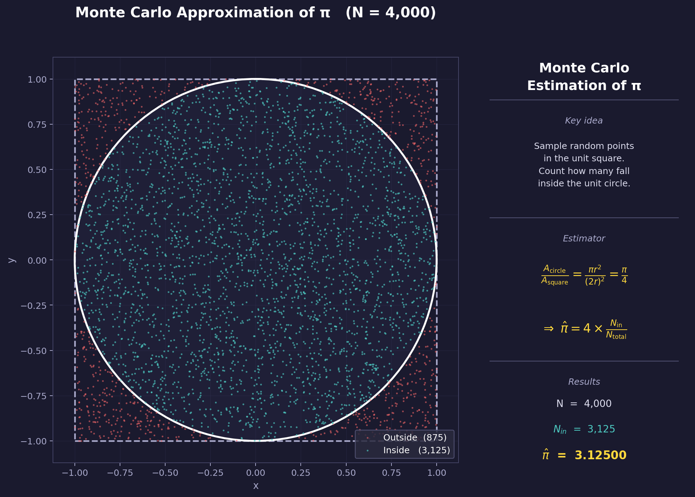
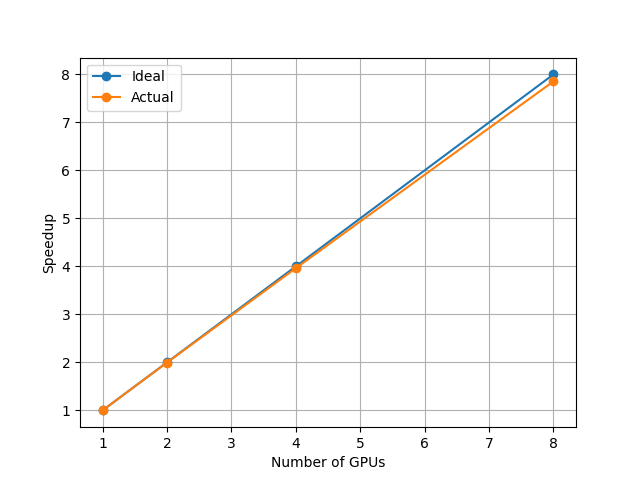

# Exercise 4: Multi-GPU Monte Carlo Pi with NCCL + MPI — Multi-Node Scaling

This exercise extends Exercise 3 to **multiple nodes** by combining NCCL with
MPI. MPI handles process management and bootstraps the NCCL communicator across
nodes; NCCL performs the GPU-to-GPU collective (AllReduce) using NVLink
intra-node and InfiniBand inter-node — transparently and without any data
passing through the CPU.

The scaling study runs 1, 2, 4, and 8 GPUs across up to 2 nodes (4 GPUs per
node).

## Algorithm

The value of π is estimated by sampling random points uniformly in the unit
square and counting how many fall inside the unit circle:

$$\pi \approx 4 \times \frac{\text{hits inside circle}}{\text{total samples}}$$

<p align="center">
  
</p>

Each MPI rank owns an equal share of the total sample count. Within each rank,
a CUDA kernel distributes samples across GPU threads, each with an independent
SplitMix64 seed. CUB (`cub::DeviceReduce::Sum`) reduces the per-thread hit
counts to a single scalar on-device. `ncclAllReduce` then sums the per-GPU
scalars across all GPUs on all nodes so every rank holds the global hit count.

## Implementation Details

| Component | Description |
|-----------|-------------|
| `nccl_mpi_pi_mc.cu` | MPI + NCCL + CUDA source |
| NCCL bootstrap | Rank 0 calls `ncclGetUniqueId`; `MPI_Bcast` distributes the token; all ranks call `ncclCommInitRank` |
| Collective | `ncclAllReduce` (sum) — NVLink intra-node, InfiniBand inter-node |
| Reduction | `cub::DeviceReduce::Sum` for the per-GPU thread-count reduction |
| RNG | Linear-congruential generator scrambled with SplitMix64 |
| Launch config | `cudaOccupancyMaxPotentialBlockSize` — adapts to the GPU |
| GPU mapping | `MPI_Comm_split_type(SHARED)` maps each local rank to a distinct GPU |
| Timing | `MPI_Wtime` + `MPI_Reduce(MAX)` for true parallel wall time |

## Scaling Results

All runs use **10 trillion samples** (`10,000,000,000,000`) across up to 2 nodes.

| GPUs | Nodes | Wall time (s) | Speedup |
|------|-------|---------------|---------|
| 1    | 1     | 45.15         | 1.00×   |
| 2    | 1     | 22.62         | 2.00×   |
| 4    | 1     | 11.40         | 3.96×   |
| 8    | 2     | 5.75          | 7.85×   |

<p align="center">
  
</p>

The speedup remains near-ideal through 8 GPUs across 2 nodes because the
computation is embarrassingly parallel and the only inter-node communication is
a single `ncclAllReduce` on a 8-byte scalar at the end.

## Contents

| File | Description |
|------|-------------|
| `nccl_mpi_pi_mc.cu` | MPI + NCCL + CUDA source — Monte Carlo π computation |
| `Makefile` | Build rules |
| `run_1.sbatch` | SLURM script — 1 GPU, 1 node |
| `run_2.sbatch` | SLURM script — 2 GPUs, 1 node |
| `run_4.sbatch` | SLURM script — 4 GPUs, 1 node |
| `run_8.sbatch` | SLURM script — 8 GPUs, 2 nodes |
| `output_1.out` | Example output — 1 GPU |
| `output_2.out` | Example output — 2 GPUs |
| `output_4.out` | Example output — 4 GPUs |
| `output_8.out` | Example output — 8 GPUs |
| `mc_pi.png` | Algorithm illustration |
| `nccl_speedup_plot.png` | Speedup plot |

## Requirements

### Modules

```bash
module load nvhpc/24.11-fasrc01                       # NCCL and CUDA
module load gcc/12.2.0-fasrc01 openmpi/4.1.5-fasrc03  # MPI
```

## Compilation

```bash
make
```

or manually:

```bash
nvcc -O3 -std=c++17 -o nccl_mpi_pi_mc.x nccl_mpi_pi_mc.cu -lnccl -lmpi
```

### Makefile

```makefile
# Compiler
NVCC = nvcc

# Target
TARGET = nccl_mpi_pi_mc.x

# Source
SRC = nccl_mpi_pi_mc.cu

# Flags
CXXFLAGS = -O3 -std=c++17
LIBS = -lnccl -lmpi

# Default rule
all: $(TARGET)

# Build rule
$(TARGET): $(SRC)
	$(NVCC) $(CXXFLAGS) -o $@ $^ $(LIBS)

# Clean rule
clean:
	rm -f $(TARGET)
```

## Running on the Cluster (SLURM)

```bash
sbatch run_1.sbatch   # 1 GPU,  1 node
sbatch run_2.sbatch   # 2 GPUs, 1 node
sbatch run_4.sbatch   # 4 GPUs, 1 node
sbatch run_8.sbatch   # 8 GPUs, 2 nodes
```

The scripts follow the same pattern, differing in `-N`, `--ntasks-per-node`,
and `--gpus-per-node`. Example for 8 GPUs across 2 nodes (`run_8.sbatch`):

```bash
#!/bin/bash
#SBATCH -J nccl_mpi_pi_mc
#SBATCH -N 2
#SBATCH --ntasks-per-node=4
#SBATCH --gpus-per-node=4
#SBATCH -t 30
#SBATCH -p gpu
#SBATCH -o output_8.out
#SBATCH -e error_8.err
#SBATCH --mem-per-cpu=4G

export NCCL_IB_HCA=mlx5_0          # InfiniBand HCA — adjust if needed
export UCX_LOG_LEVEL=error

module load nvhpc/24.11-fasrc01
module load gcc/12.2.0-fasrc01 openmpi/4.1.5-fasrc03

srun -n 8 --mpi=pmix ./nccl_mpi_pi_mc.x 10000000000000
```

The optional argument is the total sample count (default: 1,000,000,000).

## Expected Output (8 GPUs, 2 nodes)

```
rank 0/8 | local_rank 0/4 | GPU 0 | samples = 1250000000000 | ... | time = 5.733312 s
rank 1/8 | local_rank 1/4 | GPU 1 | samples = 1250000000000 | ... | time = 5.733309 s
rank 2/8 | local_rank 2/4 | GPU 2 | samples = 1250000000000 | ... | time = 5.733313 s
rank 3/8 | local_rank 3/4 | GPU 3 | samples = 1250000000000 | ... | time = 5.733302 s
rank 4/8 | local_rank 0/4 | GPU 0 | samples = 1250000000000 | ... | time = 5.733314 s
rank 5/8 | local_rank 1/4 | GPU 1 | samples = 1250000000000 | ... | time = 5.733306 s
rank 6/8 | local_rank 2/4 | GPU 2 | samples = 1250000000000 | ... | time = 5.733313 s
rank 7/8 | local_rank 3/4 | GPU 3 | samples = 1250000000000 | ... | time = 5.733308 s

========== FINAL RESULTS ==========
Exact PI       = 3.14159265
Estimated PI   = 3.14159276
Absolute error = 1.02e-07
Relative error = 3.24e-06 %
Wall time      = 5.733314 s
```

Note that `local_rank` resets to 0–3 on each node (ranks 0–3 on node 1,
ranks 4–7 on node 2), while the global `rank` runs 0–7 across both nodes.
